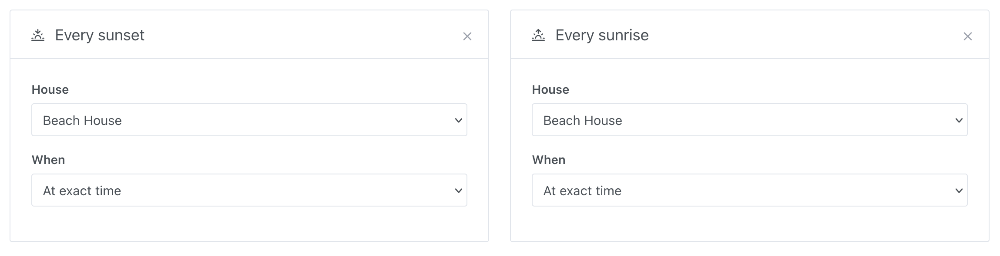
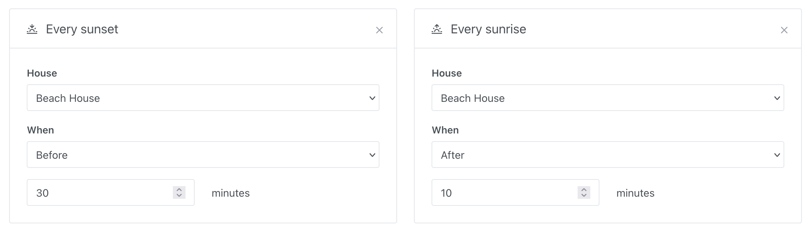

You can trigger a scene based on the sunrise or sunset. This is useful for example if you want to turn on the lights when the sun goes down, or turn off the lights when the sun rises.

## Exact sunrise or sunset

"When the sun sets" or "When the sun rises" will trigger the scene at the exact moment the sun sets or rises.

## Sunrise or sunset with delay

"30 minutes before the sun sets" or "10 minutes after the sun rises" will trigger the scene with some delay before/after.