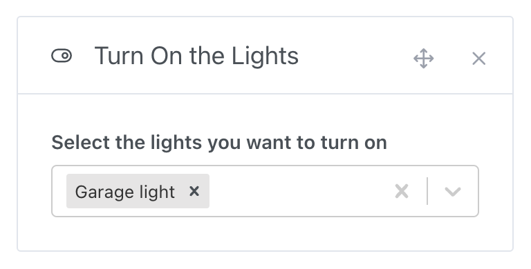

In home automation, controlling the light is often one of the most used actions.

- Waking up with light in addition to music?
- Turn off all the lights when you leave the house?
- Turn on the light when you enter a room?
- A cinema mode that turns off the living room lights?

All of these are possible with Gladys. 😀

## Control the lights in a scene

If you want to turn on lights in a scene, you can add a “turn on light” action to your scene and select the lights you want to turn on.

To turn off the lights in a scene, you can add an "turn off light" action to your scene and select the lights you want to turn off.

