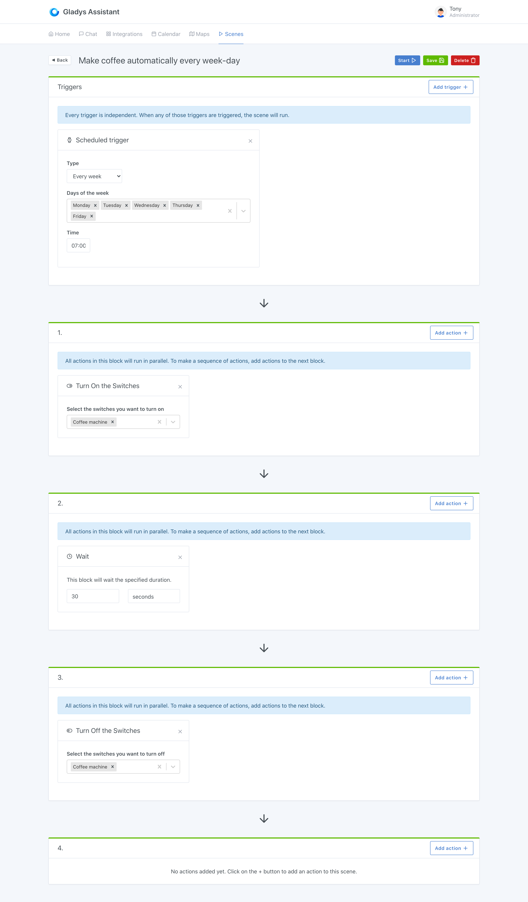

Whether it is to control a simple bedside lamp, an LED strip, or even a coffee machine, remote-controlled sockets are widely used in home automation.

In Gladys, you can control your remote-controlled outlets, whether on the dashboard or in the stages.

We will see a concrete example here.

Take the very basic filter coffee makers that can be found on the market for around ten euros. These coffee makers have the advantage of having a physical on / off button, which can remain in the permanent "on" position.

With a remote-controlled socket in front, it becomes possible to control the machine, and therefore to make coffee on order!

## Make coffee automatically every morning of the week with Gladys

We can therefore imagine the following scene:

```
Trigger: "Monday to Friday at 7 a.m."

Actions:
  - Switch on the "coffee machine" socket
  - Wait 30 seconds (for the coffee to be prepared)
  - Switch off the "coffee machine" socket
```

In Gladys, the scene will look like this:



As you can see, first there is a trigger that goes off every day of the week except weekends (Monday to Friday).

Then the scene turns on the outlet, waits 30 seconds, then turns off the outlet.

Super simple, right?
