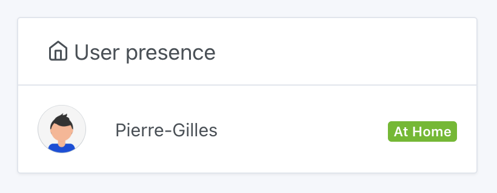
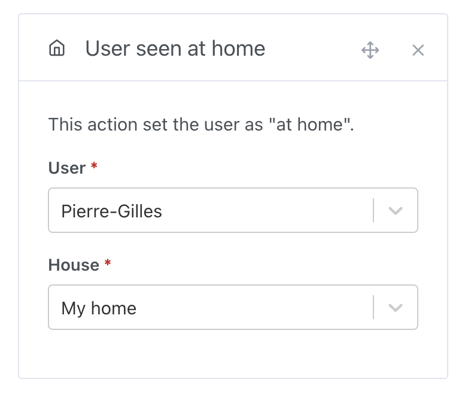
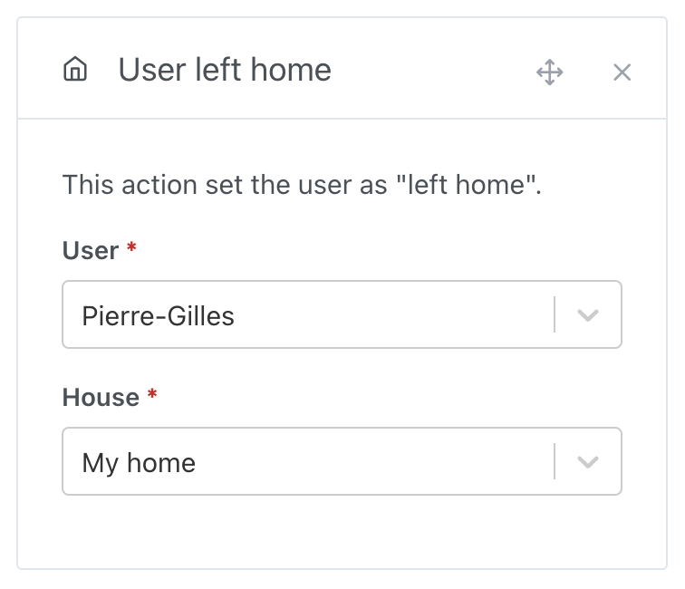

# User Presence on the Dashboard

On the dashboard, Gladys allows you to display which users are present or absent from the house.

You can use scenes to define a user's presence or absence.

- This can be done manually, by launching the scene when you leave or arrive home (useful, but perhaps a bit restrictive – automation is preferred!).
- Or, automate presence detection: This could be a button at the entrance, motion detection if you're home alone, a Tasker app that sends an MQTT message when you're connected to home Wi-Fi, or a Nut tracker. The choice is yours!

We have tutorials for [Bluetooth detection](/docs/integrations/bluetooth/) and [network scan](/docs/integrations/lan-manager/).

## Define the User as "Present at Home" in a Scene

The goal of this action is to tell Gladys, "The user has been detected at home."

With this information, Gladys will be able to:

- Trigger a "return home" event if the user was previously marked as away.
- Do nothing if the user was already at home.

To set this up, you can create a "user seen at home" action within a scene:

## Define the User as "Away from Home" in a Scene

The goal of this action is to inform Gladys, "The user is not in this house."

With this information, Gladys will be able to:

- Trigger a "leaving home" event if the user was previously marked as present at home.
- Do nothing if the user was not marked as present, or if they were marked as away from **this** house.

To configure this, you can create a "user left home" action within a scene:

