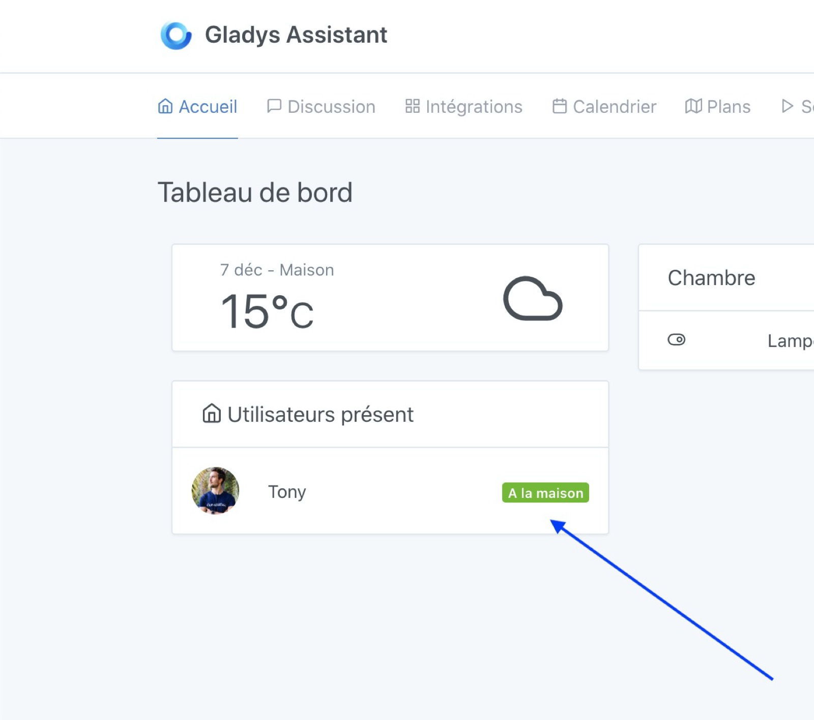
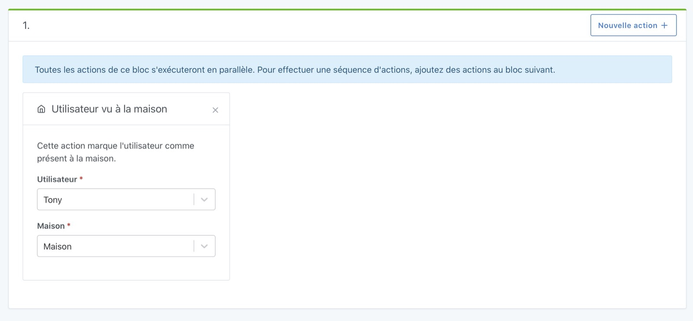
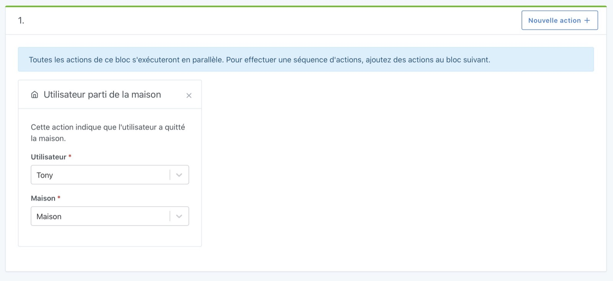

On the dashboard, Gladys allows you to display which users are present/absent from the house.

To define the presence / absence of a user, you can do it in the scenes.

- Either with the objective of launching the scene manually when you leave / come home (practical, but hey maybe a little restrictive, we want automation!)
- Either by automating the detection of the presence: This can be a button in the entrance, a motion detection if you are alone at home, a small Tasker that sends a message in MQTT when you are connected to the Wi-Fi of at home, a Nut: it's up to you!

## Prerequisites

You must be in Gladys Assistant v4.0.3 minimum to have this functionality.

## Define the user as "present at home" in a scene

The objective of this action is to tell Gladys: "the user has been seen at home".

With this information, Gladys will be able to:

- Or emit a "return home" event if the user was away from home before that.
- Or do nothing if the user was already at home.

To do this, in a scene, you can create a "user seen at home" action:

## Define user as "away from home" in a scene

The objective of this action is to tell Gladys "The user is not this house".

With this information, Gladys will be able to:

- Or send a "leaving home" event if the user was marked as "at home" before that.
- Either do nothing if the user was not at home, or not in ** this ** house.

To do this, in a scene, you can create a "user left home" action:

