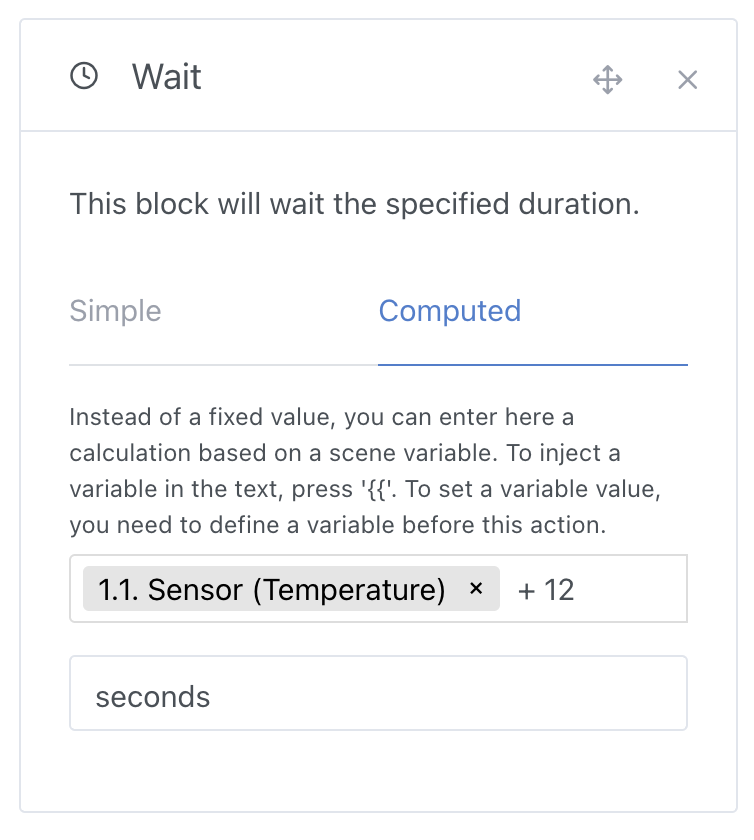

This action allows you to wait for a fixed or calculated duration.

## Simple fixed variable

You can specify a fixed wait time that will not vary:

## Calculated variable

You can define a dynamic wait time that varies based on variables or mathematical calculations.

For example, if you have retrieved a sensor value earlier in your scene (with the "Get last state" action), you can use this variable as a basis to calculate your wait time:

### Available mathematical functions

See [math functions](/docs/scenes/math-functions).
