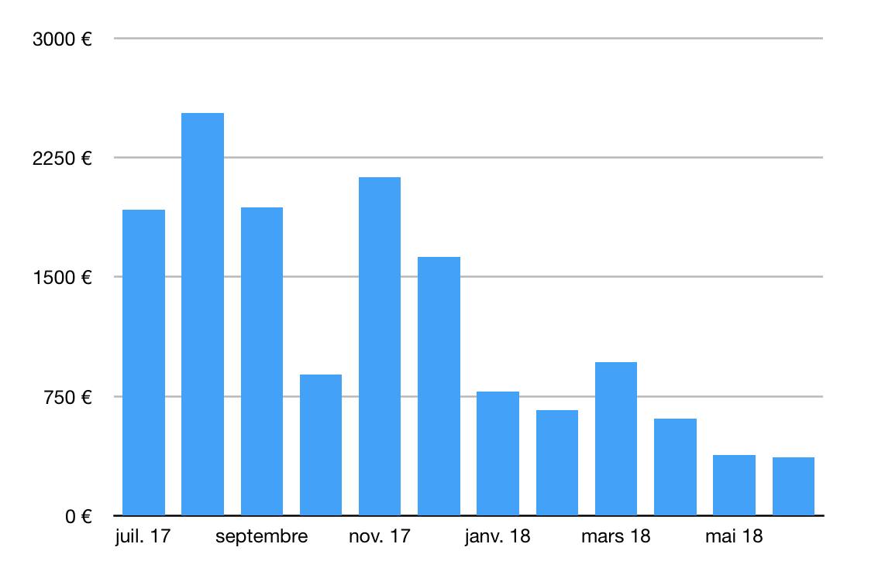

Hey everyone!

👋 My name is Pierre-Gilles Leymarie. I'm 24 years old, and since 4 years, I'm building an open-source home automation software, Gladys, for completely free on GitHub!

⭐️ My dream is to enable anyone to have his own Jarvis at home, like in Iron Man, without having to install a closed and cloud based solution.

🚀 My long term goal for Gladys, is that it becomes one of the most used open-source platform in home automation.

To achieve this goal, I need YOU!

<!--truncate-->

I have tons of projects for Gladys, like:

- An iOS app (and WatchOS!)
- More integrations!
- More machine learning (that runs locally!)
- More tutorials, videos, articles!
- Lots of improvements in current Gladys software (UI/UX, features, stability)
- Even a secret project that I'm sure you'll enjoy!

But.... It takes time 🕛 to build great software! 👨💻

Currently, my only moments to work on Gladys are late at night (after my day at work), and during my week-ends. I'm spending nights, and full week-ends on it, but it's not a long term solution. It's even frustrating because I have lots of projects on Gladys that I'm not able to finish because of time issue.

For example, this is the kind of typical week I have:

As you can see, my weeks are pretty full 😁

But I want to spend more time on Gladys! As my days are not extensible, I need to remove something so it can fit: I need to work less and Gladys needs to be one of my day job.

Yes, you read rights:

🎉 🎉 **I'M GOING TO WORK PART-TIME ON GLADYS !!** 🎉 🎉

Going part-time on open-source has always been my dream, but that dream can only become true with your support!

## My long-term plan

My vision is that the world need an open-source home automation platform, so we are not locked in a couple of years with only closed source and proprietary solution like Google/Amazon provide.

But being open-source doesn't mean you don't have people working part-time/full time as employee on it.

In fact, most open-source projects that are widely used have employees paid to work on it.

I want to take here one example: Ghost.

[Ghost](https://ghost.org/fr/about/) is an open-source blogging platform founded 5 years ago by [John O’Nolan](https://twitter.com/JohnONolan).

This platform is massively used: more than 512 000 websites are running it.

To make this open-source tool so successful, so stable and so easy to use, they have a team of 11 people working full-time on Ghost.

How are they paid?

Well, Ghost is open-source, but they provide an hosted version of it that you have to pay monthly.

This model brings them 81k dollars every month to pay their team of 11 people.

I hope that you understand my point with this example: you can't have a great product without great people spending time on it.

## Where are we now ?

Today the project is growing faster than ever! 🚀

Gladys has been downloaded more than 32 000 times 🤯

The website has every day more visitors, and is growing like crazy as you can see below!

The [Gladys Assistant](https://www.youtube.com/channel/UCImYJQrVc8akWzm57KsZQ2A) YouTube channel that I started last year has close to 100 000 views, and I'm definitely going to spend more time on it!

## And in terms of revenue ?

One year ago, the project was not sustainable. The project was burning my money every months.

Since 4 years, I was paying:

- Hosting cost of the Discourse community
- Hosting cost of the website
- Hosting cost of the developer platform
- Newsletter cost for 2 500 subscribers
- Emails sent by the Discourse community (30-50k emails sent per months)
- Setup for events like Maker Faire Paris, and multiple talks in France
- Hardware for Gladys/tutorials
- Setup for video recording (Camera/Microphone/tripod)

Believe me, for a student like me, it was a lot.

So I worked hard during 4 months, to create the Gladys Starter Pack, a set of videos + ebook sold 39€ in pre-sale, then 49€.

(Fun fact: One week before the release, I got my laptop stolen.. 😅Luckily, I had everything backed up online, but still it was not a fun story^^)

The goal for me was to see if the project could bring enough revenue to be self-sustainable, and if one day I could live from it, and maybe even start a team of people working with me on Gladys!

And on launch day, THAT happened....

I was like WOW 😱

Since that day, I knew that I would dedicate my week-time on Gladys in the future.

But I needed to finish my studies!

As you know, I'm currently working as an apprentice as part of my engineering studies.

My contract, and therefore my studies, end the 16th of August, 2018.

After that contract, I had a choice to make. An important choice for my life.

I had lots of proposal to become a full-time engineer. These packages were definitely interesting, in terms of salary and mission. But with a full time engineer job with even more responsibilities, I wouldn't have been able to continue my work on Gladys. So I said no, and chose the Gladys option 😄

## So what's next ?

After the 16th of August, I'm going to take a summer break before starting this adventure on Gladys 🚀 (Yes, I need to recover from these crazy 4 years without that much holidays 😅)

And after summer, I'll be working part-time on Gladys, as the first Gladys employee!

On the other part-time, I'll work as a freelancer so I can still eat and pay my rent.

## Become a supporter of this crazy project!

As you can see on the chart, revenue on the Gladys Starter Pack has been declining recently, mostly because I haven't made any campaign on it lastly, as I was mostly focused on lots of improvements on Gladys: Work on MQTT, the Zwave module, stability and UI fixes.

This is why I need YOU!

If you want to support an indie maker!
If you want to be part of this crazy adventure!
If you want to show the world that open-source can be a viable alternative in the home automation world!

**Edit 2020: We deleted our Patreon page in favor of our new Gladys Plus package!**

You can NOW support Gladys on Patreon ❤️

Thank you for being there, thank you all for your support 🙏

Pierre-Gilles
