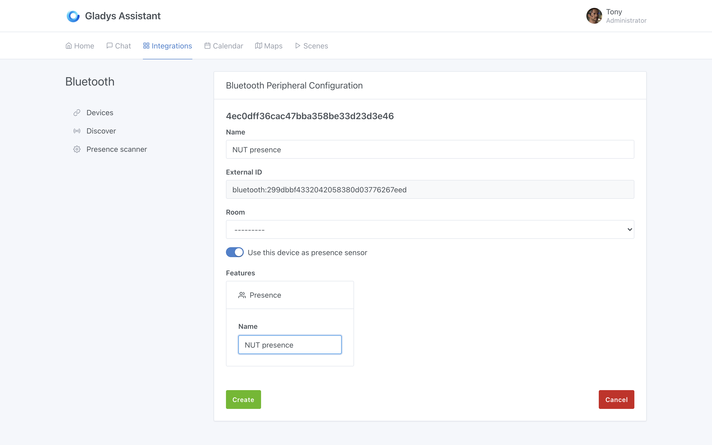
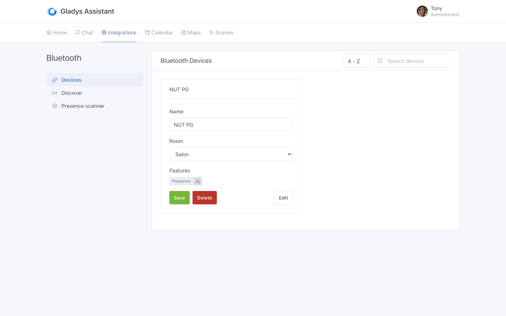
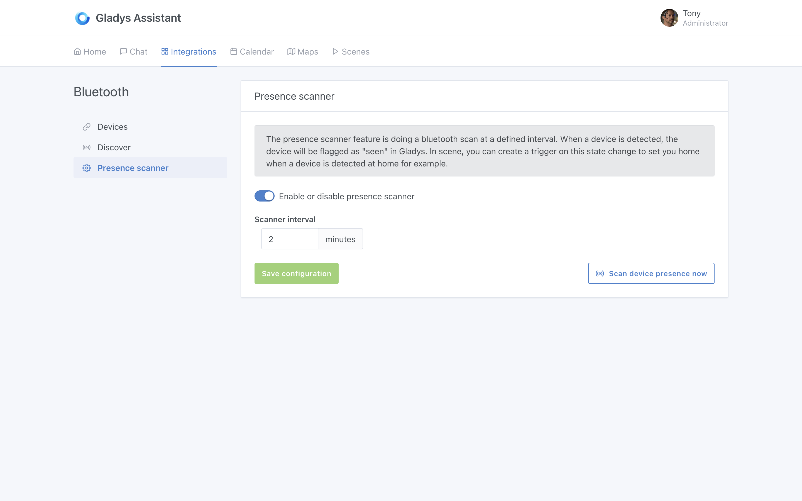
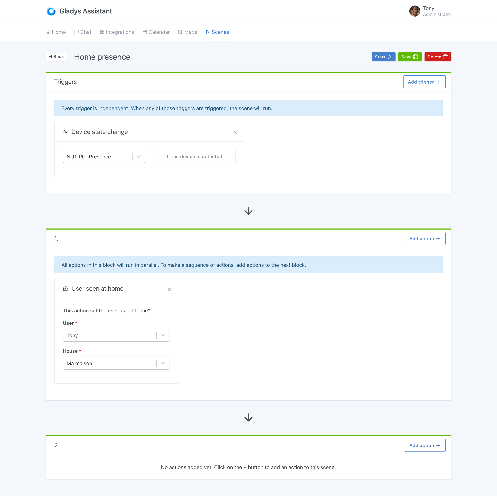
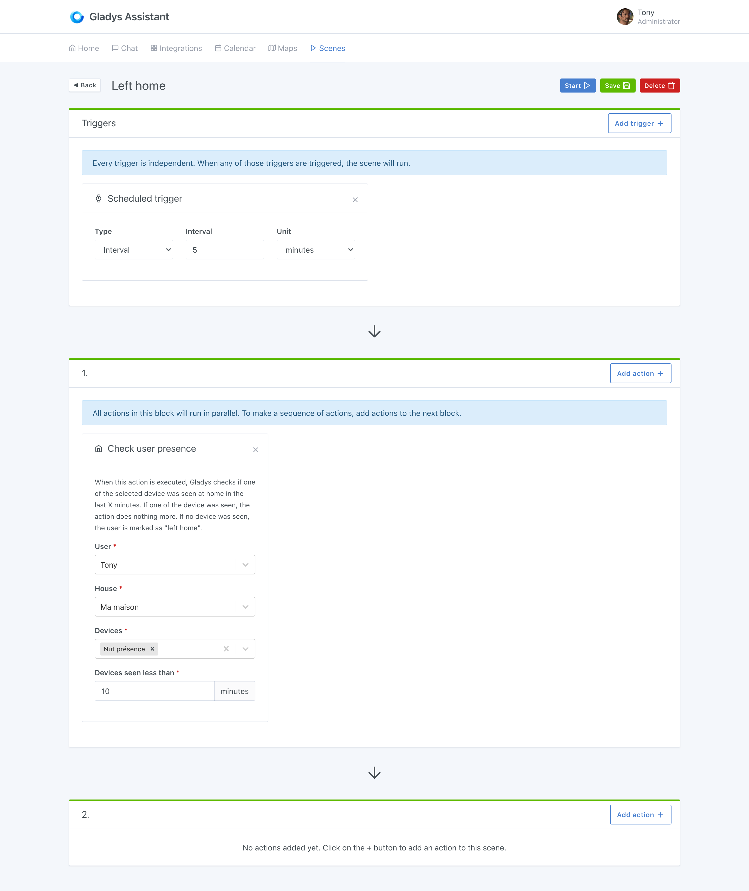
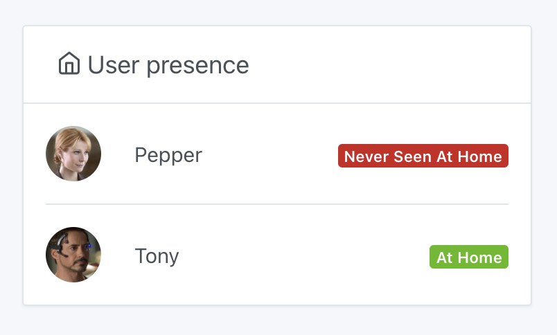

Bluetooth integration is useful for presence detection.

There are bluetooth key chains like the [NUT keychain](https://www.amazon.com/gp/product/B08K3124JR/ref=as_li_qf_asin_il_tl?ie=UTF8&tag=gladproj-20&creative=9325&linkCode=as2&creativeASIN=B08K3124JR&linkId=5688d18164e92becabd17c6d49fdd778) which permanently signal their presence via Bluetooth.

With this kind of key fob Gladys can detect when you are / are not at home by simply scanning for nearby bluetooth devices.

**Note:** This trick does not work with all Bluetooh devices. This only works with bluetooth devices which transmit continuously, and which do not obfuscate their bluetooth address, as most phones do for example. In general, the "dumber" the device, the better it works! For example, I had a Fitbit Force 2 bracelet, and it worked. However, it does not work with an Apple Watch.

## Configure your bluetooth device

Go to the "Bluetooth" integration, "Discovery" tab. Scan the surrounding bluetooth devices, and find the device you want to add.

Click on "Connect to Gladys":

Then activate the option "Use this device as a presence sensor".

Give this device a unique name, and add it to Gladys.

You should arrive on this screen:

Now, go to the "Presence scanner" screen, and check that your configuration looks like this:

It's good, everything is configured on the Bluetooth side!

## Manage presence in scenes

### A "homecoming" scene

Now we are going to create a scene that will mark you as "present at home" when this Nut keychain is detected.

Go to the "Scenes" tab, and create a scene like this:

The scene is very simple.

WHEN "the key fob is detected" THEN "put user Tony as present at home".

### A "leaving home" scene

To manage the departure from the house, I recommend that you make a scene executed periodically which will check if your NUT keychain has been detected recently at home, or not.

If so, Gladys will do nothing. If not, Gladys will mark the user as absent.

The scene should look like this:

You can play around with the settings to suit your home. If you feel that 10 minutes is too short to be put as absent, you can extend it to 20 minutes to avoid "false starts" :)

## Display presence on the dashboard

Now, if you want to display the presence of the different users at home, you can use the "Users present" box:

