To synchronise your Gladys calendar with external services (Google Calendar, iCloud, Nextcloud...).

## Available services (tested & others)

1. [iCloud](#icloud)
2. [Google Calendar](#google-calendar)
3. [Synology Calendar](#synology-calendar)
4. [Nextcloud](#nextcloud)
5. [Others](#others)

### iCloud

Log in with your Apple account : [https://appleid.apple.com](https://appleid.apple.com)

Cliquez sur "Generate Password".

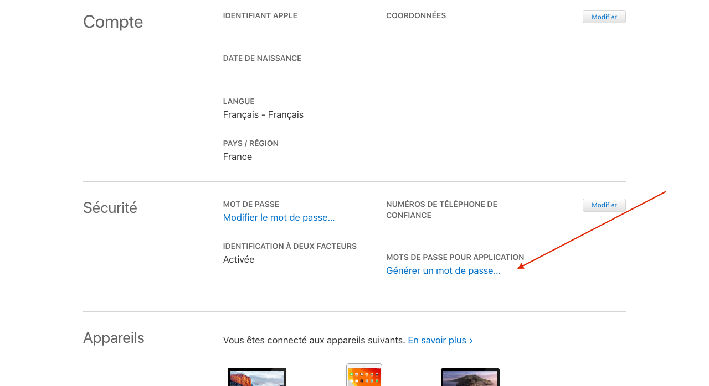

Type a name for your password, "Gladys" for exemple.

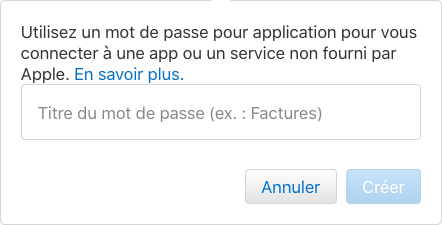

Note the generated password.

In Gladys dashboard, go to CalDAV config page.

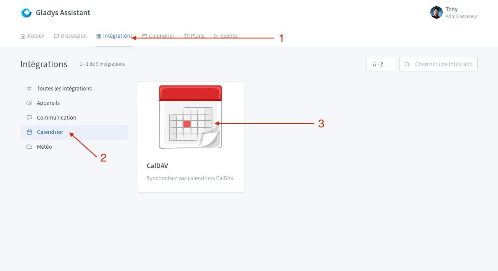

1. Choose "iCloud Calendar"
2. Leave the default URL
3. Type your Apple ID (should be the email adress associated with your Apple account)
4. Paste here the previously generated password

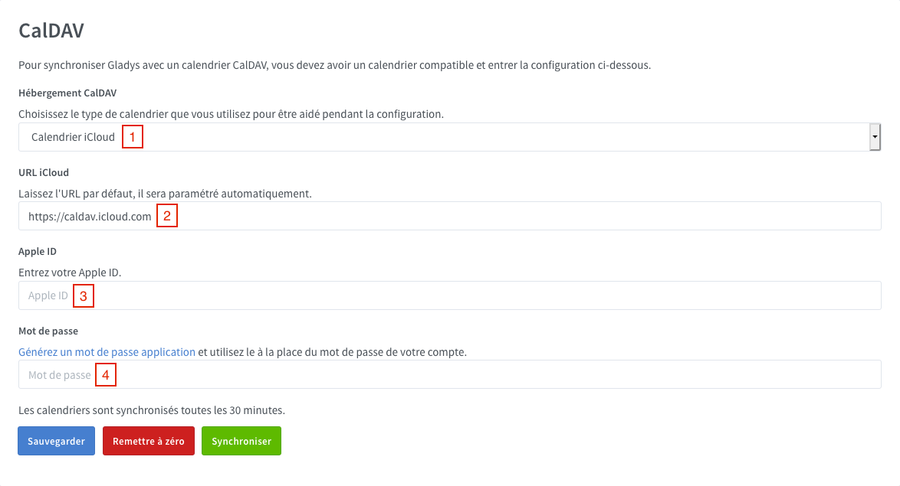

Click on "Save". If there is a validation message, Gladys will sync your calendar. If an error appears, check previous steps and try again.

### Google Calendar

Log in with your Google account : [https://myaccount.google.com/](https://myaccount.google.com/)

Go to security tabs and click on "App Passwords".

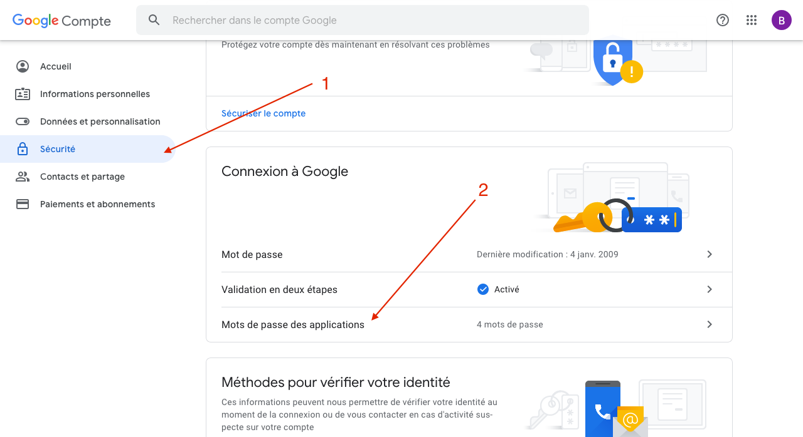

1. Select "Calendar" for application
2. Select "Other" for device
3. Once you entered the desired name ("Gladys" for example), click on "Generate" and note the generated password

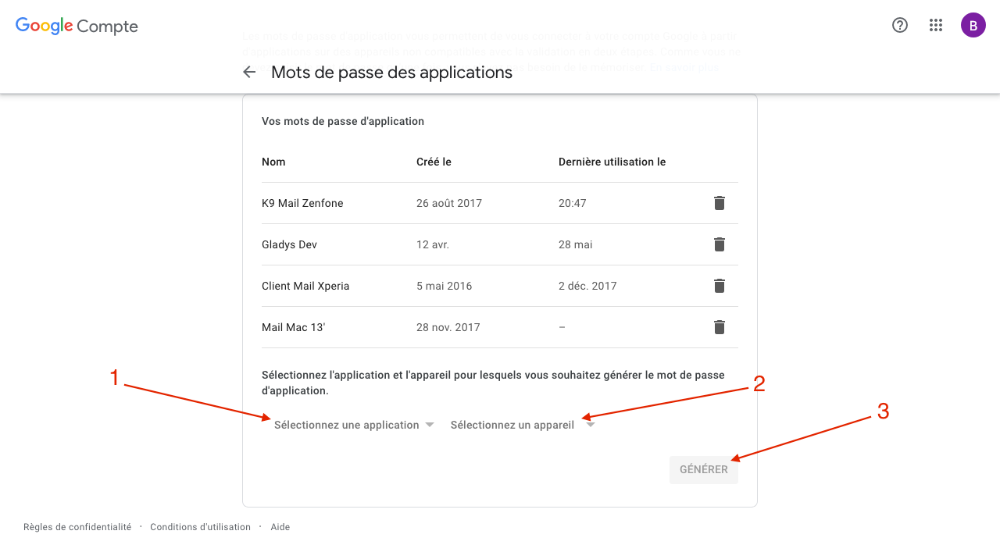

In Gladys dashboard, go to CalDAV config page.

1. Choose "Google Calendar"
2. Leave the default URL
3. Type your Google email address
4. Paste here the previously generated password

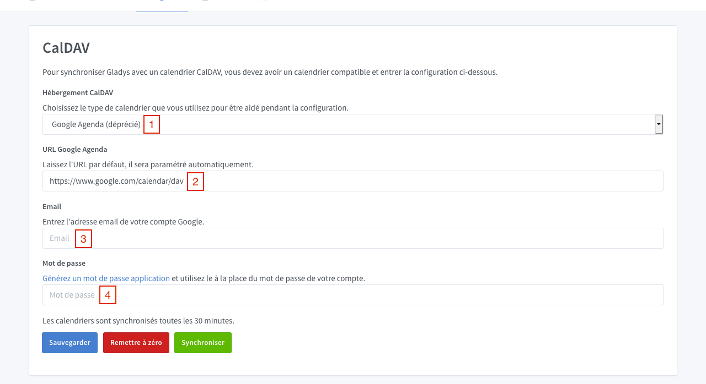

Click on "Save". If there is a validation message, Gladys will sync your calendar. If an error appears, check previous steps and try again.

### Synology Calendar

On your Synology, open "Calendar" application.

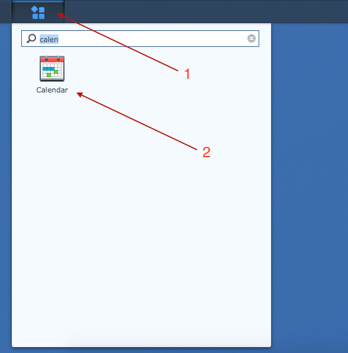

1. Next to your calendar, click on the small triangle
2. Then click on "CalDAV Account"

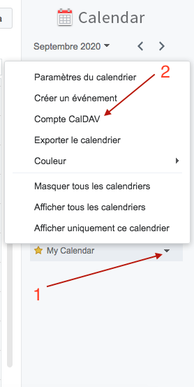

Copy "macOS / iOS" url.

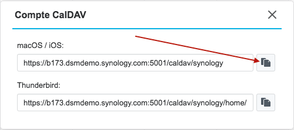

In Gladys dashboard, go to CalDAV config page.

1. Choose "Synlogy Calendar"
2. Paste here the previously copied URL
3. Type your Synology username
4. Type here you Synology password

Click on "Save". If there is a validation message, Gladys will sync your calendar. If an error appears, check previous steps and try again.

### Nextcloud

1. On your Nextcloud instance go to config page, then click on Security tab
2. At the bottom enter "Gladys" and click on "Create new app password"

Note the generated password

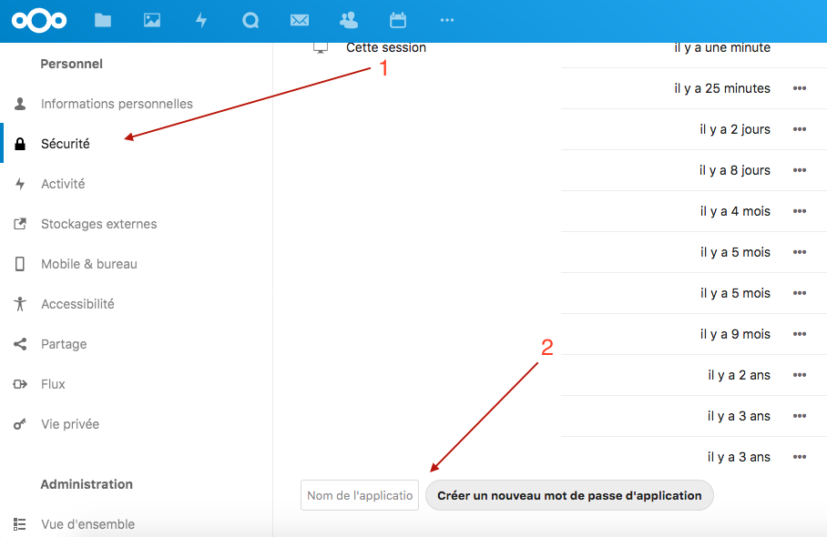

In the Calendar application click on "Settings & import"

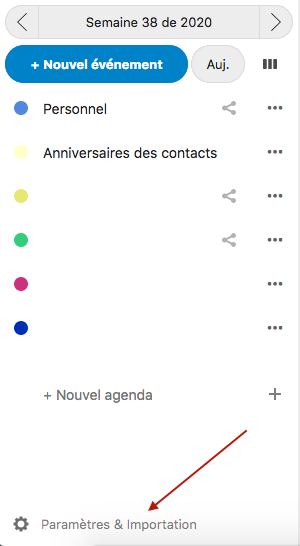

Then "Copy primary CalDAV address"

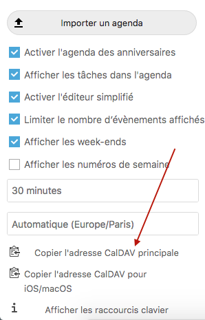

In Gladys dashboard, go to CalDAV config page.

1. Choose "Other"
2. Paste here the previously copied URL
3. Type your Nexcloud password
4. Paste here the previously generated password

Click on "Save". If there is a validation message, Gladys will sync your calendar. If an error appears, check previous steps and try again.

### Others

For all others services

1. Enter here the CalDAV URL
2. Enter here your username or your email address
3. Then enter your password (if possible an application password)

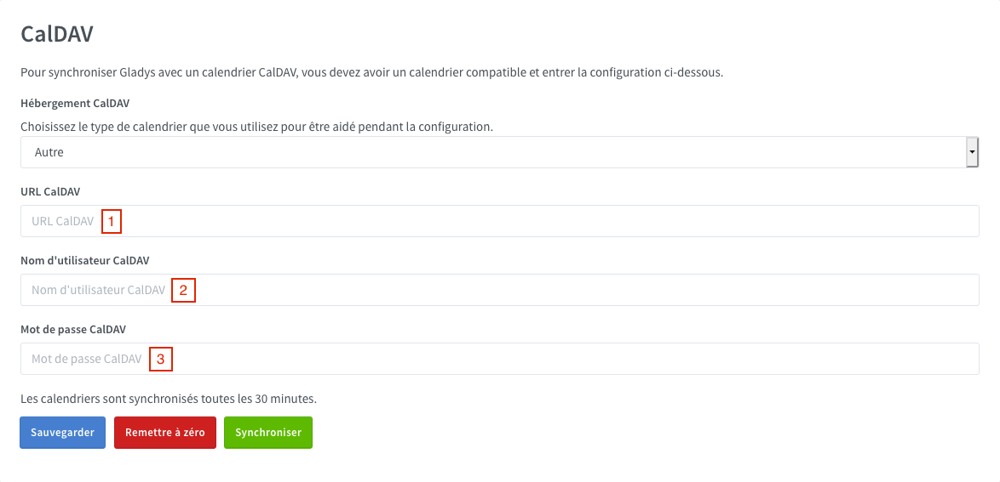
