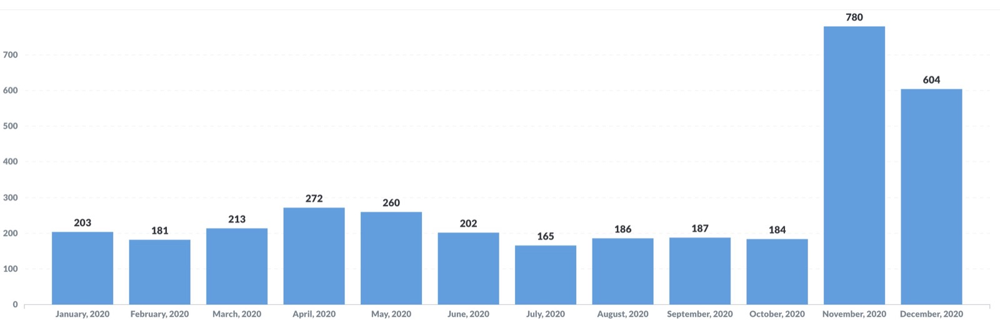
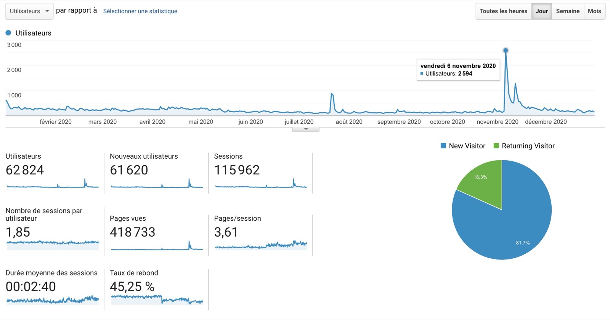

Salut à tous !

Comme chaque année, il est l’heure d’un nouveau bilan annuel pour Gladys Assistant. Je l'avais fais en [2019](/fr/blog/bilan-2019-gladys-assistant), [2018](/fr/blog/bilan-2018-pour-gladys-assistant), [2017](/fr/blog/bilan-gladys-2017), [2016](/fr/blog/bilan-annee-2016) et [2015](/fr/blog/bilan-2015-et-projets-pour-2016).

C'est parti pour le bilan de l'année 2020 🙂

<!--truncate-->

## Que s’est-il passé en 2020 ?

L’année 2020 a été riche en nouveautés pour le projet, car en Novembre la version 4 de Gladys [est sortie](/fr/blog/lancement-gladys-assistant-4), une version réécrite de zéro.

Vous êtes très nombreux à avoir rejoint la communauté suite à ce lancement, puisque vous êtes 780 à avoir installé Gladys v4 le mois de son lancement: un super chiffre très encourageant.

Voilà les statistiques d’installation de cette v4 sur toute l’année 2020. Avant Novembre, la v4 était encore en beta et uniquement utilisé en interne ce qui explique les chiffres bas d’installations. Le pic est en Novembre, et il se stabilise en décembre ensuite car beaucoup de gens ont testés Gladys sans forcément s’en servir immédiatement à long terme: c’est normal 🙂

Désormais, le produit reçoit des mises à jour fréquentes de la part des 17 contributeurs GitHub sur cette v4.

En moyenne, hors vacances, il y a eu **une nouvelle version de Gladys par semaine** tout au long de cette année.

## Quelques statistiques

### Le site Gladys

Les visites sur le site ont été en baisse en début d’année, mais ont repris très fort en Novembre suite au lancement de la v4.

2 600 visiteurs uniques en 1 jour, c’était une belle journée ! La principale source de ce traffic était l’article de [Maison et Domotique](https://www.maison-et-domotique.com/123220-gladys-assistant-v4-solution-domotique-open-source/) sur le sujet, ainsi que celui de [Korben](https://korben.info/gladys-assistant.html) quelques jours plus tard.

Le taux de rebond n’a cessé de baisser suite à la sortie de notre nouveau site (taux de rebond = le pourcentage de visiteurs qui quittent le site sans faire aucunes interactions avec celui-ci) Il était assez élevé en début d’année (50%), et tourne désormais autour de 22%.

### Les réseaux sociaux

Sur les réseaux sociaux:

- [@gladysassistant sur Twitter](https://twitter.com/gladysassistant) rassemble 2 746 followers
- [Gladys Assistant Facebook](https://www.facebook.com/gladysassistant) comptabilise 745 likes
- [@gladysassistant sur instagram](https://www.instagram.com/gladysassistant) rassemble 555 abonnés

Et enfin 1 775 followers sur [mon Twitter personnel](https://twitter.com/pierregillesl) !

### La newsletter

Au niveau de la newsletter, vous êtes 3 757 à suivre la [newsletter Gladys Assistant](https://email-list.gladysassistant.com/subscription/1mXJoEWEl).

- 3242 abonnés en français
- 515 abonnés en anglais

L'année dernière j'ai envoyé une vingtaine d'email, soit entre 1 et 2 emails par mois.

Je n'envoie que des emails écrit à la main (avec amour !), du contenu de qualité, non-automatisé. Je suis absolument anti-spam comme vous et je passe du temps à écrire du contenu pertinent. J'espère que ça se ressent !

### Le GitHub Gladys Assistant

Nous sommes à 1 556 stars ⭐ sur le [repo Gladys Assistant](https://github.com/GladysAssistant/Gladys)

C'est +16% par rapport à l'année dernière !

Je compte sur vous pour nous emmener à 10 000 🚀🚀 Si chacun de vous pouvais prendre 5 secondes pour aller mettre une étoile au projet, ça serait juste génial 😍

## Projets et objectifs pour 2021

Mon objectif de l’année dernière (sortir la v4) étant atteint, mon objectif principale désormais est de faire connaître ce produit et de convertir un maximum de nouveaux utilisateurs.

Je vais donc diviser mon temps en deux missions cette année:

- **Evangélisation du produit :** continuer mon travail auprès de journalistes spécialisés, participer à des conférences (en ligne!), écrire du contenu. Bref, faire en sorte que Gladys Assistant rayonne et soit mise en avant à un maximum d’endroits. Je suis fier de cette v4 et je veux qu’elle soit utilisée ! C’est un cercle vertueux: plus il y a d’utilisateurs, plus il y a de contributeurs, donc plus le produit s’améliore, ce qui ramène des nouveaux utilisateurs.
- **Travail sur le produit et la documentation :** Je suis conscient que le produit est nouveau et forcément certaines fonctionnalités manquent. Néanmoins je trouve qu’on a pris un bon rythme de développement et que les outils et process qu’on a en place (Les [features requests](https://community.gladysassistant.com/c/feature-requests/43/l/latest?order=votes) sur le forum, les issues GitHub, CircleCI + CodeCov) nous permettent de travailler vite et bien. Progressivement, fonctionnalités par fonctionnalités, on se rapprochera d’un logiciel domotique complet et assez riche pour répondre à 90% des cas. La documentation est un point qui me tient particulièrement à coeur sur cette v4. J’ai mis la barre haute sur la qualité des tutoriels écrits sur le site, et je suis content de voir que la communauté écrit des tutoriels encore plus beau et complet que les miens 😄 C’est comme ça qu’on pourra attirer les 1 000 prochains utilisateurs.

En tout cas je vous souhaite à tous une très bonne année 2021 🥳

Si vous n’avez pas encore testé Gladys Assistant 4, c’est le moment: rendez-vous sur [la documentation](/fr/docs) !

A très vite.

Pierre-Gilles
