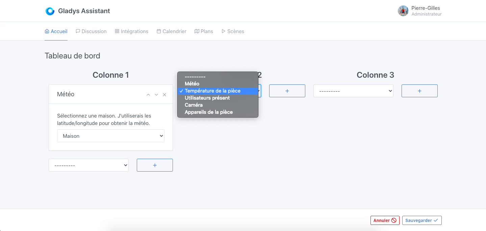
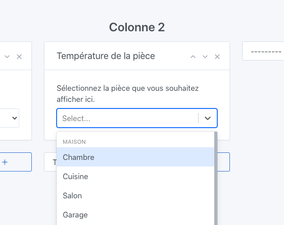

Dans Gladys Assistant, vous pouvez afficher la température moyenne d'une pièce sur votre tableau de bord.

Cette box va chercher la température de tous les capteurs de températures présent dans la pièce, et en affiche une moyenne sur le tableau de bord.

## Pré-requis

Vous devez au préalable avoir configuré au moins un capteur de température. Cela peut-être un capteur de n'importe quel protocole (Z-Wave, MQTT, peu importe), et avoir affecté ce capteur à une pièce.

## Configuration

Rendez-vous sur le tableau de bord, et cliquez sur "Editer".

Sélectionnez la box "température de la pièce", et cliquez sur le bouton +.

Ensuite, sélectionnez la pièce que vous voulez afficher.

Cliquez sur "Sauvegarder".

Vous devriez voir la température moyenne de cette pièce !
