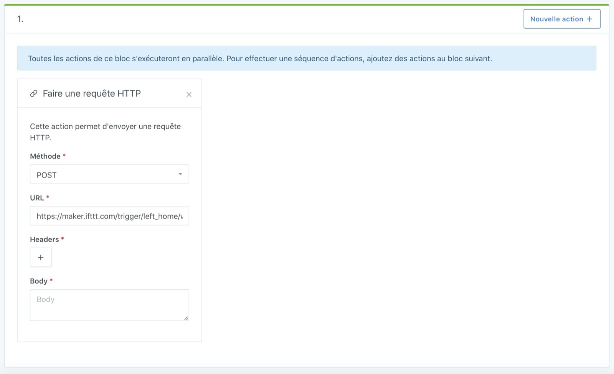
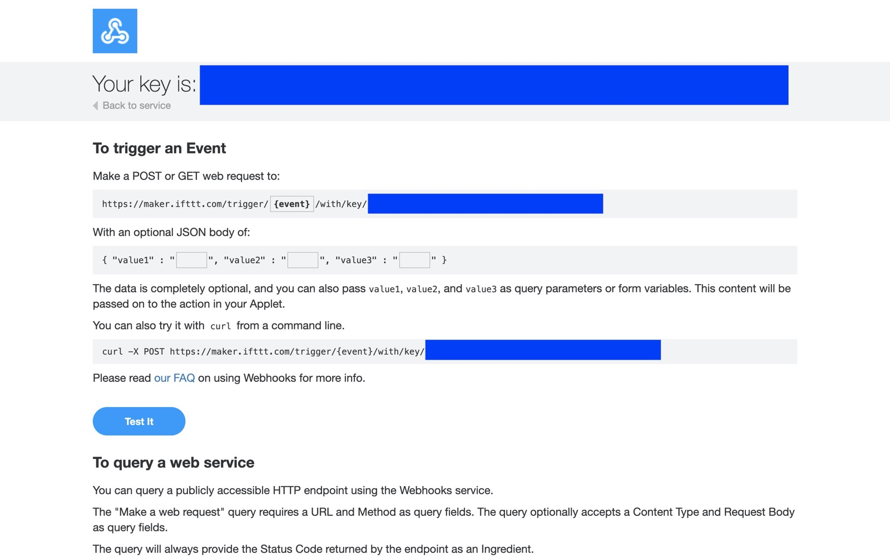
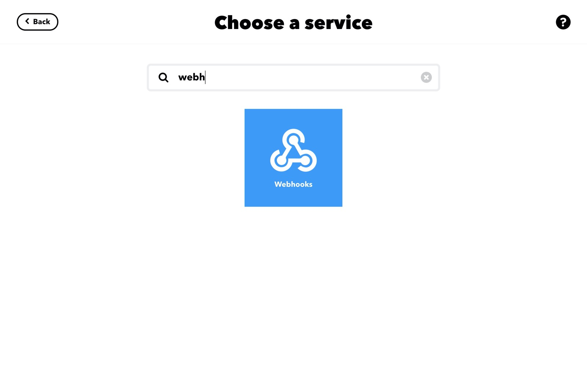
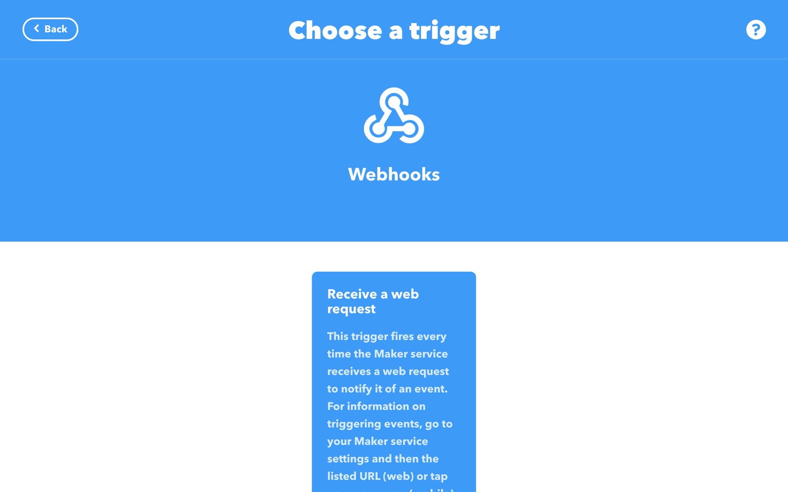
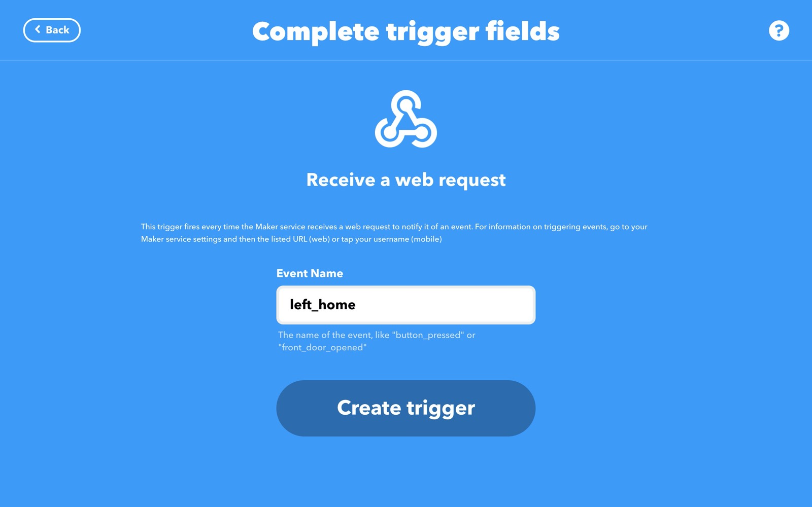
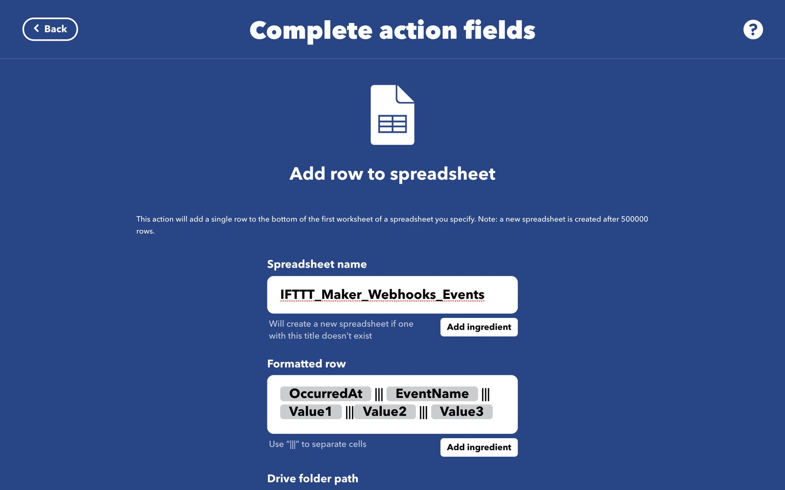
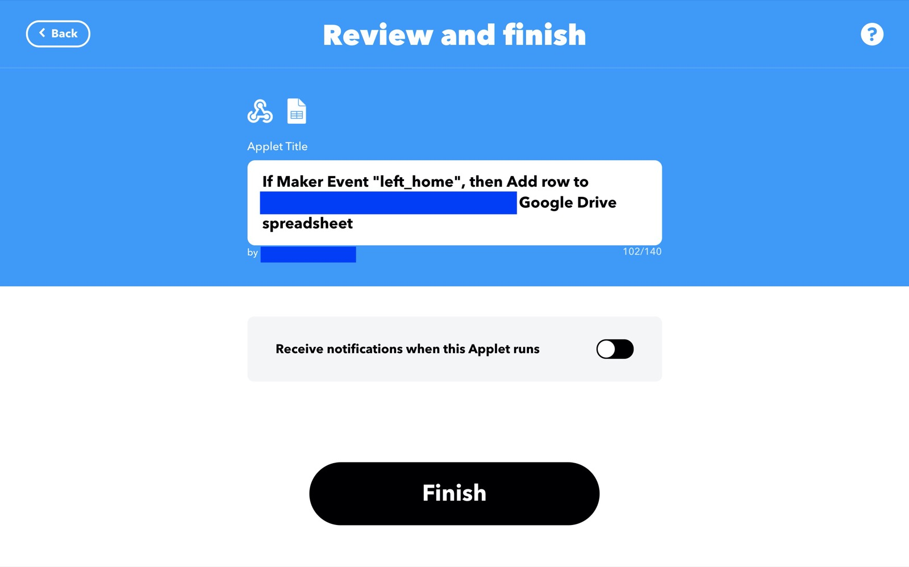
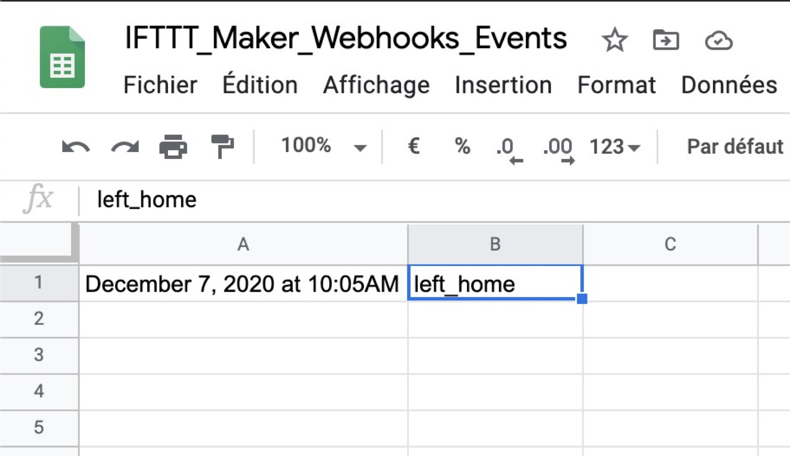

Dans les scènes, il est parfois pratique d'appeler une API externe afin de contrôler des périphériques pas forcément géré par Gladys Assistant, ou pour simplement appeler un service externe sans développer un service spécifiquement pour l'occasion.

## Pré-requis

Vous devez être en Gladys Assistant v4.0.3 minimum pour avoir cette fonctionnalité.

## Envoyer une requête HTTP dans une scène

Dans les scènes, vous pouvez créer une action "Faire une requête HTTP", qui vous permet de faire une requête HTTP GET, POST, PATCH, PUT ou DELETE.

Vous pouvez ajouter des `headers` si vous en avez besoin pour l'authentification par exemple.

## Exemple concret: Déclencher une action IFTTT depuis une scène Gladys Assistant

Vous connaissez probablement [IFTTT](https://ifttt.com/), un service qui permet de connecter différents services entre eux. Leur business model ayant changé récemment, il n'est possible que de créer 3 actions par compte, mais c'est amplement suffisant si vous voulez l'utiliser uniquement pour palier à un manque de Gladys par exemple.

Dans cet exemple, nous allons utiliser IFTTT pour enregistrer une valeur dans Google Sheet à chaque fois qu'une scène est appelée.

Nous allons ici envoyer un évènement "départ de la maison" à IFTTT et lui demander de logguer cet évènement dans un Google Sheet, afin de par exemple tracker vos départs de la maison.

C'est bien entendu un exemple que vous pouvez adapter selon vos besoins 😁

### Configurez les Maker Webhooks dans IFTTT

Dans IFTTT, rendez-vous sur [https://ifttt.com/maker_webhooks](https://ifttt.com/maker_webhooks) afin de configurer les Maker Webhooks.

Je vous laisse suivre le tutoriel d'IFTTT pour configure les Maker Webhook.

Normalement, après avoir configuré les Webhooks, vous devriez arriver sur une page comme cela:

Remplacez `{event}` par le nom de votre event, dans mon exemple "left_home", puis copiez-collez l'URL.

Gardez l'URL pour plus tard.

### Configurez le service Google Sheet dans IFTTT

Sur la page "Explore" d'IFTTT, cherchez le service "Google Sheet", et connectez votre compte Google. Cela servira pour la suite.

### Créez un Applet

Recherchez le service "Webhooks" que vous avez configuré juste avant.

Sélectionnez "Receive a web request":

Entrez le nom de l'évènement que vous avez entré à l'étape précédente, ici "left_home":

Sélectionnez où vous voulez qu'IFTTT enregistre la donnée (dans quelle spreadsheet sur votre Google Drive)

Cliquez sur "Save".

Puis cliquez sur Finish.

### Dans Gladys, créez une scène

Créez une nouvelle scène dans Gladys, puis ajoutez lui une action "faire une requête HTTP".

Sélectionnez "méthode: POST", puis dans URL entrez l'URL du webhook IFTTT que vous avez configuré précédemment.

Sauvegardez la scène, puis lancez-là.

Si vous vous rendez sur Google Drive, vous devriez voir un dossier "IFTTT" à la racine, contenant un dossier "MakerWebhook", ainsi que dans ce cas un dossier "let_home".

Dedans, vous trouverez un spreadsheet avec une ligne qui a enregistré le moment où vous êtes parti de la maison:

## Conclusion

Ce n'était qu'un exemple, cette action dans les scènes permet de faire des millions de choses:

- Appeler l'API d'une autre box domotique
- Appeler IFTTT pour contrôler n'importe quelle API : De la musique via Sonos ? Faire sonner son téléphone ? Envoyer un email ? Envoyer un tweet ?
- Appeler l'API de [Zapier](https://zapier.com/) pour appeler n'importe quelle API (Gmail, Calendar, Trello, et des centaines d'autres)

Bref, les possibilités sont illimitées.
