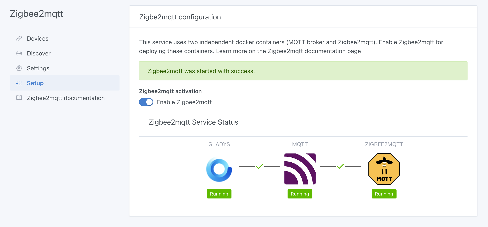
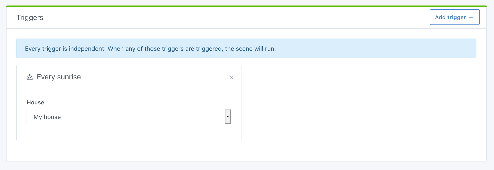
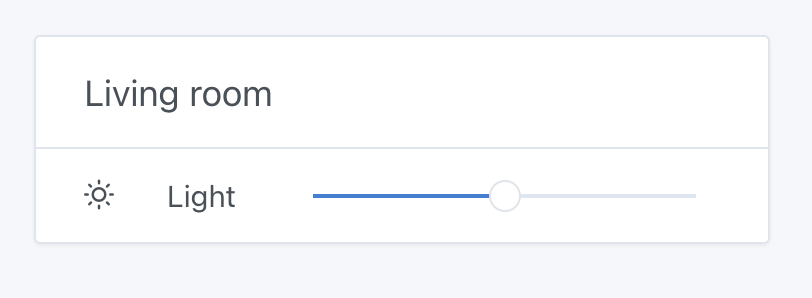
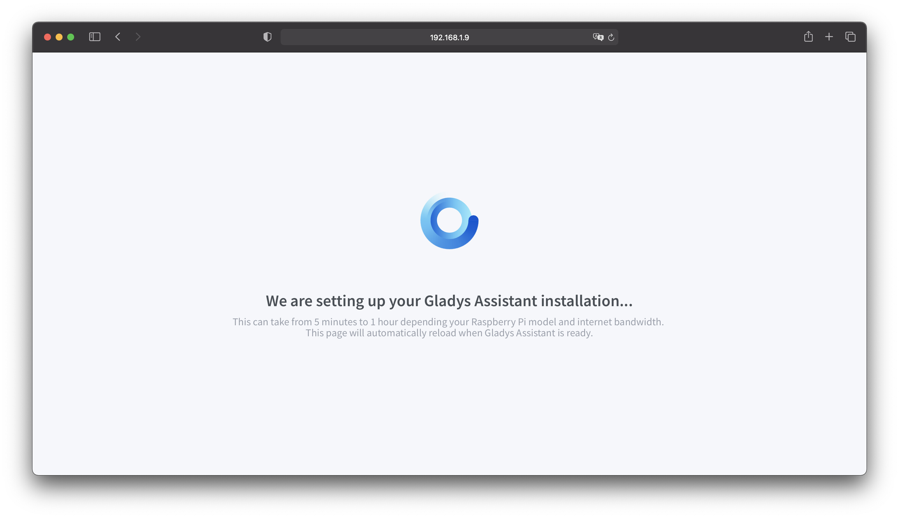

Hallo zusammen,

Gladys v4.2.0 erscheint heute! Schon!

Seit dem Start von Gladys Assistant 4 im letzten November haben immer mehr Contributors ihren Beitrag geleistet und neue Funktionen für Gladys Assistant beigesteuert.

Seit November haben wir **11 neue Versionen von Gladys** veröffentlicht. Das sind fast 3 neue Releases pro Monat. Wir geben Gas!

{/* truncate */}

## Was ist neu in Version 4.2

### Zigbee2mqtt

Es ist offiziell: Die [Zigbee2mqtt](https://www.zigbee2mqtt.io/)-Integration ist jetzt in Gladys 4 integriert 🚀

Damit ist es jetzt möglich, eine große Auswahl an Zigbee-Geräten über einen Zigbee-USB-Stick zu steuern. Hier ist die [Liste der unterstützten Geräte](https://www.zigbee2mqtt.io/information/supported_devices.html).

Das ist das Ergebnis monatelanger Arbeit vieler Mitglieder der Community. Danke an [Reno](https://community.gladysassistant.com/u/reno/summary) für die erste Entwicklung, danke an [cicoub13](https://community.gladysassistant.com/u/cicoub13/summary) für die Wiederaufnahme der Entwicklung und danke an [lmilcent](https://community.gladysassistant.com/u/lmilcent/summary) fürs Testen!

Momentan werden noch nicht unbedingt alle Geräte perfekt unterstützt, was normal ist, da wir nicht jedes erdenkliche Gerät der Welt besitzen. Es kann sein, dass noch einige Anpassungen nötig sind, die wir im Laufe der Nutzung dieser Integration entdecken werden.

Sieh dir [die Dokumentation dieser Integration](/de/docs/integrations/zigbee2mqtt) an.

Zögere nicht, im Forum Feedback zu geben, wenn du auf ein Gerät stößt, das nicht richtig unterstützt wird.

### Sonnenaufgang / Sonnenuntergang

Es ist jetzt möglich, Szenen zu erstellen, die bei Sonnenuntergang oder Sonnenaufgang ausgelöst werden.

Danke an [Lokkye](https://community.gladysassistant.com/u/lokkye/summary) für die Arbeit an diesem PR!

### Philips Hue

Wir haben die NPM-Abhängigkeit, die wir in der Philips-Hue-Integration verwenden, auf die neueste Version aktualisiert.

Einige Nutzer hatten Probleme, eine Philips-Hue-Bridge in ihrem Netzwerk zu finden, weil wir bisher den N-UPnP-Scan von Philips Hue verwendet haben, der auf deren Online-API basiert.

Wir haben diese Funktion so geändert, dass sie über den UPnP-Scan im Netzwerk läuft, der komplett lokal und ohne Aufrufe an die Server von Philips Hue stattfindet. Das sollte die Probleme beheben, die einige von euch hatten!

### Helligkeitssteuerung im Dashboard

Dank der Arbeit von [VonOx](https://community.gladysassistant.com/u/vonox/summary) kannst du jetzt die Helligkeit deiner Lampen im Dashboard steuern.

### Gladys Plus

Ich habe meine Arbeit an Optimierungen und Performance fortgesetzt, um den Zugriff auf Gladys Plus zu beschleunigen!

Bei meinen Recherchen habe ich eine Möglichkeit gefunden, die Last sowohl auf den Gladys-Plus-Servern als auch auf den lokalen Instanzen zu reduzieren.

Diese Änderung verbessert die Performance drastisch, und ich bin gespannt, wie sich das in Produktion auf größeren Instanzen (wie der von Terdious) oder auf Instanzen mit langsamer Verbindung (wie der von Mastho) auswirkt.

### Großes Update mehrerer interner Abhängigkeiten

Wir haben die Gelegenheit genutzt, einige der von uns verwendeten Abhängigkeiten umfassend zu aktualisieren:

- Von Node 12 -> auf Node.js 14 LTS
- Von Sequelize 4 -> auf Sequelize 6
- Wir sind auf die neueste Version von [node-nlp](https://github.com/axa-group/nlp.js) umgestiegen, der Bibliothek, die wir in Gladys für die Spracherkennung nutzen. Laut unseren Tests erkennt das Sprachverarbeitungsmodell Anfragen deutlich besser! Außerdem wurden dem Wettermodul neue Sätze hinzugefügt, für noch reichhaltigere Gespräche mit Gladys 😄

Nicht alles war einfach umzusetzen, aber wir sind froh, es geschafft zu haben!

## Wie aktualisiere ich?

Um Gladys zu aktualisieren, empfehlen wir Watchtower: Es aktualisiert deinen Container automatisch, sobald eine neue Version erscheint. Siehe die [Dokumentation](/de/docs/installation/docker#auto-upgrade-gladys-with-watchtower).

## Ein neues Raspberry-Pi-OS-Image

Ich nutze die Gelegenheit, um anzukündigen, dass wir ein neues Raspberry-Pi-OS-Image haben, das wir automatisch mit demselben Build-Prozess bauen, den auch die Raspberry Pi Foundation verwendet!

Dieses Image hat mehrere Vorteile:

- Es ist immer aktuell. Wenn du Gladys auf einem Raspberry Pi installierst, sucht dieses Image während der Installation automatisch nach der neuesten Version von Gladys. Beim ersten Start siehst du während der automatischen Installation von Gladys eine Warteseite 🙂

- Es ist einfacher für uns, denn jetzt können wir automatisch ein neues Image bauen, sobald die Foundation ein neues Raspberry-Pi-Modell veröffentlicht.

Vielen Dank an [VonOx](https://community.gladysassistant.com/u/vonox/summary) für die großartige Arbeit. Ich hätte es nicht besser machen können!!

## Danke

Diese neue Version ist das perfekte Beispiel für die Stärke von Open Source: gemeinsam das zu schaffen, was wir allein nicht schaffen würden.

Einmal mehr hat die Gladys-Community gezeigt, dass sie da ist, um gemeinsam zu entwickeln, gemeinsam zu testen und dieses Projekt voranzubringen.

Danke an alle, die zu diesem Release beigetragen haben 👏👏

Pierre-Gilles Leymarie
