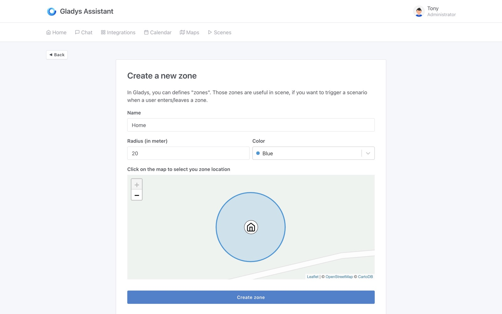
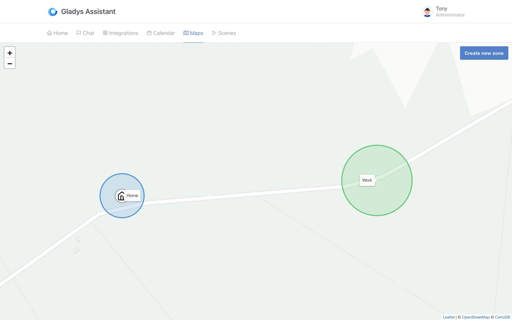
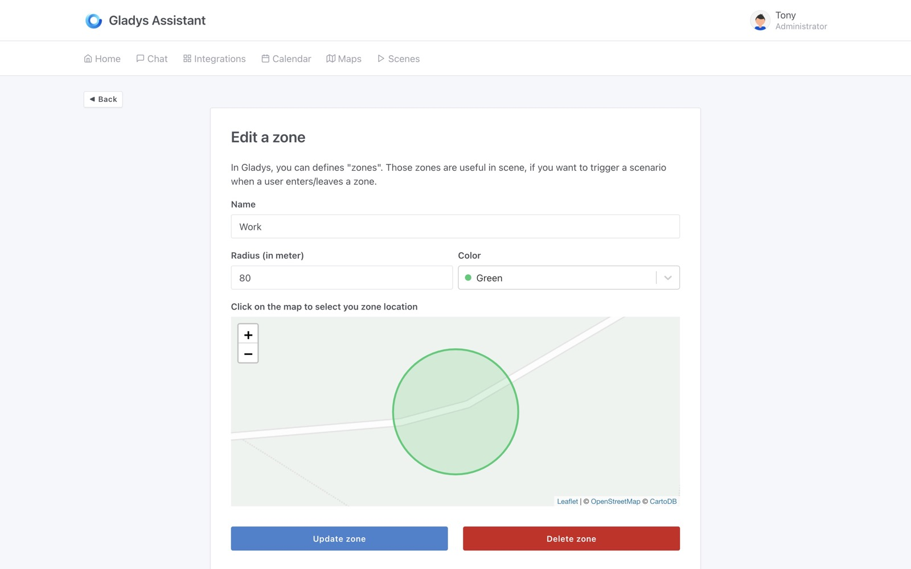
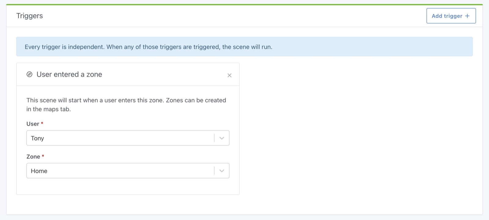
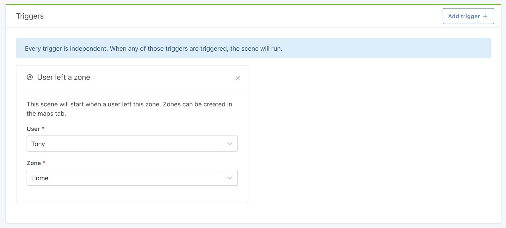
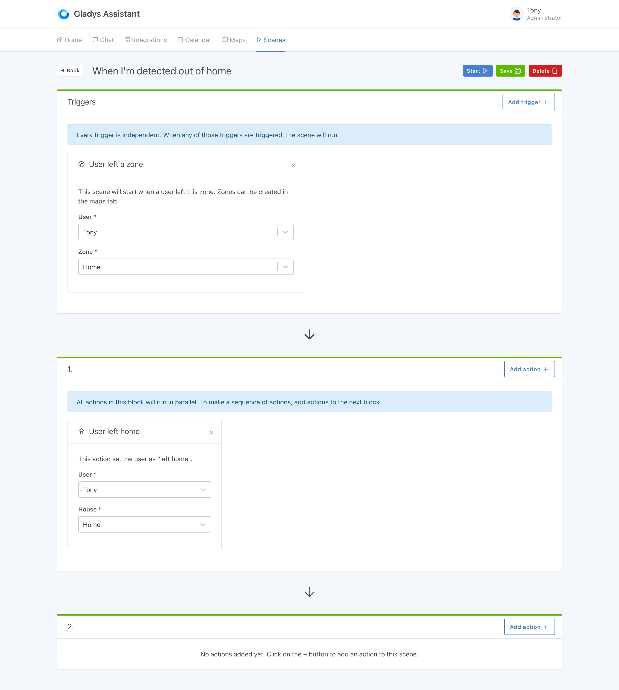
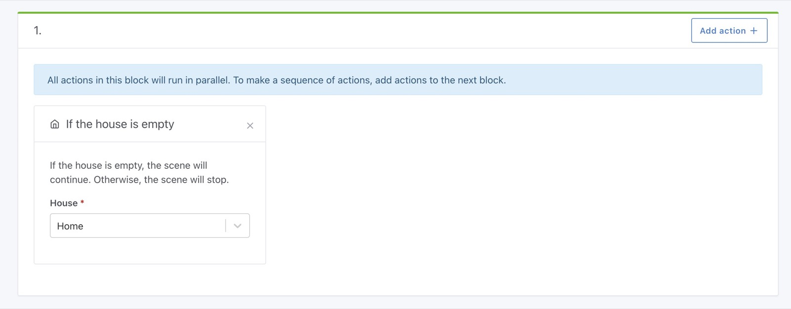
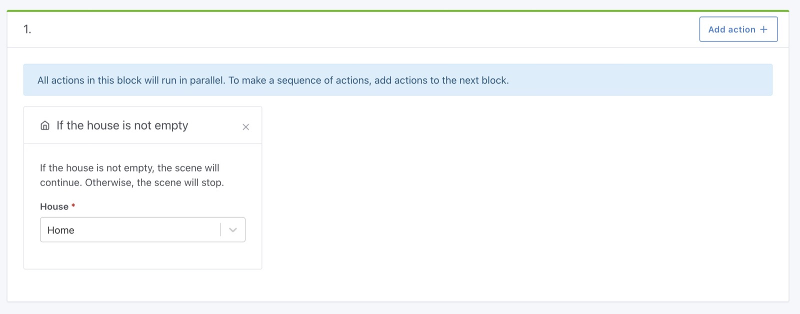
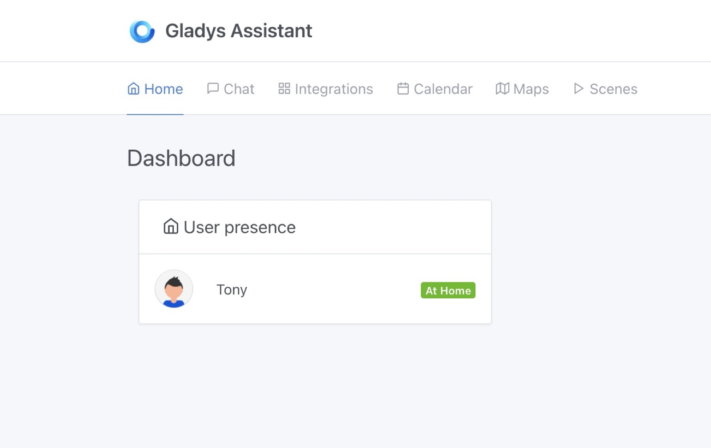

Hallo zusammen,

Heute veröffentlichen wir Gladys Assistant v4.4, eine brandneue Version, die die Kartenansicht in Gladys endlich richtig nützlich macht!

## Was ist neu in Gladys Assistant 4.4?

### Zonen in der Kartenansicht erstellen

Auf der Karte kannst du jetzt Zonen erstellen:

- Für dein Zuhause
- Deine Arbeit
- Die Schule
- Buchstäblich überall auf der Welt!

Deine erstellte Zone sollte dann auf der Karte erscheinen

Diese Zonen kannst du natürlich auch bearbeiten:

{/* truncate */}

### Eine Szene starten, wenn ein Nutzer eine Zone betritt/verlässt

Mit den zuvor erstellten Zonen kannst du jetzt eine Szene erstellen, die ausgelöst wird, wenn ein Nutzer die Zone betritt:

oder wenn der Nutzer die Zone verlässt:

## Ein Beispiel: Deinen Nutzer auf „zu Hause“ oder „unterwegs“ setzen

Stell dir vor, du möchtest deinen Nutzer auf „zu Hause“ setzen, wenn du eine Zone betrittst, und auf „unterwegs“, wenn du sie verlässt.

Dafür erstellst du zwei Szenen, eine für „zu Hause“:

Und eine für „unterwegs“:

### Bedingung „Haus leer/nicht leer“ in Szenen

Es war bereits möglich, eine Szene zu erstellen, die ausgelöst wird, wenn ein Haus leer/nicht leer ist, aber man konnte in einer Szene keine Bedingung hinzufügen, um nur fortzufahren, wenn das Haus leer/nicht leer ist.

Jetzt geht das!

Mit dieser Szene kannst du die Anwesenheitskarte zum Dashboard hinzufügen:

### Bugfixes

In diesem Release haben wir einige Bugs behoben:

- Der Aufruf einer Szene aus einer Szene dupliziert jetzt das Scope-Objekt, um eine Verunreinigung des Kontexts zu vermeiden [`#1205`](https://github.com/GladysAssistant/Gladys/pull/1205)
- Log in der Szenen-Aktion „Nur fortfahren, wenn“ korrigiert [`#1201`](https://github.com/GladysAssistant/Gladys/pull/1201)

## Wie aktualisiere ich?

Um Gladys zu aktualisieren, empfehlen wir Watchtower: Es aktualisiert deinen Container automatisch, sobald eine neue Version erscheint. Siehe die [Dokumentation](/de/docs/installation/docker#auto-upgrade-gladys-with-watchtower).

## Danke an die Contributors

Danke an alle, die zu diesem Release beigetragen und ihr Feedback im Forum gegeben haben!

Wenn du über dieses Release sprechen möchtest, bist du im [Forum](https://community.gladysassistant.com/) herzlich willkommen!
