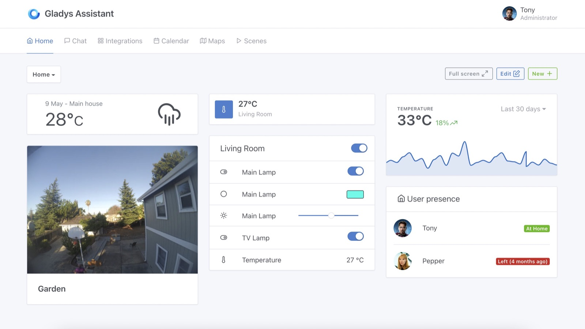

Hallo zusammen!

Diese Woche veröffentliche ich eine Reihe großer Funktionen, die schon seit einiger Zeit gewünscht wurden 🚀

Alles ist in Gladys Assistant v4.7 verfügbar 🥳

## Was ist neu in Gladys Assistant v4.7?

### Diagramme im Dashboard

Wir haben jetzt eine native Möglichkeit, Diagramme im Dashboard anzuzeigen – komplett automatisch und ohne eine Drittanbieter-Datenbank wie InfluxDB einrichten zu müssen.

{/* truncate */}

Dafür aggregiert Gladys jetzt alle Gerätedaten in 3 verschiedenen Granularitätsstufen:

- Stündliche Daten: Gladys speichert maximal 100 Werte pro Gerätefunktion und pro Stunde.
- Tägliche Daten: Gladys speichert maximal 100 Werte pro Gerätefunktion und pro Tag.
- Monatliche Daten: Gladys speichert maximal 100 Werte pro Gerätefunktion und pro Monat.

Beim Anzeigen eines Diagramms im Dashboard verwendet Gladys einen dieser 3 aggregierten Datensätze, um das Diagramm so schnell wie möglich darzustellen.

Unser Ziel ist es, unabhängig von der Datenmenge, die dein Sensor speichert, unter 100 ms Antwortzeit zu bleiben.

Wie du diese Funktion einrichtest, erfährst du in [der Dokumentation](/de/docs/dashboard/chart).

### Volle Zigbee2mqtt-Kompatibilität

Als wir dieses Jahr die Zigbee2mqtt-Kompatibilität veröffentlicht haben, sind wir sehr vorsichtig vorgegangen:

Jedes Gerät musste manuell von einem Entwickler klassifiziert werden, bevor es in Gladys genutzt werden konnte.

Für den Anfang war dieser Ansatz sicherer, weil er es uns ermöglichte, jedes Gerät besser zu integrieren, eine große Bandbreite an Zigbee-Geräten zu verstehen und Gladys an diese Geräte anzupassen.

Doch nach einiger Zeit wurde es sehr repetitiv, für jedes neue Zigbee-Gerät einen eigenen PR zu schreiben, also haben wir einen anderen Ansatz gewählt:

Jedes Gerät automatisch erkennen!

Dank Alexandre Trovato und seinem [Pull Request #1302](https://github.com/GladysAssistant/Gladys/pull/1302) können wir jetzt die von Zigbee2mqtt gesendeten Daten auswerten, um diese Geräte automatisch den Funktionen von Gladys zuzuordnen.

Das bedeutet: Alle Zigbee2mqtt-kompatiblen Geräte sind jetzt nativ mit Gladys kompatibel!

### In der Tasmota-Integration einen Schalter in ein Licht umwandeln

Das war ein häufiges Feedback: Manche Nutzer schließen eine Lampe an einen Schalter an und möchten daher, dass dieser Schalter in Gladys als Licht behandelt wird.

Wenn ich zum Beispiel sage „Mach das Licht im Wohnzimmer an“, sollte das auch diese Schalter einschalten.

In der Tasmota-Integration kannst du jetzt einen Schalter in ein Licht umwandeln.

### Neue Kategorie „Gerätetemperatur“ zur Überwachung der CPU-Temperatur

Manche Geräte senden einen Wert für die Temperatur ihrer CPU.

In Gladys hatten wir nur eine Kategorie „Temperatur“, und das Problem war: Auf die Frage „Wie warm ist es im Wohnzimmer?“ antwortete Gladys mit der CPU-Temperatur des Computers in deinem Wohnzimmer...

Jetzt gibt es eine eigene Kategorie „Gerätetemperatur“, mit der du diese CPU-Temperaturen klar zuordnen kannst, ohne die Funktion „Raumtemperatur“ in Gladys zu beeinflussen.

Entwickelt in [#1327](https://github.com/GladysAssistant/Gladys/commit/94acaac8fd32c3c0e0c82c581f10904d5ed36f0d).

### Viele Verbesserungen und Bugfixes

- In der MQTT-Integration wird jetzt angezeigt, ob der Broker verbunden ist oder nicht ([#1349](https://github.com/GladysAssistant/Gladys/commit/a5c95dcfbfc84b8ddde141a4e3680cae9fb659ce))
- In der CalDAV-Integration ist das Datum bei wiederkehrenden Terminen jetzt korrekt ([#1367](https://github.com/GladysAssistant/Gladys/commit/b6ab1c06e94f804c6077da7b99e5e258ef0cf475))
- In der Telegram-Integration wird die Temperatur jetzt im richtigen Format des Nutzers angezeigt ([#1363](https://github.com/GladysAssistant/Gladys/commit/bcbb1234b1590fb14a2af5eef87065c966297287))
- Im Szenen-Tab wurde ein Bug behoben, der verhinderte, dass man den Namen einer Szene bearbeiten konnte ([#1318](https://github.com/GladysAssistant/Gladys/commit/7ed2d520b8b5b6c03b539311903425393797aaa1))
- Viele Bugfixes und Verbesserungen an der eWeLink-Integration ([#1044](https://github.com/GladysAssistant/Gladys/commit/a755d55f2ebb70983111343018b3fd9a1590933b))

## Wie aktualisiere ich?

Um Gladys zu aktualisieren, empfehlen wir Watchtower: Es aktualisiert deinen Container automatisch, sobald eine neue Version erscheint. Siehe die [Dokumentation](/de/docs/installation/docker#auto-upgrade-gladys-with-watchtower).

## Danke an die Contributors

Danke an alle, die zu diesem Release beigetragen und ihr Feedback im Forum gegeben haben!

Wenn du über dieses Release sprechen möchtest, bist du im [Forum](https://community.gladysassistant.com/) herzlich willkommen!
