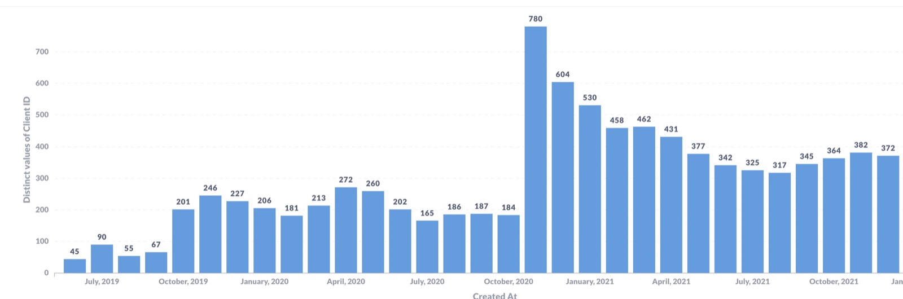
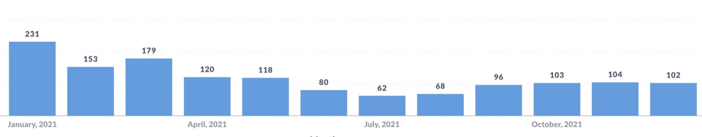
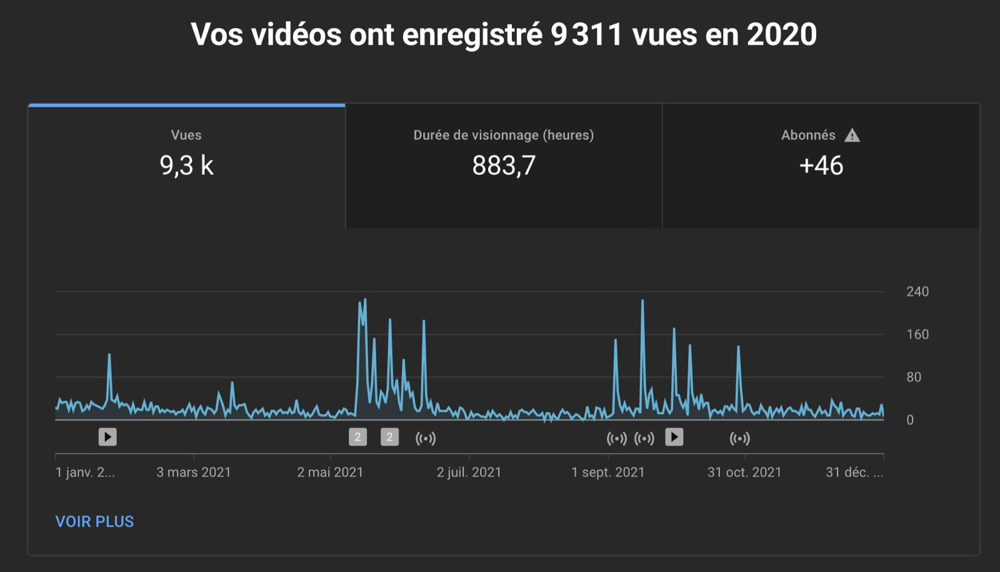
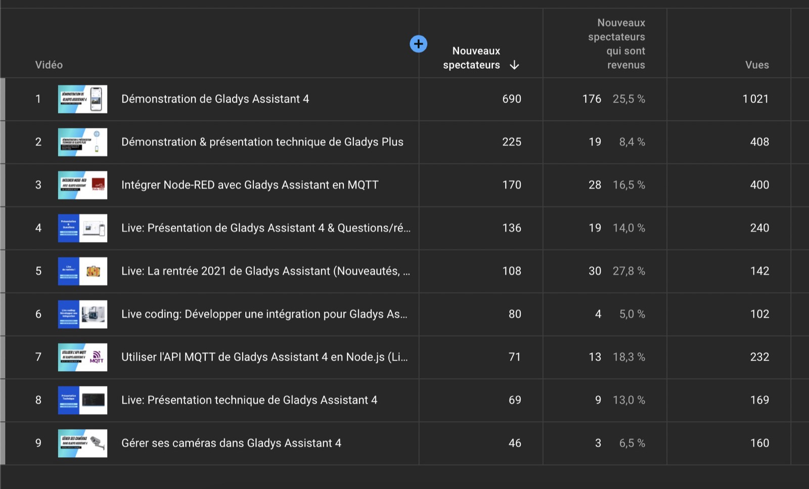

Hallo zusammen und ein frohes neues Jahr!

Es ist schon Tradition: Jedes Jahr schreibe ich einen Artikel, der alles zusammenfasst, was im vergangenen Jahr bei Gladys Assistant passiert ist.

Willkommen zur Ausgabe 2021 dieses Artikels 😄

{/* truncate */}

## Was ist 2021 passiert?

2021 war das produktivste Jahr in der Geschichte des Projekts: **Wir haben 23 Updates veröffentlicht**, also im Schnitt alle 2,2 Wochen ein Update!

Diese Produktivität ist das Ergebnis der ganzen Vorarbeit, die 2019 und 2020 geleistet wurde, um diese neue Version von Gladys (Gladys 4) mit einem moderneren Tech-Stack aufzusetzen. Dieser Stack gibt uns mehr Vertrauen in den Code, den wir veröffentlichen, macht das Testen einfacher und erlaubt es uns dadurch, Features und Bugfixes schneller auszuliefern.

Und es ist vor allem **das Engagement der gesamten Community**, das dem Projekt dieses Tempo ermöglicht hat.

Ohne die PRs all der Mitwirkenden wäre eine so breite Kompatibilität, ein so vollständiges Produkt und eine so schnelle Reaktion auf Bugs unmöglich.

DANKE an alle Mitwirkenden: Alexandre Trovato, Vincent Kulak, Bertrand D'Aure, Cyril Beslay, Corentin Allemand, NickDub, Sescandell, Terdious, Frédéric Le Barzic, Rob McCann, Thibaud Roudier und Nicolas Geissel! 🙏

Zu den Features, die in diesem Jahr entwickelt wurden, gehören unter anderem:

- Zigbee2mqtt-Integration, Erkennung von Sonnenaufgang/Sonnenuntergang, Helligkeitssteuerung im Dashboard in [Gladys Assistant 4.2](/de/blog/gladys-assistant-4-2-is-here)
- Anwesenheitsverwaltung in Szenen, zeitbasierte Bedingungen in Szenen, HTTP-Anfragen in Szenen in [Gladys Assistant 4.3](/de/blog/gladys-assistant-4-3-is-here)
- Erkennung beim Betreten und Verlassen von Zonen, Bedingung „Haus leer / nicht mehr leer“ in Szenen in [Gladys Assistant v4.4](/de/blog/gladys-assistant-4-4-is-here)
- Mehrere Dashboards, Google-Home-Integration, Möglichkeit eine Szene zu deaktivieren, beliebige Geräte in einer Szene steuern in [Gladys Assistant v4.5](/de/blog/gladys-assistant-4-5-is-here)
- Anzeige von Sensor-Diagrammen im Dashboard, volle Kompatibilität mit allen Zigbee2mqtt-Geräten in [Gladys Assistant v4.6 und v4.7](/de/blog/display-chart-and-major-zigbee2mqtt-upgrade)

Wie du siehst, konnten wir für jedes neue Feature Dokumentation und Blogartikel schreiben.

Auch das ist das Ergebnis der Vorarbeit an der Website, die das Veröffentlichen von Artikeln deutlich vereinfacht hat. Ich hoffe, diesen Schwung 2022 beizubehalten und noch mehr Inhalte zu schreiben.

## Ein paar Statistiken

Die Seite [/open](/de/open/) ist wieder auf der Website und zeigt dir in Echtzeit die Anzahl der laufenden Gladys-Instanzen und die Anzahl der Gladys-Plus-Nutzer (und damit die Einnahmen des Projekts).

### Nutzung

Seit v4 schätzen wir die Anzahl aktiver Instanzen, indem wir die Update-Anfragen zählen, die bei unserer Infrastruktur eingehen.

Hier die Anzahl aktiver Installationen pro Monat seit dem Start von v4 (inklusive Alpha):

Und hier die Anzahl neuer Instanzen pro Monat:

Im November 2020 wurde Gladys v4 veröffentlicht, und es erschienen viele Artikel auf Fachseiten, was die Downloads in den folgenden Monaten stark angekurbelt hat.

Der Sommer 2021 war bei Nutzung und Neuzugängen sehr schwach – was nicht überrascht, denn Frankreich hatte in dieser Zeit die Lockdown-Maßnahmen gelockert und kaum jemand saß einfach nur vor dem Computer.

Zum Glück zog das Wachstum im September wieder an, und Ende Dezember 2021 kamen wir schließlich auf **372 aktive Instanzen**.

Eine schöne Zahl, aber sie liegt unter meinen Erwartungen.

Mein Ziel waren 1.000 aktive Instanzen – davon sind wir im Moment noch weit entfernt 😄

### Der YouTube-Kanal

Ab Mai 2021 habe ich das Thema YouTube ernsthaft angepackt 😎

Ich habe 5 Videos veröffentlicht und 5 YouTube-Livestreams gemacht.

Das ist eine Menge Arbeit, denn jedes Video bzw. jeder Livestream kostet mich etwa einen vollen Arbeitstag: Vorbereitung, Ankündigung vor dem Live, Dreh, Schnitt, Veröffentlichung (Thumbnail, Beschreibung, Zeitstempel, Social-Media-Posts, Newsletter).

10 Videos entsprechen also 10 Arbeitstagen. Da ich nur in Teilzeit an Gladys arbeite, macht das über das Jahr verteilt ungefähr einen Monat Arbeit aus. Man sieht es nicht, aber es ist ein riesiger Aufwand 😅

Meine Videos sind alle auf Französisch, da ich Franzose bin. Falls du Interesse hast, hier meine beliebtesten Videos:

- [Demonstration von Gladys Assistant 4](https://www.youtube.com/watch?v=yP-umEMVcro)
- [Live: Technische Vorstellung von Gladys 4](https://www.youtube.com/watch?v=t6mVCZ5Y9SU)
- [Node-RED per MQTT mit Gladys Assistant verbinden](https://www.youtube.com/watch?v=bpmHzR8_S5g)
- [Demonstration & technische Vorstellung von Gladys Plus](https://www.youtube.com/watch?v=TmjrBeufjyo)

2021 hatte der Kanal 9.300 Aufrufe und 883 Stunden Wiedergabezeit.

Ein guter Anfang, und ich mache 2022 in diese Richtung weiter, denn Videos sind für mich ein echter Gewinn für das Projekt:

- Dank des YouTube-Algorithmus werden die Videos Zuschauern angezeigt, die Gladys noch nicht kennen, sich aber für Hausautomation, den Raspberry Pi oder die anderen Tech-Themen interessieren, über die ich spreche. Diese Zuschauer entdecken das Projekt über YouTube und installieren Gladys danach vielleicht selbst.

YouTube zeigt mir sogar Statistiken zu diesen Nutzern:

- Videos sind eine gute Ergänzung zu schriftlichen Tutorials, denn es ist oft einfacher, etwas nachzumachen, das man im Video sieht, als etwas, das man in einem Artikel liest. Man kann sich einfach besser hineinversetzen!

Wenn du dir ein bestimmtes Thema als Video wünschst, sag es mir gern im Forum oder auf Twitter – ich bin für jedes Videothema offen.

### Soziale Netzwerke

In den sozialen Netzwerken:

- [@gladysassistant auf Twitter](https://twitter.com/gladysassistant) hat 2.744 Follower
- [Gladys Assistant auf Facebook](https://www.facebook.com/gladysassistant) zählt 756 Likes
- [@gladysassistant auf Instagram](https://www.instagram.com/gladysassistant) versammelt 573 Abonnenten

Und schließlich 1.874 Follower auf [meinem persönlichen Twitter](https://twitter.com/pierregillesl)!

### Der Newsletter

Beim Newsletter folgen 3.508 von euch dem [Gladys-Assistant-Newsletter](https://email-list.gladysassistant.com/subscription/haflMsWmU).

- 3.016 Abonnenten auf Französisch
- 492 Abonnenten auf Englisch

Das ist ein Rückgang gegenüber dem Vorjahr, aber völlig normal! Ich habe Regeln zur Bounce-Erkennung eingeführt, die die Liste von alten E-Mail-Adressen bereinigt haben, die es nicht mehr gibt.

Ein „Bounce“ ist eine E-Mail, deren Empfänger nicht mehr erreichbar ist: Die Domain oder die Adresse existiert nicht mehr. Das kommt im Gladys-Publikum häufig vor, weil einige von euch eine eigene Domain für ihre E-Mail nutzen (z. B. vorname_at_nachname.com) und diese Adresse irgendwann aufgeben bzw. die Domain nicht verlängern.

### Gladys Assistant auf GitHub

Wir stehen bei 1.879 Sternen ⭐ im [Gladys-Assistant-Repository](https://github.com/GladysAssistant/Gladys).

Das sind +21 % im Vergleich zum Vorjahr!

Wieder ein zweistelliges Wachstum auf GitHub 😍

Ich zähle auf dich: Unterstütze uns auf GitHub, indem du dem Projekt einen Stern ⭐ gibst.

## Projekte und Ziele für 2022

### Ein technisch solides Produkt

Für mich dienten die letzten 2 Jahre dazu, das Fundament für eine robuste, stabile und einfach zu bedienende Hausautomations-Software zu legen.

Jetzt, wo die Basis steht, sind wir bei Reisegeschwindigkeit angekommen: Es wird regelmäßig entwickelt, die Website wächst mit jedem neuen Feature, im Blog erscheinen regelmäßig Artikel, und ich mache YouTube-Videos, um jedes neue Feature in Gladys zu erklären.

Anders gesagt: Schluss mit Experimenten und Proofs of Concept – v4 ist wirklich stabil, und die Abläufe, die wir mit der Community etabliert haben, funktionieren gut.

### Aber die Nutzung zieht noch nicht mit

Die Nutzung spiegelt allerdings noch nicht die ganze geleistete Arbeit wider. Auf der Tech-Seite haben wir einen Punkt erreicht, an dem die Prozesse gut eingespielt sind und wir ein gutes Tempo haben – diesen Punkt haben wir bei der Nutzung noch nicht erreicht.

Bei der Gewinnung neuer Nutzer ist das noch nicht der Fall.

Leider gibt es beim Produkt noch kein stetiges Wachstum. Wie wir an der Jahreskurve gesehen haben, war die Zahl der Installationen beim Launch sofort sehr hoch (dank der verschiedenen Artikel auf reichweitenstarken Hausautomations-Seiten), aber sobald der Launch-Effekt verpufft war, kam nichts mehr.

Im September kam das Wachstum sehr langsam zurück, aber das reicht ganz klar nicht.

Meiner Meinung nach gibt es dafür mehrere Gründe:

- Beim Launch fehlten Integrationen und wichtige Funktionen (z. B. Zigbee2mqtt / Zonenverwaltung / Mehrbenutzer / mehrere Dashboards / Diagrammansicht). Ich kann mir vorstellen, dass einige neue Nutzer Gladys im Launch-Monat getestet und dann zur Seite gelegt haben. Diese Features sind jetzt vorhanden, aber ich bin nicht sicher, ob man außerhalb der Community von all diesen Entwicklungen weiß.

- Unsere Z-Wave-Integration wurde mangels Maintainer nicht gepflegt und ist ganz klar nicht auf dem neuesten Stand. Z-Wave ist immer noch ein recht verbreitetes Protokoll, vor allem bei den „Profis“ der Hausautomation 😄. Ein spezialisierter Tester (YouTuber, Blogger), der einen Artikel über Gladys schreiben will, testet mit dem, was er zu Hause hat: oft Z-Wave.

Langfristig bin ich mir nicht sicher, ob Z-Wave diese Marktanteile halten wird, wenn man sich die neuen Technologien ansieht: Zigbee-Geräte für 8 $ für einen guten Sensor und 8 $ für einen USB-Stick vs. Z-Wave-Geräte für 60 $ für einen einzigen Sensor und 25 $ für den USB-Stick. Dazu der kommende Hausautomations-Standard Matter, komplett Open Source. Und Bluetooth Low Energy.

Kurzfristig haben Hausautomations-Nutzer, für die Z-Wave die Haupttechnologie ist, aber Probleme mit Gladys, und das ist nicht gerade gute Werbung für die Software.

- Vermutlich zu wenig Kommunikation außerhalb des Projekts. Über YouTube versuche ich, neue Leute zu erreichen, aber ich sollte mich meiner Meinung nach mehr auf bestehende Medien stützen: als Gast in Livestreams (Twitch / YouTube) auftreten? Mehr Hausautomations-Medien kontaktieren? Mehr Präsenz in fremden Foren?

Wenn du Ideen oder Feedback hast, einen Blog betreibst oder jemanden kennst, der uns helfen könnte, Gladys bekannter zu machen – zögere nicht!

### Ein bisschen Optimismus

Keine Sorge, ich beschwere mich nicht 😄

Das ist die Realität jedes Produkt-Launches: Nichts fällt vom Himmel, und manchmal dauert es Jahre, bis ein Produkt stetig wächst. Ich habe Freunde, deren Wachstum monatelang flach war und dann plötzlich senkrecht nach oben ging – oft ohne dass sie genau wussten, warum … Das Wichtigste ist, dranzubleiben und nicht lockerzulassen 💪

Auf jeden Fall danke an die gesamte Gladys-Community, die dieses Produkt möglich macht.

Danke an alle [Gladys Plus](/de/plus)-Unterstützer, die das Projekt finanziell unterstützen und dabei von tollen Features profitieren: Google Home, Backups, Ende-zu-Ende-verschlüsselter Fernzugriff, offene API.

Ein frohes neues Jahr 2022 an alle, und wir sehen uns im Forum, um über all das zu sprechen 🙂

Pierre-Gilles Leymarie
