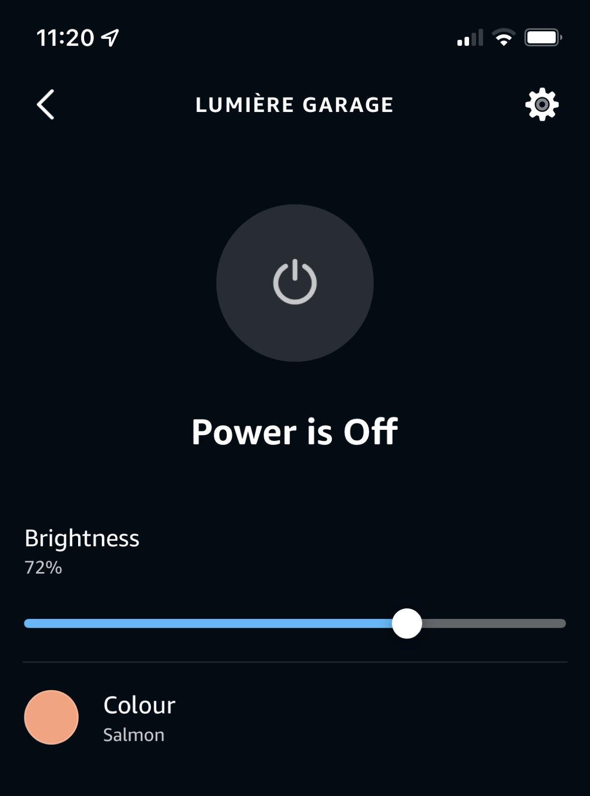
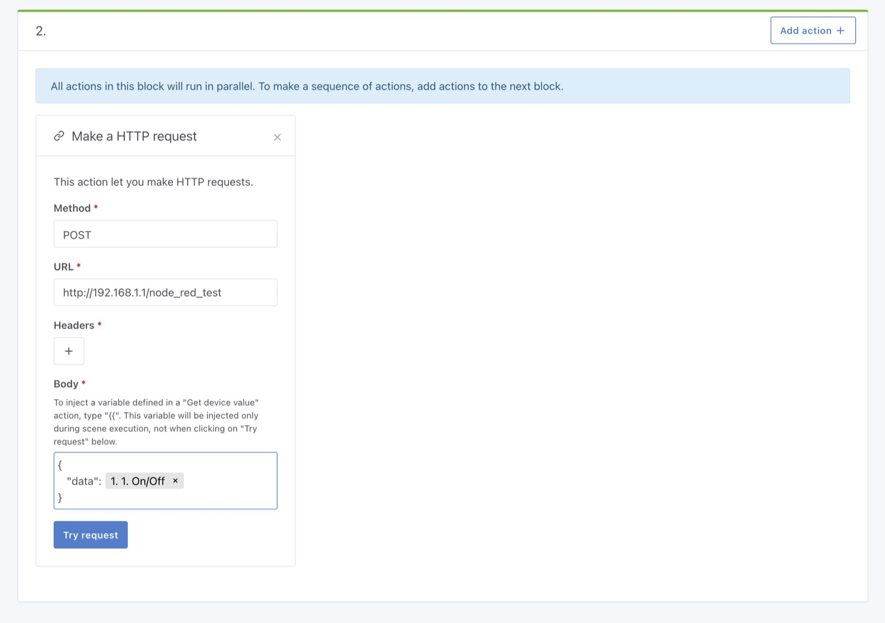

Hallo zusammen!

Heute veröffentliche ich ein neues Release, Gladys Assistant v4.9.

In dieser Version bringe ich eine große neue Integration zu Gladys: Amazon Alexa.

Damit sind wir jetzt mit allen Sprachassistenten kompatibel: [Google Home](/de/docs/integrations/google-home) und [Amazon Alexa](/de/docs/integrations/alexa).

{/* truncate */}

## Was ist neu in Gladys Assistant 4.9?

### Amazon-Alexa-Integration

Du kannst deine Gladys-Geräte jetzt über Amazon Alexa steuern.

Vorerst unterstützen wir 3 Arten der Steuerung:

- Ein/Aus (bei Lampen und Schaltern)
- Helligkeit von Lampen
- Farbe von Lampen

Das heißt, du kannst sagen:

- „Alexa, schalte das Licht im Wohnzimmer ein.“
- „Alexa, dimme das Licht im Badezimmer.“

Amazon Alexa ist mit wenigen Klicks eingerichtet.

Folge dazu unserer Dokumentation zur [Einrichtung von Amazon Alexa](/de/docs/integrations/alexa).

### Variablen in die Aktion „HTTP-Anfrage“ in Szenen einfügen

Du kannst jetzt beliebige Variablen einer Szene in die Aktion „HTTP-Anfrage“ einfügen.

Das ist super einfach und hilft dir, leistungsstarke Szenen zu bauen, zum Beispiel einen Aufruf von Node-RED mit einem eigenen Parameter!

## Zigbee2Mqtt: Unterstützung für Sonoff SNZB-01

Wir unterstützen jetzt mehr Klickarten am kabellosen Schalter Sonoff SNZB-01.

## Wie aktualisiere ich?

Um Gladys zu aktualisieren, empfehlen wir Watchtower: Es aktualisiert deinen Container automatisch, sobald eine neue Version erscheint. Siehe die [Dokumentation](/de/docs/installation/docker#auto-upgrade-gladys-with-watchtower).

## Danke an die Contributors

Danke an alle, die zu diesem Release beigetragen und ihr Feedback im Forum gegeben haben!

Wenn du über dieses Release sprechen möchtest, bist du im [Forum](https://community.gladysassistant.com/) herzlich willkommen!

## Unterstütze uns

Wenn du uns unterstützen möchtest, gibt es viele Möglichkeiten:

- Beiträge im Forum beantworten und dein Feedback geben.
- Uns helfen, die Dokumentation zu verbessern.
- Neue Funktionen/Integrationen für Gladys entwickeln – wir sind zu 100 % Open Source.
- Eine [einmalige Spende](https://www.buymeacoffee.com/gladysassistant) machen.
- Unser [monatliches Abo von Gladys Plus](/de/plus) abschließen.
