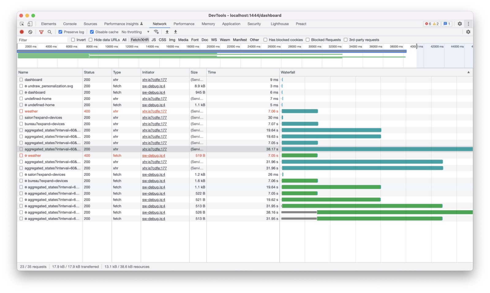
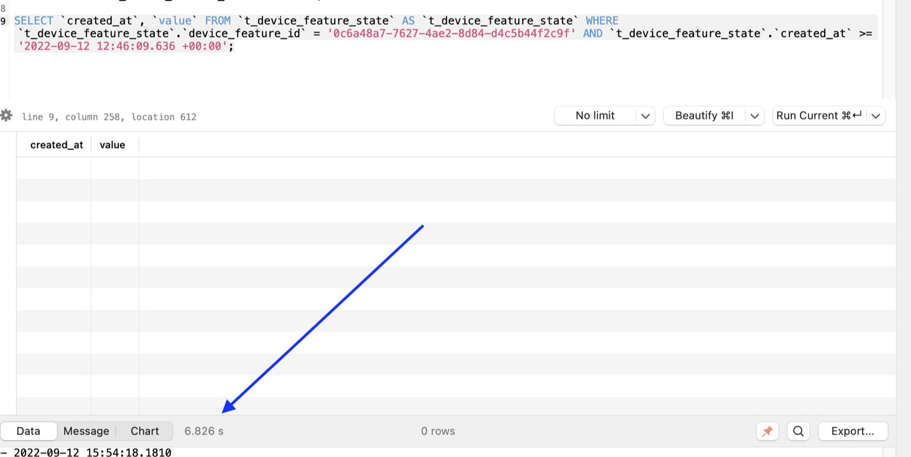
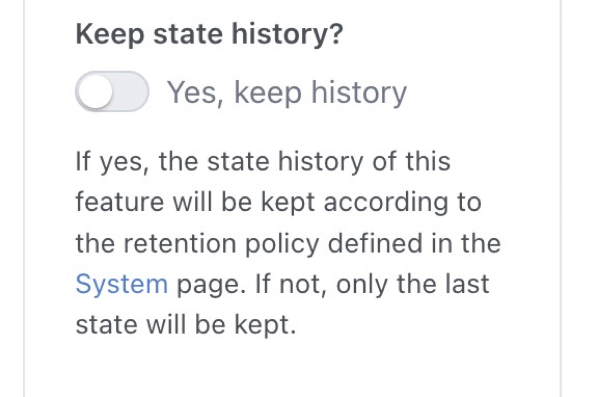
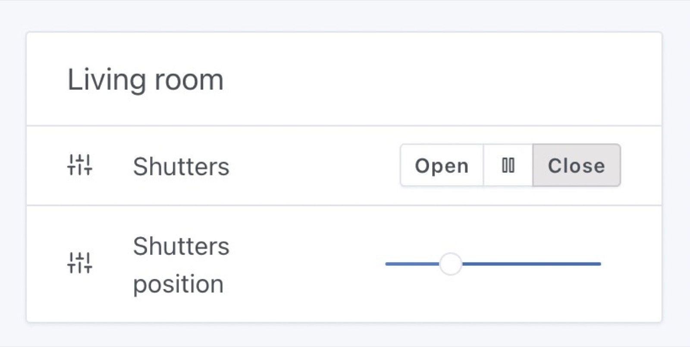
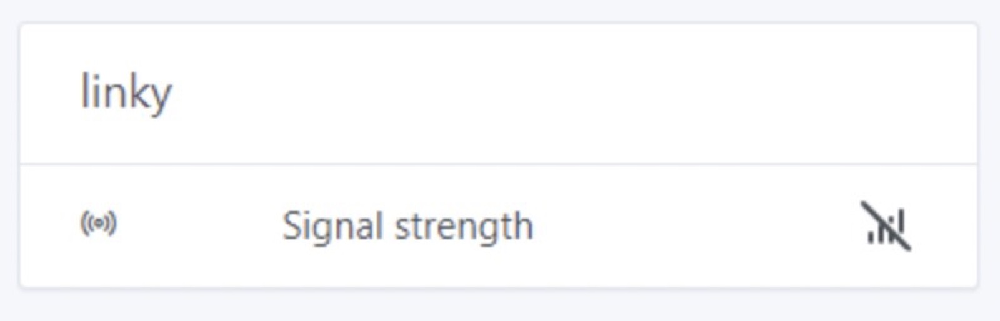

Hallo zusammen!

Ich hoffe, ihr hattet alle einen tollen Sommerurlaub 🙂

Heute veröffentliche ich Gladys Assistant v4.10, ein großes Release mit tollen neuen Features – sowohl bei den Integrationen als auch im Kern.

{/* truncate */}

## Was ist neu in Gladys Assistant 4.10?

### Broadlink-Kompatibilität

Wir haben eine neue Integration 🎉

Broadlink-Geräte sind kleine IR-Sender, die als Fernbedienung fungieren und sich über WLAN steuern lassen.


Mit Gladys v4.10 kannst du jetzt deine Broadlink-Geräte mit Gladys verbinden und damit die Geräte steuern, die dein Broadlink steuern kann (vorerst nur per Infrarot, nicht per Funk).

### Enorme Performance-Verbesserungen im Dashboard

Ich hatte Rückmeldungen bekommen, dass das Dashboard bei manchen Nutzern extrem langsam lädt, wenn mehrere Diagramme auf demselben Dashboard sind.

Also habe ich einen Nutzer gebeten, mir seine Datenbank zu schicken, um zu sehen, wo das Problem liegt.

Das hier habe ich gesehen:



Sein Dashboard brauchte bis zu 40 Sekunden zum Laden: überhaupt nicht normal!! 😅

Also habe ich jede einzelne SQL-Abfrage, die an der Anzeige des Dashboards beteiligt ist, einzeln ausgeführt.

Schnell habe ich festgestellt, dass einige super simple Abfragen bis zu 6 Sekunden liefen, nur um am Ende ein leeres Ergebnis zurückzugeben: nicht normal!



Mit `EXPLAIN QUERY PLAN` habe ich mir angesehen, was SQLite da eigentlich macht.

Dabei ist mir aufgefallen: Obwohl ich auf beiden in der Abfrage verwendeten Attributen (`device_feature_id` und `created_at`) die richtigen Indizes hatte, nutzte SQLite nur einen Index für den ersten Filter und musste dann alle Zeilen sequenziell durchgehen, um nach `created_at` zu filtern.

Die Lösung war einfach: Ich habe einen Index angelegt, der beide Attribute abdeckt:

```sql
CREATE INDEX ix_device_feature_state_device_feature_id_created_at
ON t_device_feature_state (device_feature_id, created_at);
```

Und sofort ging die Abfrage von 6 Sekunden auf … 5 ms! ⚡

Die Ladezeit seines Dashboards sank von 40 Sekunden auf 100 ms! ⚡

Diese Performance-Verbesserung ist in Gladys Assistant v4.10 enthalten.

Beachte, dass das Erstellen des Index etwas Zeit brauchen kann – das Update von Gladys kann also länger dauern als üblich.

### Auswählen, welcher Geräteverlauf gespeichert wird

Du kannst jetzt auswählen, für welche Geräte der Zustandsverlauf gespeichert werden soll.

Wenn du ein sehr gesprächiges Gerät hast, das Unmengen an Daten in deiner Datenbank ablegt, kannst du es jetzt vom Verlauf ausschließen. Gladys behält dann nur den letzten Wert.



### WebCal-Unterstützung

WebCal ist ein Standard für den Zugriff auf iCalendar-Dateien (`.ics`-Dateien).

Viele Organisationen teilen öffentliche Termine über WebCal-Kalender: Feiertage, Sportereignisse, TV-Sendungen, öffentliche Sitzungen und mehr.

Die CalDAV-Integration unterstützt jetzt die Synchronisierung dieser WebCal-Kalender.

Wenn du in deinem Kalender (iCloud, Nextcloud, …) WebCal-Kalender abonniert hast, kann Gladys sie jetzt synchronisieren!

### Unterstützung für Rollläden/Vorhänge in der MQTT-Integration

Wir unterstützen jetzt elektrische Rollläden und Vorhänge in der MQTT-Integration.



Du kannst in Gladys einen Rollladen anlegen und 3 Zustände steuern:

```
STOP: 0
OPEN: 1
CLOSE: -1
```

Außerdem kannst du die Position des Rollladens steuern (sofern dein Rollladen das unterstützt).

### Zigbee2mqtt: Signalqualität (LQI) im Dashboard anzeigen

Über Zigbee2mqtt erhalten wir ein Attribut zur „Signalstärke“, das anzeigt, ob ein Gerät weit vom Netzwerk entfernt ist oder nicht.

Wir unterstützen dieses Attribut (LQI) jetzt, und du kannst es in deinem Dashboard anzeigen:



### Zigbee2mqtt: Unterstützung für VOC-Sensoren (Luftqualitätssensoren)

VOC, also „flüchtige organische Verbindungen“, sind Chemikalien, die von verschiedensten Produkten im Haushalt abgegeben werden (Farben, Möbel, Kosmetik).

Manche Schadstoffwerte können in Innenräumen 2- bis 5-mal höher sein als draußen.

Es gibt Sensoren, die den VOC-Wert zu Hause messen – und die unterstützen wir jetzt in Gladys!

### Tasmota: Unterstützung für Geräte, die Arrays von Werten senden

Einige Geräte wie der mit Tasmota geflashte Sonoff Dual R3 wurden von Gladys nicht richtig verarbeitet.

Jetzt unterstützen wir sie vollständig!

### Viele Bugfixes/UI-Verbesserungen

Ich gehe nicht auf jede einzelne Änderung ein, aber wir haben auch einige kleine Bugs behoben und die Oberfläche verbessert!

Alle Details findest du im [CHANGELOG](https://github.com/GladysAssistant/Gladys/releases/tag/v4.10.0).

## Wie aktualisiere ich?

Um Gladys zu aktualisieren, empfehlen wir Watchtower: Es aktualisiert deinen Container automatisch, sobald eine neue Version erscheint. Siehe die [Dokumentation](/de/docs/installation/docker#auto-upgrade-gladys-with-watchtower).

## Danke an alle Mitwirkenden

Danke an alle, die zu diesem Release beigetragen und im Forum ihr Feedback gegeben haben!

Wenn du über dieses Release sprechen möchtest, bist du im [Forum](https://community.gladysassistant.com/) herzlich willkommen!

## Unterstütze uns

Wenn du uns unterstützen möchtest, gibt es viele Möglichkeiten:

- Beantworte Beiträge im Forum und gib Feedback.
- Hilf uns, die Dokumentation zu verbessern.
- Entwickle neue Features/Integrationen für Gladys – wir sind zu 100 % Open Source.
- Mach eine [einmalige Spende](https://www.buymeacoffee.com/gladysassistant).
- Abonniere [Gladys Plus](/de/plus).
