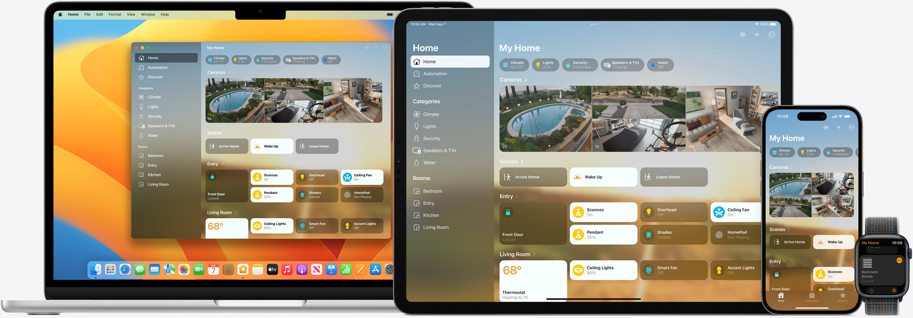
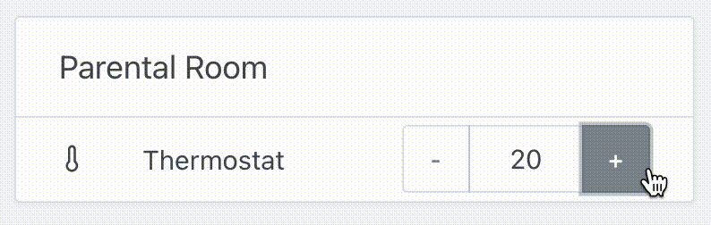
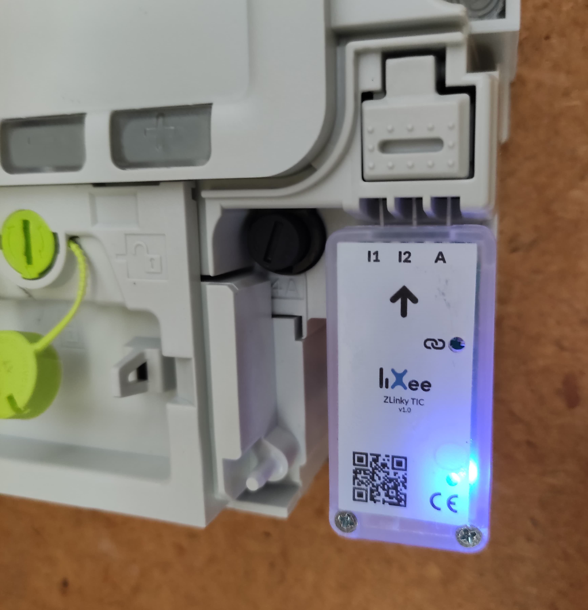

Hallo zusammen!

Heute freue ich mich, Gladys Assistant 4.12 mit jeder Menge neuer Features zu veröffentlichen.

{/* truncate */}

## Was ist neu in Gladys Assistant 4.12?

### HomeKit-Unterstützung

Gladys ist jetzt offiziell mit HomeKit kompatibel. Du kannst also alle deine Gladys-Geräte über deine Apple-Geräte steuern und Siri nutzen.

Vorerst unterstützen wir 3 Gerätetypen:

- Glühbirne (An/Aus, Farbe, Farbtemperatur und Helligkeit)
- Schalter (An/Aus)
- Temperatursensor

Weitere Gerätetypen kommen auf Anfrage im [Forum](https://community.gladysassistant.com/) dazu.

Um deine Gladys-Geräte mit HomeKit zu verbinden, folge [unserer Dokumentation](/de/docs/integrations/homekit)!

### Steuere dein Thermostat

In der MQTT-Integration gibt es jetzt einen neuen Gerätetyp: Thermostat 🚀

Du kannst jetzt ganz einfach die Temperatur in deinem Zuhause steuern und das Ganze auch in Szenen automatisieren.

### Für Nutzer in Frankreich: Stromverbrauch mit Zigbee Lixee TIC überwachen

Für Nutzer in Frankreich unterstützen wir jetzt den Lixee-TIC-Sensor – ein Gerät, das an den intelligenten Stromzähler Linky angeschlossen wird, um live zu sehen, wie viel Leistung dein Haus gerade verbraucht.

Das Gerät wird einfach an deinen Linky-Zähler gesteckt:

Es verbindet sich über die Zigbee2mqtt-Integration mit Gladys und zeigt dir den Stromverbrauch deines Hauses in Echtzeit an.

## Wie aktualisiere ich?

Um Gladys zu aktualisieren, empfehlen wir Watchtower: Es aktualisiert deinen Container automatisch, sobald eine neue Version erscheint. Siehe die [Dokumentation](/de/docs/installation/docker#auto-upgrade-gladys-with-watchtower).

## Danke an alle Mitwirkenden

Danke an alle, die zu diesem Release beigetragen und ihr Feedback gegeben haben.

Wenn du über dieses Release sprechen möchtest, bist du im [Forum](https://community.gladysassistant.com/) herzlich willkommen!

## Unterstütze uns

Wenn du uns unterstützen möchtest, gibt es viele Möglichkeiten:

- Beantworte Beiträge im Forum und gib Feedback.
- Hilf uns, die Dokumentation zu verbessern.
- Entwickle neue Features/Integrationen für Gladys – wir sind zu 100 % Open Source.
- Mach eine [einmalige Spende](https://www.buymeacoffee.com/gladysassistant).
- Abonniere [Gladys Plus](/de/plus).
