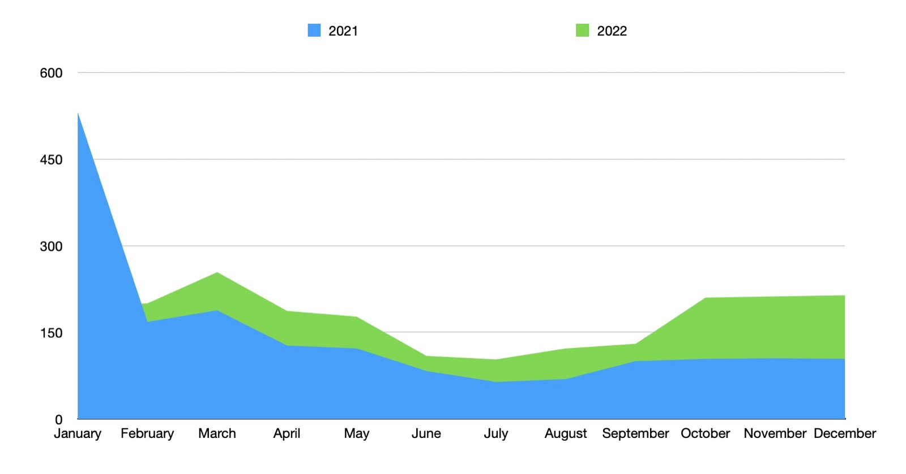
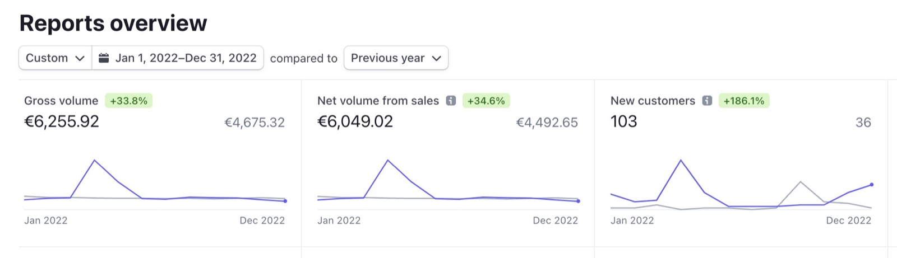
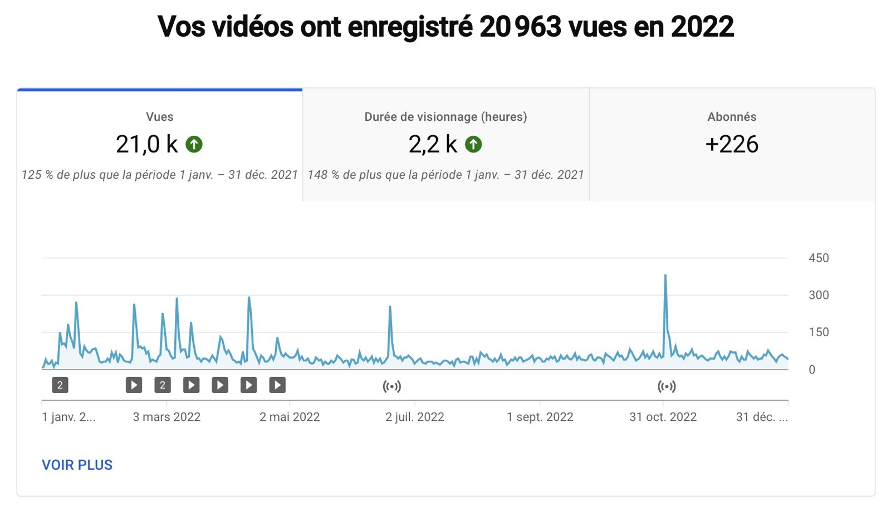

Hallo zusammen und frohes neues Jahr!

Jedes Jahr schreibe ich einen Artikel, in dem ich zusammenfasse, was im vergangenen Jahr passiert ist, und meine Pläne für das nächste Jahr vorstelle.

Dieses Jahr ist keine Ausnahme, hier ist also mein Jahresrückblick zu Gladys.

{/* truncate */}

## Was ist 2022 passiert?

2022 war ein großartiges Jahr für Gladys Assistant!

Wir waren sogar noch produktiver als im Vorjahr, mit **28 Releases**, also im Schnitt einem Release alle 2 Wochen.

Ich denke, das ist das Maximum, das wir machen sollten, denn zu viele Updates sind eine Belastung für die Nutzer und könnten die allgemeine Stabilität verringern. Ein Release alle 2 Wochen scheint ein guter Rhythmus zu sein, den wir 2023 beibehalten werden.

Dieses Jahr wurden 200 PRs von großartigen Mitwirkenden in master gemergt!

Folgende Features bleiben in Erinnerung:

- [Kalenderbasierte Auslöser und Bedingungen in Szenen](/de/blog/gladys-assistant-4-8-with-calendar-in-scenes/)
- [Unterstützung für Amazon Alexa](/de/blog/gladys-assistant-4-9-with-alexa-integration/)
- [Broadlink-Integration](/de/blog/gladys-assistant-4-10-broadlink-and-performances/)
- [Unterstützung für Apple HomeKit](/de/blog/gladys-assistant-4-12-homekit/)
- [Kompatibilität mit Node 18 und Ecowatt-Integration](/de/blog/gladys-assistant-4-13-ecowatt/)

Danke an alle, die zu diesen Releases beigetragen haben. Dank euch haben wir heute ein so tolles Produkt!

Ich denke dabei an: Alexandre Trovato, Vincent Kulak, Bertrand D'Aure, Cyril Beslay, Corentin Allemand, NickDub, Terdious, Romuald Pochet und Nicolas Geissel! 🙏

### Nutzung

Dieses Jahr haben wir ein ordentliches Wachstum bei der Nutzung des Produkts gesehen.

Jeder Monat hatte mehr Nutzer als derselbe Monat im Vorjahr (außer Januar, aber das liegt daran, dass im Januar 2021 die v4 mit viel Medienaufmerksamkeit gestartet ist).

Beim Umsatz haben wir gegenüber 2021 ein Plus von 33,8 % gesehen.

Der größte Teil des Umsatzes kam im März, als ich das Jahresabo für 59,99 € eingeführt habe:

Ich bin mit diesen Zahlen sehr zufrieden und hoffe, dass sich dieser Trend 2023 fortsetzt.

### Der YouTube-Kanal

Dieses Jahr habe ich 8 Videos veröffentlicht und 3 YouTube-Livestreams gemacht.

Das ist etwas mehr als im letzten Jahr (5 Videos und 5 Livestreams), und es lohnt sich definitiv.

Diese Videos sorgen auf YouTube für Sichtbarkeit dessen, was wir bei Gladys machen.

Bei den Aufrufen habe ich die Zahlen von 2021 verdoppelt, von 9.000 auf 20.000 Aufrufe im Jahr:

Bisher ist der Kanal komplett auf Französisch. Falls es dich interessiert, hier sind meine beliebtesten Videos dieses Jahres:

- [Gérez vos appareils Zigbee dans votre domotique avec Zigbee2mqtt et Gladys Assistant](https://youtu.be/ALW3uDB9P0s)
- [Installer un Raspberry Pi sur un disque externe SSD sans ligne de commandes (pour débutant)](https://youtu.be/Zn7imzI0oYU)
- [Live : Lancement de Gladys Assistant 4.9 avec le support d'Amazon Alexa](https://youtu.be/Da_AQSQedFg)
- [Louis et sa boîte aux lettres connectée - Gladys Assistant chez vous #1](https://youtu.be/XXanY-SP_5w)

### Soziale Netzwerke

In den sozialen Netzwerken:

- [@gladysassistant auf Twitter](https://twitter.com/gladysassistant) hat 2.775 Follower
- [Gladys Assistant auf Facebook](https://www.facebook.com/gladysassistant) zählt 763 Likes
- [@gladysassistant auf Instagram](https://www.instagram.com/gladysassistant) vereint 575 Abonnenten

Und schließlich 2.266 Follower auf [meinem persönlichen Twitter](https://twitter.com/pierregillesl)!

### Der Newsletter

Beim Newsletter folgen 3.388 von euch dem [Gladys Assistant Newsletter](https://email-list.gladysassistant.com/subscription/haflMsWmU).

- 2.874 Abonnenten auf Französisch
- 514 Abonnenten auf Englisch

Das sind weniger als im letzten Jahr, aber wie ich letztes Jahr schon gesagt habe, habe ich eine Bounce-Erkennung eingebaut, die Abonnenten entfernt, die meine E-Mails nicht mehr erhalten.

Mal sehen, was 2023 passiert, aber diesmal hoffe ich, dass die Mailingliste wächst!

### Gladys Assistant auf GitHub

Wir liegen bei 2.233 Sternen ⭐ auf dem [Gladys Assistant Repo](https://github.com/GladysAssistant/Gladys).

Das sind +19 % im Vergleich zum Vorjahr!

Immer noch ein zweistelliges jährliches Wachstum auf GitHub 😍

Ich zähle auf dich, uns auf GitHub mit einem Stern ⭐ für das Projekt zu unterstützen.

## Projekte und Ziele für 2023

Wie gesagt: Das Wachstum bei der Nutzung und beim Umsatz von Gladys Plus macht mich viel zuversichtlicher für die Zukunft.

Anders als Ende 2021, als meine Meinung gemischt war, bin ich überzeugt, dass Gladys ein Projekt mit unbegrenztem Potenzial ist, wenn wir auf diesem Kurs bleiben.

Ich für meinen Teil möchte 2023 weiter gehen, und dafür habe ich ein neues Unternehmen für Gladys Assistant gegründet: **Gladys Assistant SAS**.

Bisher habe ich die Einnahmen aus Gladys Plus über meine persönliche französische „Micro-Entreprise" abgerechnet, neben meinen Freelance-Einnahmen. Das Problem dieses Status ist, dass er mich nicht dazu gebracht hat, die Einnahmen aus Gladys Plus in Wachstum zu reinvestieren, weil man dabei keine Ausgaben abziehen kann: Die Einnahmen einer Micro-Entreprise gelten als persönliches Einkommen, es ist kein von der Person getrenntes Unternehmen.

Dieser Statuswechsel ermöglicht es mir also, die Einnahmen aus Gladys Plus in verschiedene Projekte zu reinvestieren: Gewinnspiele? Pakete aus Hardware und Gladys Plus anbieten? Hausautomations-Hardware finanzieren? Marketing? Einen Freelancer bezahlen? Alles wird möglich!

Das mag wie eine einfache Änderung wirken, aber für mich ist es ein kompletter Paradigmenwechsel, der 2023 einen enormen Einfluss auf das Projekt haben wird.

Wenn du 2023 zu diesem Wachstum beitragen möchtest, komm zu [Gladys Plus](/de/plus)!

### Produktseite

Auf der Produktseite habe ich viele Ideen für 2023, aber die Grundidee ist ganz einfach: die Nutzer von Gladys zufriedenstellen.

Viele von euch stellen Feature-Wünsche im Forum, und das Ziel bleibt, diese Wünsche einen nach dem anderen abzuarbeiten, vom meistgewählten bis zum am wenigsten gewählten.

Einige Fortschritte, die ich 2023 bei Gladys gerne sehen würde:

- Szenen duplizieren + „Uhr"-Box auf dem Dashboard
- Enedis-Linky-Integration
- Neue Integrationen (Zwave-js-ui, Withings, Yeelight)
- Stark nachgefragte UX-Verbesserung: Szenen, Dashboards usw. neu sortieren
- Mehr Inhalte: ein Mini-PC-Tutorial? Bessere Entwicklerdokumentation? Mehr YouTube-Videos!
- Matter-Unterstützung?

## Danke an alle!

Danke an alle, die Gladys unterstützen, sei es durch die Entwicklung neuer Features, über [Gladys Plus](/de/plus/), über [einmalige Spenden](https://www.buymeacoffee.com/gladysassistant) oder durch Hilfe im [Forum](https://community.gladysassistant.com/).

Nochmals ein frohes neues Jahr an alle!

Pierre-Gilles Leymarie
