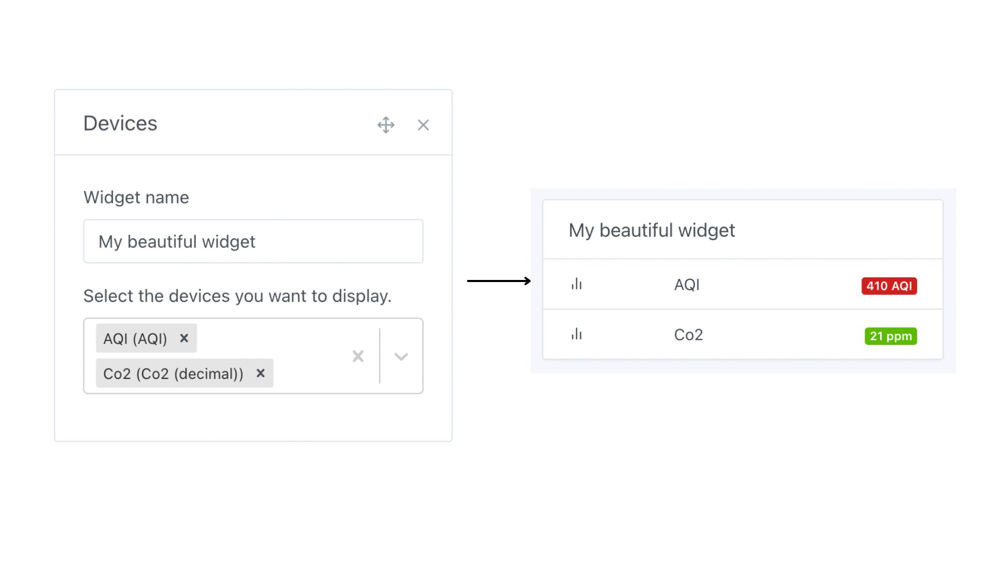
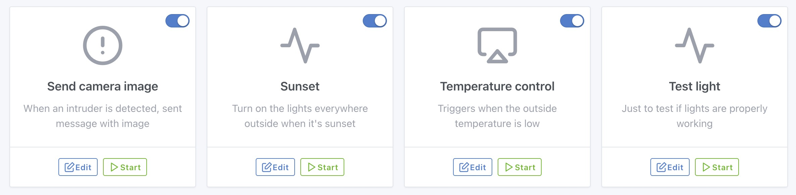
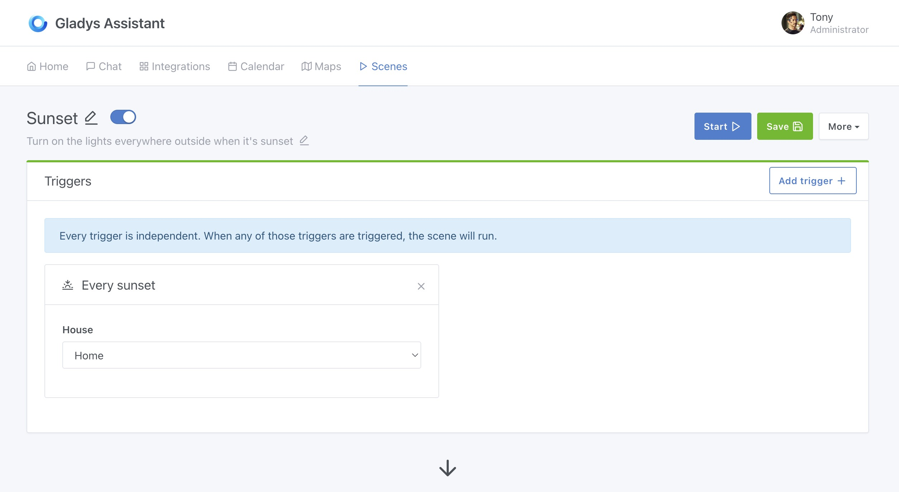
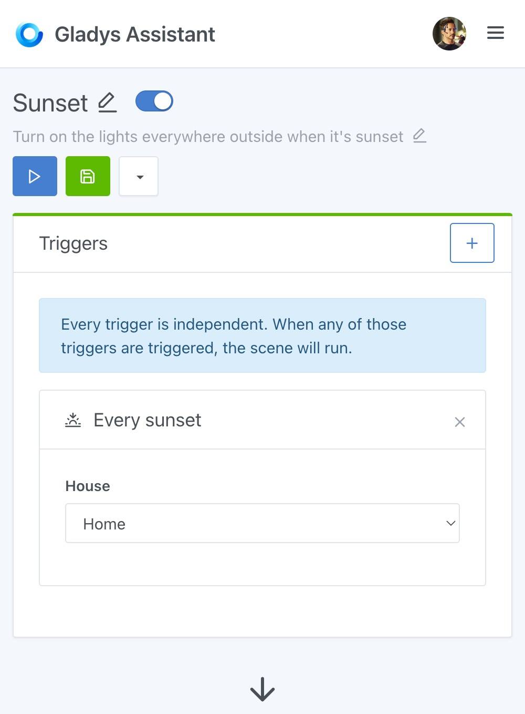
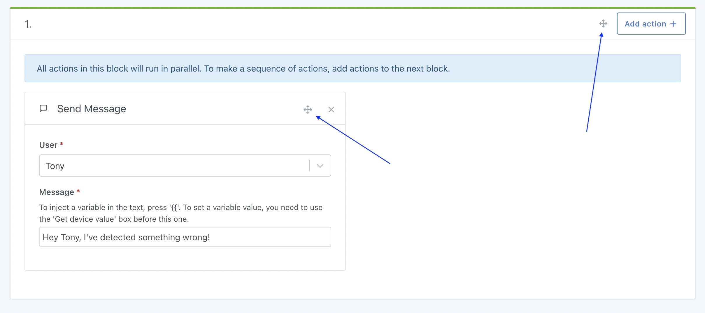
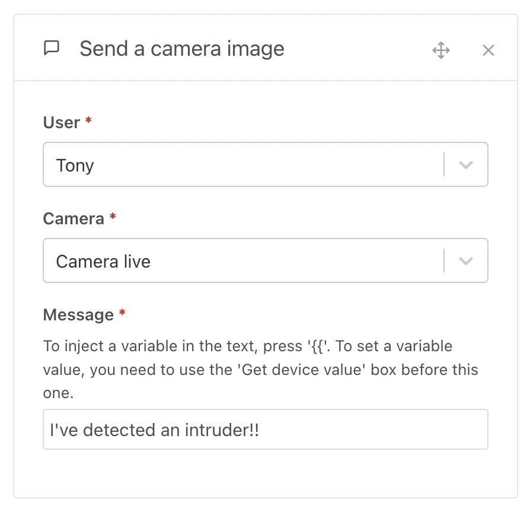
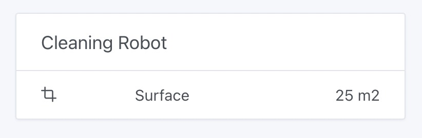
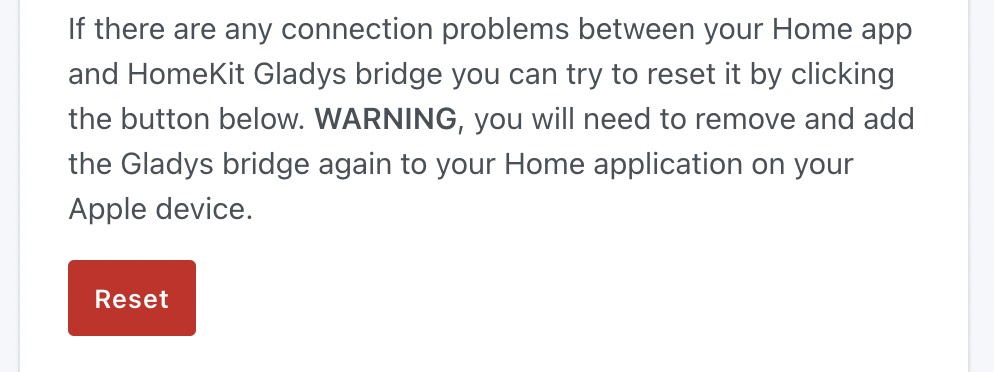

Hallo zusammen!

Heute gibt es eine neue Gladys-Version mit einigen richtig schönen Änderungen, die die tägliche Nutzung von Gladys verbessern.

Kurz bevor ich loslege: Wenn du nach Hardware suchst, auf der du Gladys betreiben kannst, ist ein Beelink-Mini-PC eine super Möglichkeit, mit zuverlässiger und leistungsstarker Hardware in die Hausautomation einzusteigen.

Manche in der Community haben sogar gleich mehrere bestellt, sozusagen 😂

Die Community ist sich ziemlich einig: Mini-PCs sind heute eine mehr als ernstzunehmende Alternative zum Raspberry Pi, der schwer zu bekommen ist und am Ende preislich ähnlich liegt, wenn man alles zusammenrechnet (Board + SSD + Netzteil + Gehäuse).

👉 Wirf einen Blick in den [Leitfaden zur empfohlenen Hardware](/de/docs/installation/recommended-hardware/), um unsere aktuellen Empfehlungen zu sehen.

## Neues „Geräte“-Widget

{/* truncate */}

Das hat viele frustriert: Bisher war es nicht möglich, ein „Geräte“-Widget anzulegen, das Geräte aus verschiedenen Räumen kombiniert.

Das ist jetzt erledigt, mit diesem neuen Widget von Lokkye, das komplett anpassbar ist: Du kannst jedes beliebige Gerät hineinziehen und ihm einen beliebigen Titel geben:

## Verbesserte Bedienung der Szenen

Das Erstellen und Bearbeiten von Szenen wurde in dieser Version insgesamt deutlich verbessert.

Zunächst einmal hat eine Szene jetzt eine bearbeitbare Beschreibung, mit der du deine Szenen besser auseinanderhalten kannst:

Diese Beschreibung lässt sich ganz einfach bearbeiten, indem du in der Szene auf die Beschreibung klickst:

Dir wird auffallen, dass der Kopfbereich oben im Bearbeitungsbildschirm der Szene funktionaler und übersichtlicher geworden ist. Nebenfunktionen (Duplizieren und Löschen) sind in einen „Mehr“-Button gewandert, damit der Bildschirm nicht ständig mit Buttons überladen ist.

Auf dem Handy wurde die responsive Darstellung verbessert, damit der Bildschirm auch auf kleinen Displays klar und gut lesbar bleibt:

Und schließlich bietet Gladys jetzt die am häufigsten gewünschte Funktion: Aktionen bzw. Aktionsblöcke innerhalb von Szenen verschieben.

Mit diesem Kreuz zum Anfassen kannst du Aktionen greifen und per Drag & Drop an eine andere Stelle der Szene ziehen.

## Kamerabilder in Szenen versenden

Ein super PR von Lokkye, mit dem du jetzt in Szenen ein Kamerabild per Nachricht verschicken kannst.

Die Idee hinter dieser Funktion ist, Szenen wie „Wenn Bewegung erkannt wird, DANN schick mir ein Bild der Außenkamera per Nachricht“ bauen zu können:

## Google Home: Bug bei der Helligkeitssteuerung behoben

Ich habe Feedback von einem schwedischen Gladys-Nutzer bekommen, der erklärt hat, dass seine IKEA-Tradfri-Lampen mit der Google-Home-Integration nicht besonders gut funktionierten.

Wenn er die Helligkeit in Google Home auf 100 % gestellt hat, waren seine Lampen in Gladys nur auf halber Helligkeit.

Der Grund für diesen Bug war ganz einfach: IKEA-Tradfri-Lampen haben einen Helligkeitsbereich von 0–254 und nicht 0–100 %. Es braucht also einen kleinen Umrechnungsschritt von der Google-Home-Skala (0–100 %) auf die Tradfri-Skala (0–254) und wieder zurück.

Der Bug wurde [in diesem PR](https://github.com/GladysAssistant/Gladys/pull/1813) behoben.

## Flächeneinheiten hinzugefügt

Das war ein Wunsch von Hizo im Forum: Jetzt kann man MQTT-Geräte mit Flächenangaben anlegen.

Praktisch zum Beispiel für einen Saugroboter, der die gereinigte bzw. gerade zu reinigende Fläche zurückmeldet.

## HomeKit: Button zum Zurücksetzen der Verknüpfung

Dank eines PR von bertrandda kann man die Verknüpfung mit HomeKit jetzt in Gladys zurücksetzen:

## Wie aktualisiere ich?

Um Gladys zu aktualisieren, empfehlen wir Watchtower: Es aktualisiert deinen Container automatisch, sobald eine neue Version erscheint. Mehr dazu in der [Dokumentation](/de/docs/installation/docker#auto-upgrade-gladys-with-watchtower).

## Danke an die Mitwirkenden

Danke an alle, die zu diesem Release beigetragen und ihr Feedback gegeben haben.

Wenn du über dieses Release sprechen möchtest, bist du im [Forum](https://community.gladysassistant.com/) herzlich willkommen!

## Unterstütze uns

Wenn du uns unterstützen möchtest, gibt es viele Möglichkeiten:

- Beantworte Beiträge im Forum und gib dein Feedback.
- Hilf uns, die Dokumentation zu verbessern.
- Entwickle neue Funktionen/Integrationen für Gladys, wir sind zu 100 % Open Source.
- Abonniere [Gladys Plus](/de/plus/)
