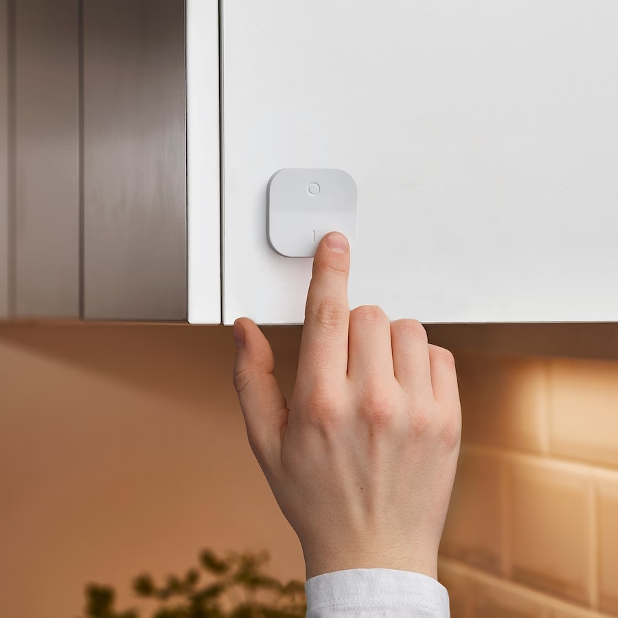
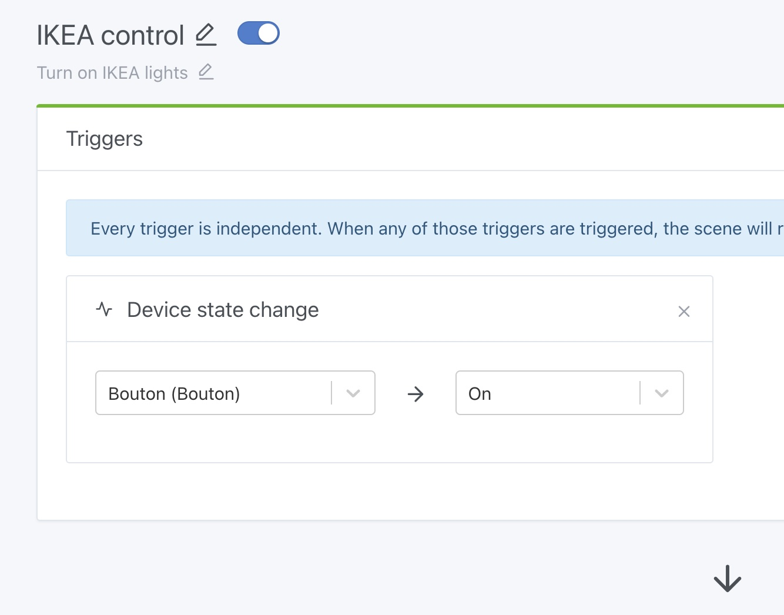
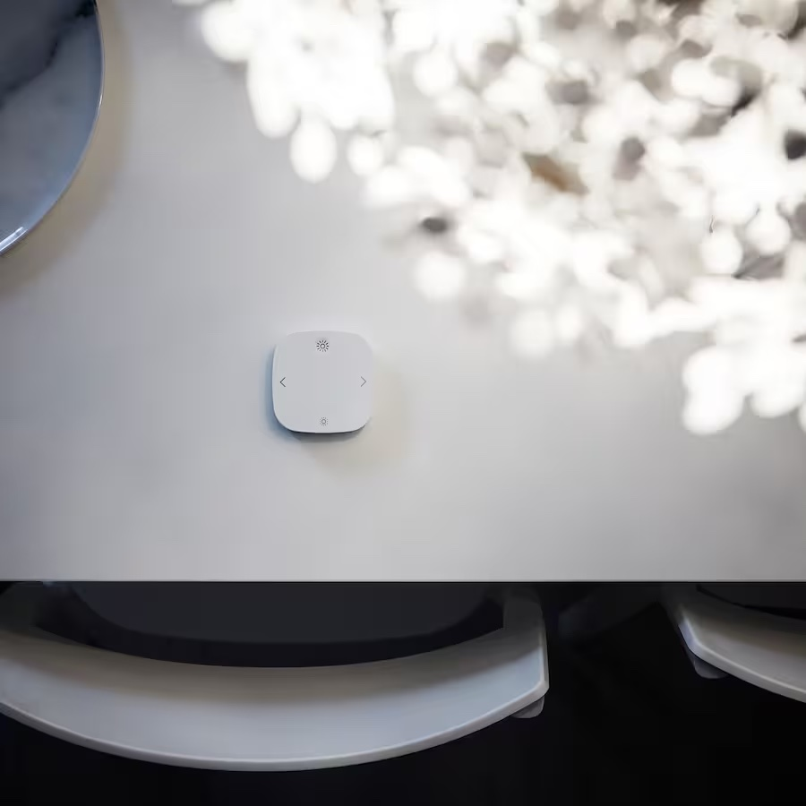

Hallo zusammen!

Ich hoffe, du hattest einen schönen Urlaub ☀️

Was Gladys Assistant angeht, bin ich letzte Woche mit einem Update auf v4.26.1 zurückgekehrt, das eine [Reihe von Fehlerbehebungen](https://community.gladysassistant.com/t/gladys-assistant-v4-26-1-mosquitto-fixed-at-v2-0-15-google-home-graph-improved/118) als Antwort auf euer Feedback aus dem Sommer gebracht hat.

Heute lege ich mit einem Update nach, das bei den Funktionen deutlich mehr zu bieten hat: Gladys Assistant 4.27.

## Benenne deine Geräte im Dashboard um

{/* truncate */}

Über diese Funktion wurde schon lange diskutiert: Was soll im Dashboard angezeigt werden, um eine Funktion richtig zu „beschreiben“? Der Gerätename? Gerätename und Raum? Der Name der Funktion? Oder beides?

Nach einigem Nachdenken ist mir klar geworden, dass wir es nie allen recht machen können. Deshalb habe ich beschlossen, dass du den Namen für die Anzeige im Dashboard selbst ändern kannst.

Konkret kannst du im Dashboard im Widget „Geräte“ jedes Gerät nach deinen Vorlieben umbenennen und verschieben:

<video width="100%" controls autoplay loop muted>
<source src="https://gladysassistant-assets.b-cdn.net/gladys-4-27/gladys-rename-devices-en.mp4" type="video/mp4" />
  Dein Browser unterstützt das Video-Tag nicht.
</video>

## Neue Zigbee-Geräte

Gladys ist jetzt vollständig mit 3 neuen Zigbee-Geräten kompatibel, darunter zwei aus der vernetzten IKEA-Produktreihe.

Falls du das [vernetzte Zigbee-Beleuchtungsangebot von IKEA](https://www.ikea.com/us/en/cat/eclairage-connecte-36812/) noch nicht kennst: Es ist sehr günstig (ab 9,99 € für eine Lampe, 6,99 € für einen Schalter) und von guter Qualität. Wenn du neu in der Hausautomation bist, ist das ein guter Einstieg. Und es gibt die Produkte in allen IKEA-Filialen oder mit Lieferung über die Website!

### IKEA-TRÅDFRI-Taster mit Dimmfunktion

Dieser Taster ist ein sehr günstiger Ein/Aus-Schalter ([6,99 € bei IKEA](https://www.ikea.com/us/en/p/tradfri-variateur-dintensite-sans-fil-connecte-blanc-70408595/)), der bei gedrückt gehaltenem Ein oder Aus auch als Dimmer funktioniert.

Ich habe die Unterstützung für 5 Aktionen hinzugefügt:

- Ein
- Aus
- Helligkeit erhöhen
- Helligkeit verringern
- Helligkeitsänderung stoppen

Diese Aktionen stehen dir in Szenen für deine Automatisierungen zur Verfügung:

### IKEA-STYRBAR-Taster mit Helligkeits- und Farbsteuerung

Mit dieser vernetzten Fernbedienung kannst du Ein/Aus, Helligkeit und Farbe einer oder mehrerer Lampen steuern. Sie ist für [9,99 € bei IKEA](https://www.ikea.com/us/en/p/styrbar-remote-control-smart-white-80488370/) erhältlich.

Ich habe die Unterstützung für 11 Aktionen hinzugefügt:

- Ein
- Aus
- Helligkeit erhöhen
- Helligkeit verringern
- Helligkeitsänderung stoppen
- Klick auf Pfeil links
- Klick auf Pfeil rechts
- Pfeil links gedrückt halten
- Pfeil rechts gedrückt halten
- Pfeil links losgelassen
- Pfeil rechts losgelassen

Auch diese Aktionen stehen in Szenen zur Verfügung, damit du automatisieren kannst, was immer du möchtest.

Natürlich können diese beiden Taster in Gladys so ziemlich alles steuern.

Wer eine „direktere“ Steuerung möchte, kann die [Bindings von Zigbee2mqtt](https://www.zigbee2mqtt.io/guide/usage/binding.html) nutzen, um Schalter und Lampe direkt per Zigbee miteinander zu verknüpfen.

So hast du eine direkte Steuerung, die sogar funktioniert, wenn deine Hausautomation gerade nicht läuft.

### Xiaomi-WXKG01LM-Taster

Ich habe ein paar Aktionen hinzugefügt, die bei diesem Taster noch gefehlt haben:

- Dreifachklick
- Vierfachklick
- Klick losgelassen
- Viele Klicks

## Fehlt dir eine Zigbee-Kompatibilität?

Wenn du ein Zigbee-Gerät hast, das von Gladys noch nicht vollständig unterstützt wird, schreib einfach eine Nachricht [im Forum](https://community.gladysassistant.com/).

## Wie aktualisiere ich?

Um Gladys zu aktualisieren, empfehlen wir Watchtower: Es aktualisiert deinen Container automatisch, sobald eine neue Version erscheint. Siehe die [Dokumentation](/de/docs/installation/docker#auto-upgrade-gladys-with-watchtower).

## Unterstütze uns

Wenn du uns unterstützen möchtest, gibt es viele Möglichkeiten:

- Beantworte Beiträge im Forum und gib dein Feedback.
- Hilf uns, die Dokumentation zu verbessern.
- Entwickle neue Funktionen/Integrationen für Gladys – wir sind zu 100 % Open Source.
- Abonniere [Gladys Plus](/de/plus/)
