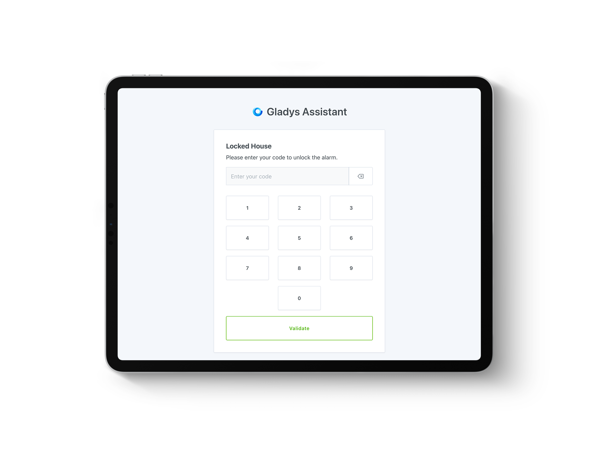
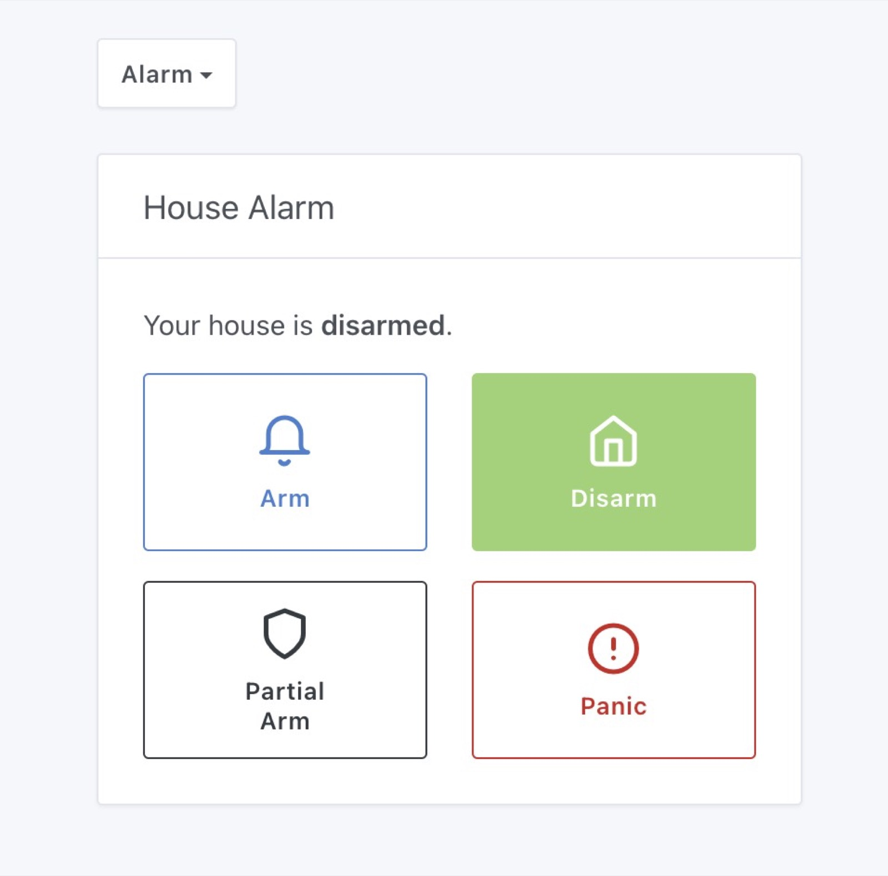
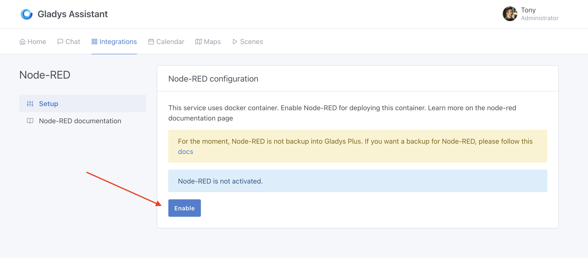
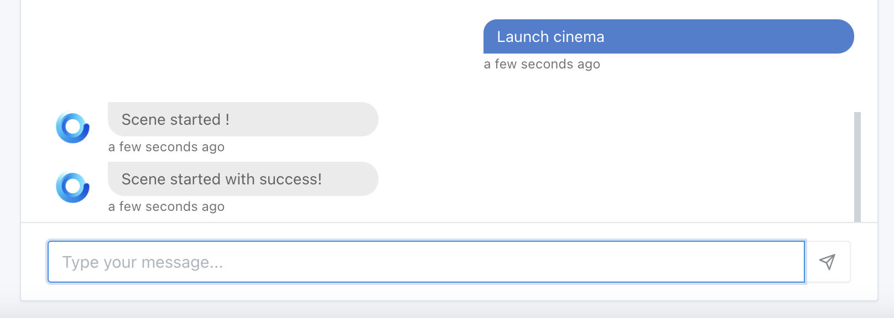
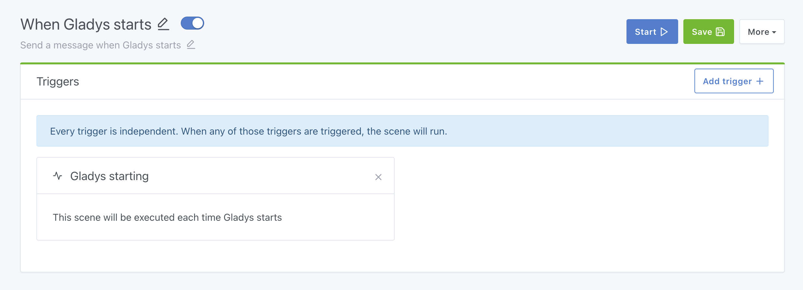
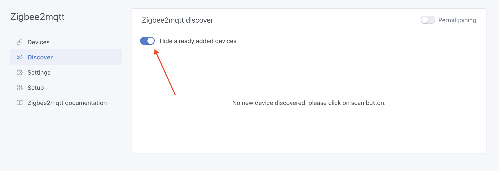

Hallo zusammen!

Gladys Assistant 4.30 ist gerade erschienen, und das ist eine Wahnsinnsversion!!! 🥳

Das Hauptfeature ist die komplette Verwaltung eines Alarmmodus, mit dem du ein vollständiges Sicherheitssystem für dein Zuhause aufbauen kannst.



Gib's zu, da bekommt man direkt Lust drauf 😎

## Eine Alarmanlage in Gladys

Gladys kann jetzt eine komplette Alarmanlage ersetzen, indem es die verschiedenen Zustände verwaltet, die jedes gute Alarmsystem hat:

{/* truncate */}



Wenn du mit Gladys eine Alarmanlage einrichten möchtest, habe ich dazu [ein komplettes Tutorial](/de/docs/dashboard/alarm/) geschrieben!

## Node-RED-Integration

Es war schon vorher möglich, Node-RED mit Gladys zu verbinden (über die [MQTT-Integration](/de/docs/integrations/mqtt)), aber das erforderte etwas Know-how, weil du Node-RED selbst starten musstest.

Lokkye hat an einer nativen Integration gearbeitet, damit jeder mit einem einzigen Klick eine Node-RED-Instanz neben Gladys starten kann!

Ab sofort gehst du einfach in die Integration „Node-RED“ und klickst auf „Aktivieren“, um einen Node-RED-Container zu starten:



## Tuya: Verwaltung des Stromverbrauchs

Die Tuya-Integration unterstützt jetzt smarte Steckdosen, die Daten zum Stromverbrauch melden.

Danke an Lokkye für die Entwicklung 🙏

## Eine Szene aus dem Chat starten

Mit der ChatGPT-Integration war das schon möglich, aber jetzt wurde dieser Befehl auch dem „lokalen“ Chat-Modell von Gladys hinzugefügt. Du kannst Gladys im Chat jetzt bitten, eine Szene zu starten:



Danke an Lokkye für die Entwicklung 🙏

## Eine Szene per MQTT starten

Du kannst eine Szene jetzt per MQTT starten, indem du eine Nachricht auf folgendes Topic veröffentlichst:

```
gladys/master/scene/SCENE_SELECTOR/start
```

Dabei ersetzt du `SCENE_SELECTOR` durch den Selektor der Szene, den du in der URL zum Bearbeiten der Szene findest.

Für die Szene `http://192.168.1.10/dashboard/scene/cinema` musst du zum Beispiel eine Nachricht an dieses Topic senden:

```
gladys/master/scene/cinema/start
```

Danke an Lokkye für die Entwicklung 🙏

## Eine Szene beim Start von Gladys ausführen

Du möchtest eine Nachricht bekommen, wenn Gladys neu startet? Bei jedem Start von Gladys eine Aktion ausführen?

Ab sofort kannst du eine Szene beim Start von Gladys ausführen:



Danke an Lokkye für die Entwicklung 🙏

## Zigbee2mqtt: Verbesserungen der Oberfläche

Bereits hinzugefügte Geräte werden auf der Seite „Zigbee-Netzwerk durchsuchen“ standardmäßig nicht mehr angezeigt:



Und die Zigbee2mqtt-URL wird jetzt auf der Konfigurationsseite angezeigt!

**Bugfix**: Wenn du den Port des USB-Sticks änderst, startet Gladys den Zigbee2mqtt-Container mit dem richtigen Volume neu.

Danke an AlexTrovato und Cicoub13 für diese Verbesserungen 🙏

## HomeKit: Unterstützung für Feuchtigkeits- und Wasserlecksensoren

Ab sofort werden deine Wasserleck- und Feuchtigkeitssensoren auch an HomeKit weitergegeben!

Danke an bertrandda für die Entwicklung 🙏

Das vollständige CHANGELOG findest du [hier](https://github.com/GladysAssistant/Gladys/releases/tag/v4.30.0).

## Wie aktualisiere ich?

Um Gladys zu aktualisieren, empfehlen wir Watchtower: Es aktualisiert deinen Container automatisch, sobald eine neue Version erscheint. Mehr dazu in der [Dokumentation](/de/docs/installation/docker#auto-upgrade-gladys-with-watchtower).

## Unterstütze uns

Wenn du uns unterstützen möchtest, gibt es viele Möglichkeiten:

- Beantworte Beiträge im Forum und gib dein Feedback.
- Hilf uns, die Dokumentation zu verbessern.
- Entwickle neue Funktionen/Integrationen für Gladys, wir sind zu 100 % Open Source.
- Abonniere [Gladys Plus](/de/plus/)
