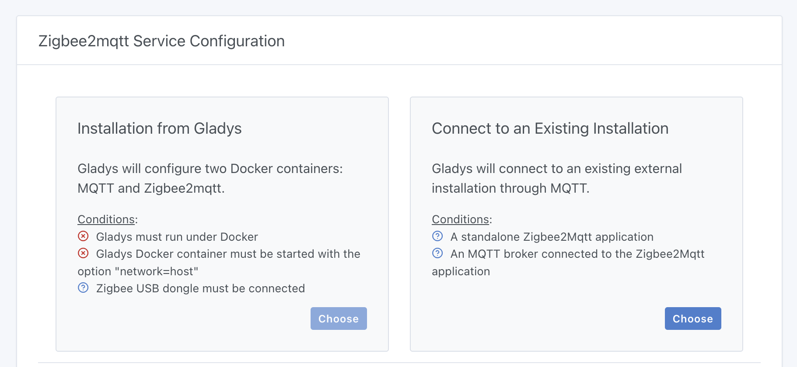
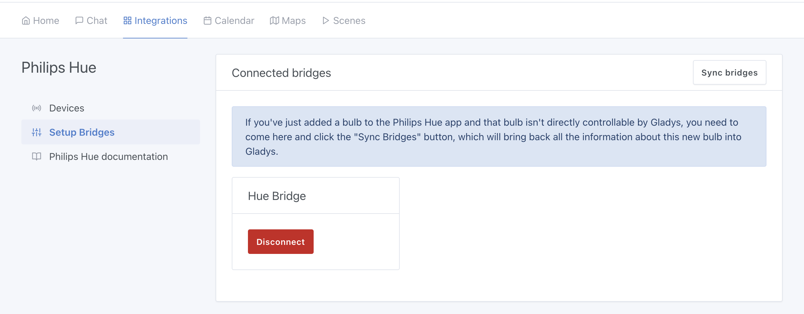
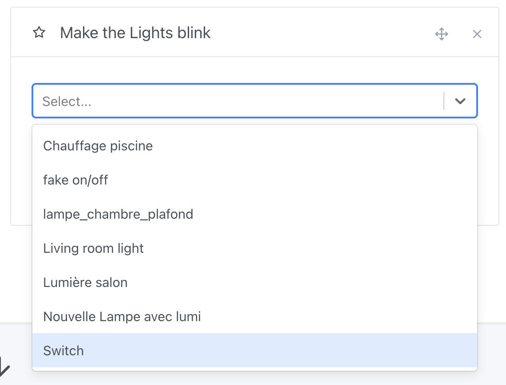

Hallo zusammen!

Heute veröffentliche ich Gladys Assistant 4.40, ein Update, das ein viel gewünschtes Feature mitbringt: die Möglichkeit, Gladys mit einer bestehenden Zigbee2mqtt-Instanz zu nutzen.

## Gladys mit einer bestehenden Zigbee2mqtt-Instanz nutzen

Wenn du ab jetzt Zigbee2mqtt in Gladys konfigurierst, bietet dir Gladys 2 Möglichkeiten an:

{/* truncate */}

Entweder du bist Einsteiger und fängst bei null an: Dann kann Gladys die gesamte Konfiguration von Zigbee2mqtt für dich übernehmen (so hat Gladys es bisher gemacht).

Oder du bist ein erfahrener Nutzer und hast bereits eine bestehende Zigbee2mqtt-Installation (zum Beispiel, weil du Home Assistant oder eine andere Hausautomations-Plattform nutzt). In diesem Fall kannst du Gladys mit deiner bestehenden Installation verbinden.

Mit dieser zweiten Option kannst du Gladys testen, ohne deine Installation anzufassen, und du kannst sogar 2 Hausautomations-Systeme gleichzeitig nutzen!

Das ist die Stärke von Open-Source-Systemen 😊

Wenn du eine andere Hausautomations-Lösung nutzt, freue ich mich sehr über dein Feedback: Teste unsere Zigbee2mqtt-Integration und sag uns in [unserem Forum](https://community.gladysassistant.com/), ob es Geräte gibt, die noch nicht unterstützt werden. Das hilft uns enorm, besser zu werden!

Danke an AlexTrovato für seine Arbeit an dieser Entwicklung 🙌

## Philips Hue: Neuer Button „Bridges synchronisieren"

Wenn du bei der Philips-Hue-Integration früher eine Philips-Hue-Lampe zu deiner Bridge hinzugefügt hast, während Gladys bereits lief, wusste Gladys nichts von dieser neuen Lampe.

Der Grund liegt in der Bibliothek, die wir verwenden: Sie hält einen Cache der verfügbaren Lampen, weil die Synchronisierung mit der Bridge eine aufwendige Operation ist.

Ab sofort gibt es einen Button „Bridges synchronisieren", mit dem du die aktuelle Liste der Lampen in Gladys abrufen kannst:

## Steckdosen in Szenen blinken lassen

Mit der Szenen-Aktion „Lichter blinken lassen" kannst du jetzt auch smarte Steckdosen oder beliebige Schalter auswählen. So kannst du eine Lampe blinken lassen, die an einer Steckdose hängt.

Aber Vorsicht: Lass keine herkömmliche Glühbirne flackern, sie könnte durchbrennen. Nutze dafür nur LEDs!

Die Lampe an meinem Badezimmerspiegel wird zum Beispiel über einen [Zigbee-Schalter ZBMINIL2](https://www.domadoo.fr/fr/peripheriques/6619-sonoff-commutateur-intelligent-sans-neutre-zigbee-30-zbminil2.html?domid=17) gesteuert und erscheint deshalb in dieser Szenen-Aktion:

Danke an Cicoub13 für diese Entwicklung 🙌

## LAN Manager: Timeout auf 60 Sekunden erhöht

Ich habe Rückmeldungen bekommen, dass das Timeout für den Netzwerkscan der LAN-Manager-Integration nicht ausreichte: Ich habe es jetzt von 30 auf 60 Sekunden erhöht.

## Wie aktualisiere ich?

Um Gladys zu aktualisieren, empfehlen wir Watchtower: Es aktualisiert deinen Container automatisch, sobald eine neue Version erscheint. Siehe die [Dokumentation](/de/docs/installation/docker#auto-upgrade-gladys-with-watchtower).

## Unterstütze uns

Wenn du uns unterstützen möchtest, gibt es viele Möglichkeiten:

- Beiträge im Forum beantworten und dein Feedback geben.
- Uns helfen, die Dokumentation zu verbessern.
- Neue Features/Integrationen für Gladys entwickeln, wir sind zu 100 % Open Source.
- [Gladys Plus](/de/plus) abonnieren
