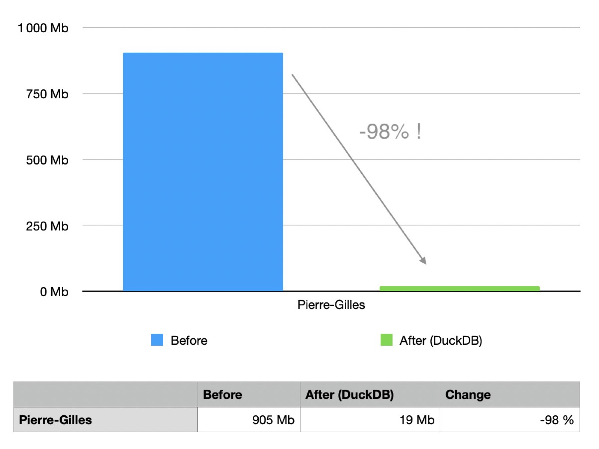
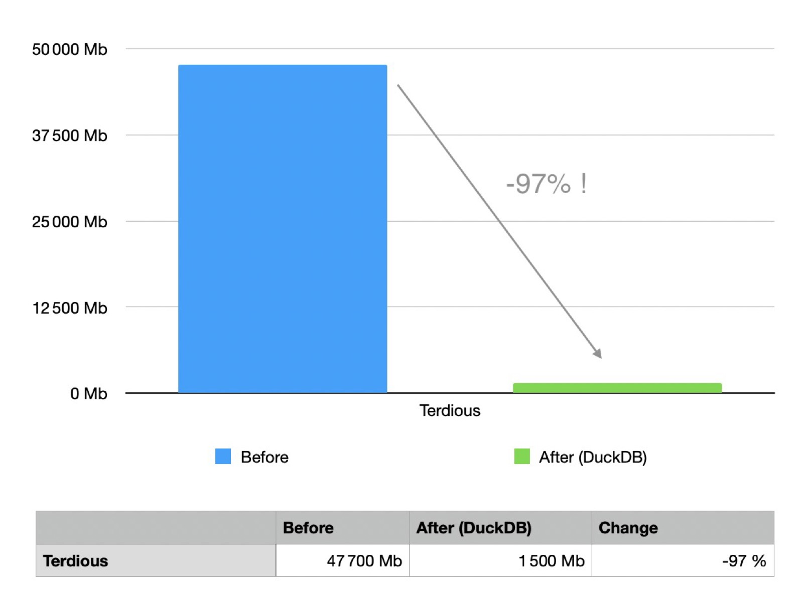
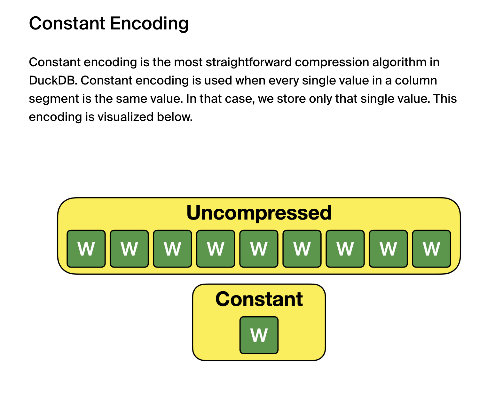
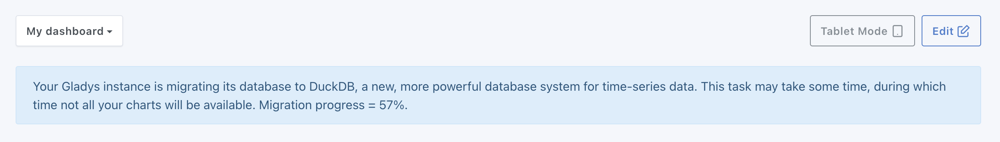
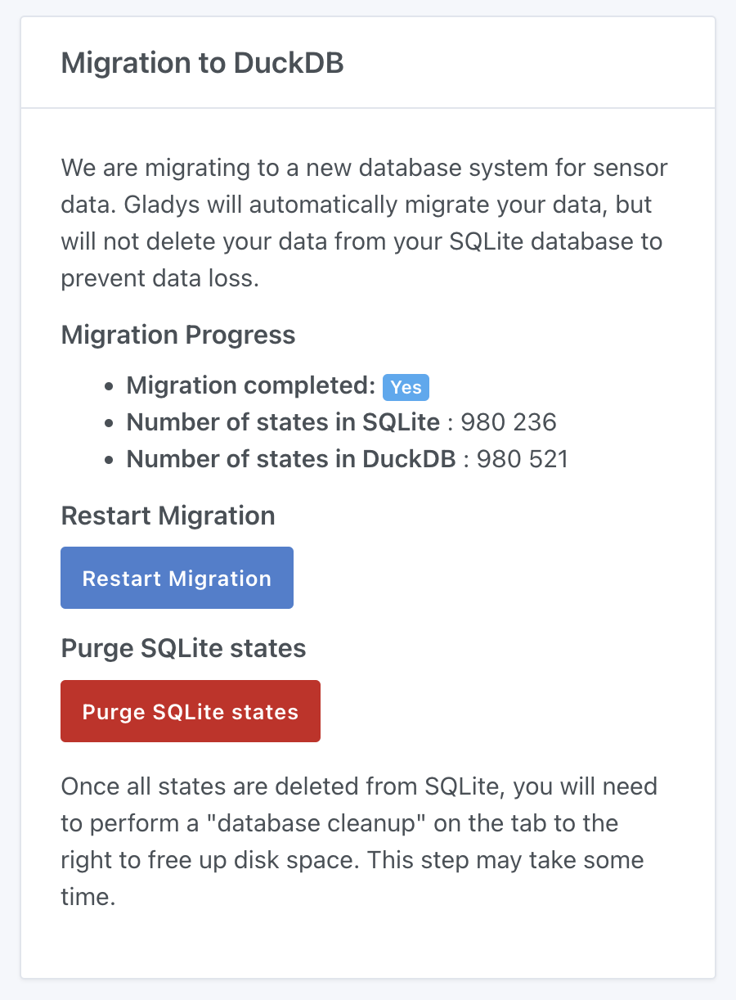
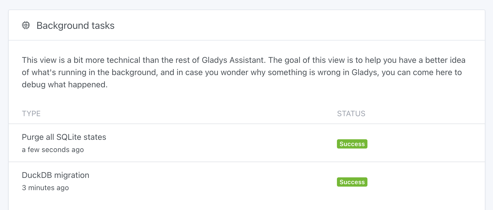
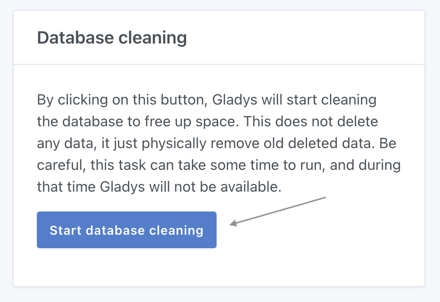

Hallo zusammen,

Heute ist ein großer Tag: Ich veröffentliche eine Major-Version von Gladys, die das Gladys-Erlebnis drastisch verbessert und uns bei der Datenspeicherung technologisch an die Spitze bringt.

Stell dir vor …

➡️ Deine Gladys-Datenbank schrumpft von 47 GB auf 1,5 GB …\
➡️ Deine Diagramme werden sofort angezeigt, selbst über lange Zeiträume …\
➡️ Deine Gladys-Plus-Backups werden leichter und schneller …

Genau das haben wir geschafft!

## Die Technologie: DuckDB

[DuckDB](https://duckdb.org/) ist ein OLAP-Datenbanksystem, das – wie SQLite – Daten in einer einzigen Datei speichert.

{/* truncate */}

Wenn man DuckDB definieren müsste:

> DuckDB ist eine analytische Datenbank-Engine, die optimale Performance bei großen Datenmengen bietet und dabei leichtgewichtig und einfach zu integrieren bleibt. Sie eignet sich besonders für eingebettete Datenanalyse, mit nativer Unterstützung für komplexe SQL-Abfragen und effizienter In-Memory-Verarbeitung.

DuckDB ist mit seinem Ansatz „OLAP + Datei“ einzigartig, und ich habe diese Technologie schon seit mehreren Jahren im Blick.

Bis vor Kurzem war DuckDB noch im Alpha-Stadium und damit nicht bereit für den Produktiveinsatz in einem kritischen Produkt wie Gladys.

Doch im Juni hat DuckDB endlich Version 1.0 erreicht – mit der klaren Ankündigung, dass sich API und Dateiformat nicht mehr grundlegend ändern werden. Damit ist DuckDB bereit für den Produktiveinsatz.

## Die Integration in Gladys

Direkt nach dem Release von Version 1.0 habe ich mit der Entwicklung in Gladys begonnen und einen YouTube-Livestream gemacht, um die Technologie gemeinsam mit euch zu testen.

Wir haben schnell gesehen, dass die Technologie sehr vielversprechend ist, also habe ich weiterentwickelt.

Kurz gesagt gehörten zu den Aufgaben:

- Die Migration des Sensorverlaufs, der aktuell in SQLite liegt, nach DuckDB (und wenn möglich ohne Ausfallzeit)
- Eine Oberfläche, um die Migration zu verfolgen, und eine Möglichkeit, die SQLite-DB danach zu „bereinigen“
- Die Anpassung des gesamten Codes, der historische Sensorwerte schreibt
- Das Neuschreiben der Abfragen für die Diagrammanzeige im Dashboard
- Die Überarbeitung des gesamten Gladys-Plus-Backup-Prozesses
- Und schließlich das Testen der Migration unter realen Bedingungen, um zu sehen, ob DuckDB im Alltag auf echten Instanzen gut funktioniert.

Kurz: Es gab jede Menge zu tun!

## Das Ergebnis

Am 6. August habe ich mit den „echten“ Tests auf meiner persönlichen Gladys-Installation begonnen.

Meine Instanz hat rund vierzig Geräte und läuft seit Februar 2024.

Ich hatte eine 905 MB große Datenbank mit 996.000 Sensorzuständen, die nach der Migration geschrumpft ist auf:



Ja, du hast richtig gelesen: Meine Datenbank ist auf 19 MB geschrumpft! Das ist fast schon lächerlich!

Beim größten Gladys-Nutzer, Terdious, mit 80 Millionen Zuständen in einer 47,7 GB großen Datenbank, ging es runter auf:



Kurz gesagt: Das ist ziemlich revolutionär!

Seit 20 Tagen läuft diese neue Version reibungslos bei mir und bei anderen Gladys-Nutzern.

Die Diagramme sind viel schneller: Terdious hat auf seinem Mini-PC doppelt so schnelle Ladezeiten festgestellt.

Auf seinem Pi 4 ist es sogar noch beeindruckender: Dashboards mit Diagrammen werden jetzt in 150 ms angezeigt statt vorher in 1 bis 5 Sekunden.

## Wie funktioniert das unter der Haube?

Jetzt fragst du dich vielleicht: Ist das Zauberei?

Eigentlich nicht wirklich:

- Zunächst einmal ist SQLite für diesen Anwendungsfall nicht geeignet. Deshalb mussten wir die Informationen 4-mal in der Datenbank speichern: einmal als „Rohdaten“, einmal monatlich aggregiert, einmal täglich aggregiert und einmal stündlich aggregiert. So konnten wir Daten schneller aus bereits reduzierten Datensätzen abrufen.
- Außerdem hatte ich auf SQLite-Seite sehr spezifische Indizes angelegt, um Abfragen wie „Zeig mir die Werte von Temperatursensor XX zwischen heute Morgen und jetzt“ zu beantworten. Diese mehrspaltigen Indizes brachten gute Performance, brauchten aber viel Speicherplatz (auch das ist Redundanz).
- Und schließlich leistet DuckDB hervorragende Arbeit. Die Daten werden aggressiv komprimiert (falls es dich interessiert, gibt es [einen Artikel in ihrem Blog](https://duckdb.org/2022/10/28/lightweight-compression.html)).

Ein Beispiel aus Gladys: Wenn du einen binären Sensor hast (Türsensor, Bewegungsmelder, Wassermelder usw.), bestehen die Daten nur aus 0 und 1 – es gibt also nur 2 mögliche Werte.

Solche Datensätze lassen sich sehr leicht komprimieren:



## Wie aktualisiere ich?

Gladys sollte sich normalerweise automatisch aktualisieren, wenn du Watchtower verwendest.

Wenn du Gladys mit Docker installiert hast, stell sicher, dass du Watchtower nutzt. Siehe die [Dokumentation](/de/docs/installation/docker/#auto-upgrade-gladys-with-watchtower).

Wenn du ungeduldig bist und weißt, was du tust, kannst du Watchtower auch manuell im „One-Shot“-Modus ausführen:

```sh
docker run --rm \
    -v /var/run/docker.sock:/var/run/docker.sock \
    nickfedor/watchtower \
    --run-once
```

(Vergiss nicht, sudo zu verwenden, wenn du Gladys als Administrator ausführst.)

Sobald Gladys auf `v4.45.0` aktualisiert ist, sind noch einige Schritte nötig, bevor deine DB schrumpft.

## Die Migration

Sobald deine Instanz aktualisiert ist, beginnt die Migration zu DuckDB.

Oben in deinem Dashboard siehst du eine Meldung:



Während der Migration kann deine Instanz langsamer sein, und deine Diagramme sind nicht verfügbar.

Den Status der Migration findest du unter „Einstellungen → System“:



Sobald die Migration abgeschlossen ist, wechselt die Zeile „Migration abgeschlossen“ von „Nein“ auf „Ja“.

Nimm dir einen Moment Zeit, um durch Gladys zu klicken und zu prüfen, ob alle deine Diagramme korrekt aussehen.

Wenn alles passt, kannst du die SQLite-Zustände löschen, indem du auf den roten Button „SQLite-Zustände löschen“ klickst. Dadurch wird ein Task gestartet:



Während dieses Tasks ist deine Gladys-Instanz etwas langsamer – das ist normal.

Je nach Anzahl der Zustände in deiner Datenbank und der Geschwindigkeit deiner Festplatte kann dieser Task ein paar Stunden oder bei einer großen DB sogar Tage dauern.

Gladys bleibt nutzbar, nur langsamer!

Wenn das Löschen abgeschlossen ist, musst du die SQLite-DB noch bereinigen, damit die Datei auf deiner Festplatte tatsächlich kleiner wird.

Klicke dazu auf den Button „Datenbank bereinigen“:



Dieser Task ist **blockierend**, Gladys ist während der Bereinigung also nicht verfügbar.

Sobald der Task fertig ist, starte Gladys neu.

Fertig! Du solltest jetzt eine viel kleinere Datenbank und eine deutlich schnellere Gladys-Instanz haben!

## Fazit

Ich hoffe, dieses Update bringt dir die gleichen Ergebnisse wie allen Testern!

Ich bin jedenfalls überzeugt, dass dieses Update die Nutzung von Gladys revolutionieren wird, und freue mich auf dein Feedback.

Nochmals danke an alle Tester, die bei der Entwicklung geholfen haben 🙏

## Das Projekt unterstützen

Es gibt viele Möglichkeiten, das Projekt zu unterstützen:

- Beteilige dich an Diskussionen im Forum und hilf Neulingen.
- Trage zum Projekt bei, indem du neue Integrationen/Features vorschlägst.
- Verbessere die Dokumentation, die Open Source ist.

Danke an alle, die Gladys unterstützen 🙏
