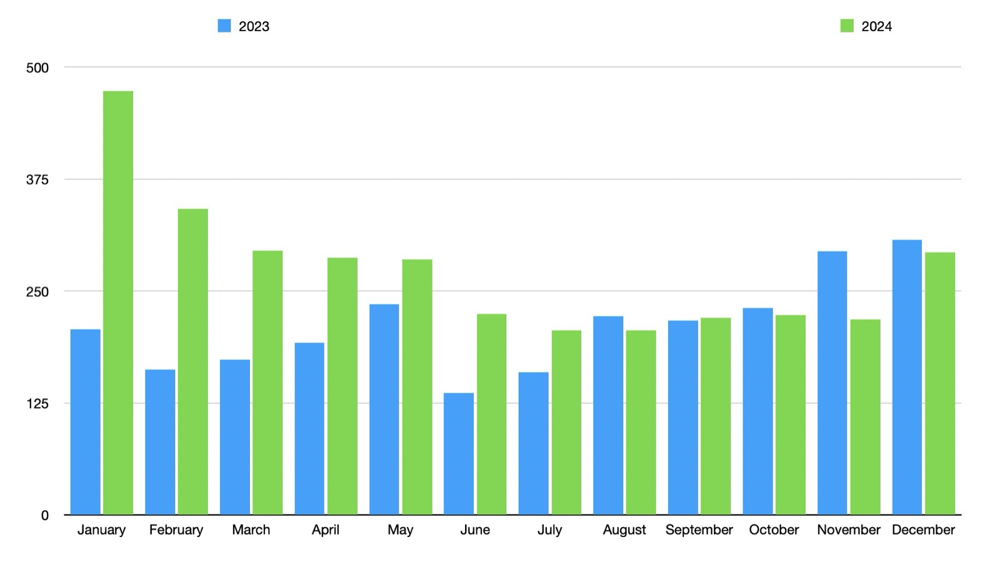
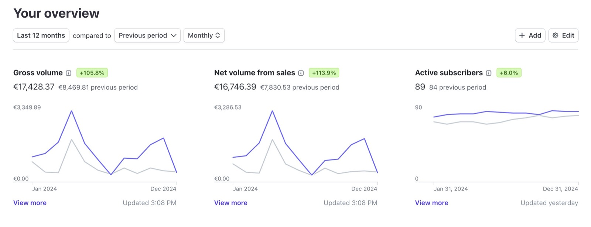
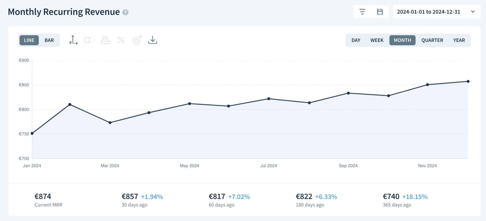
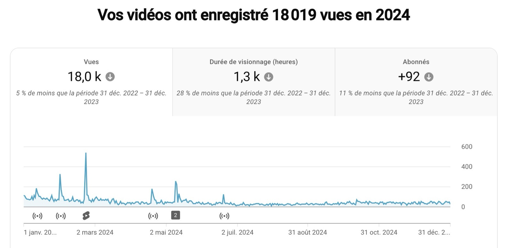

Hallo zusammen und ein frohes neues Jahr 2025!

Ich hoffe, ihr hattet ein großartiges Jahr 2024.

Für Gladys war 2024 ein entscheidendes Jahr, geprägt von persönlichen Veränderungen, die es Gladys ermöglicht haben, sein volles Potenzial zu entfalten!

Ich bin nämlich in eine Wohnung gezogen, die komplett mit Gladys automatisiert ist. Sie ist zu einem echten Schaufenster unserer Arbeit geworden und hat es mir ermöglicht, Dutzende Tutorials rund ums Smart Home aufzunehmen.

## Was ist 2024 passiert?

{/* truncate */}

2024 war ein unglaublich aktives Jahr:

- **27 Gladys-Releases** (ungefähr eins alle zwei Wochen)
- Dreh und Launch eines [kompletten Smart-Home-Kurses](https://formation.gladysassistant.com/) (aktuell 41 Videos/Artikel verfügbar)
- Launch eines Starter-Kits inklusive Hardware

### Entwicklung

Dieses Jahr wurden mehrere große Features ausgeliefert:

- Migration zu **DuckDB**, die den Speicherbedarf um bis zu 97 % reduziert
- Integration von **Z-Wave JS**, **Netatmo**, **Sonos**, **Free Mobile**, **Airplay** und mehr
- Unterstützung für **EDF Tempo**
- Externe Unterstützung für **Zigbee2mqtt**
- **KI**: Sprachintegration mit Lautsprechern (Sonos, Google Home, HomePod)
- **KI**: ChatGPT 4.0 und proaktive KI in Szenen

## Nutzung

Der Start ins Jahr 2024 brachte im Vergleich zu 2023 einen deutlichen Anstieg an Neuinstallationen:

Das Jahresende war ruhiger, und es ist schwer zu sagen, ob dieser Rückgang an meinem eigenen langsameren Tempo lag – ich war im September/Oktober auf Reisen und zum Jahresende in den Weihnachtsferien – oder ob einfach alle in dieser Zeit generell weniger verfügbar waren. So oder so sind solche Schwankungen normal: Es gibt immer Höhen und Tiefen 😄

### Umsatz

Insgesamt hat Gladys Plus 2024 einen Umsatz von **17.428 €** erzielt, ein Wachstum von **+105,8 %** gegenüber 2023. Dieses Wachstum wurde vor allem durch den Launch des Starter-Kits getragen.

Gladys Plus hat jetzt einen **MRR von 874 €**, ein Plus von **+18,15 %** gegenüber dem Vorjahr.

Diese Ergebnisse bestätigen unsere strategischen Entscheidungen für Gladys, und ich habe vor, diesen Weg 2025 weiterzugehen.

## Der YouTube-Kanal

Dieses Jahr verzeichnete der [YouTube-Kanal](https://www.youtube.com/@GladysAssistant) einen leichten Rückgang der Aufrufe, da ich in der zweiten Jahreshälfte keine Videos veröffentlicht habe.

Da ich in Teilzeit an Gladys arbeite, musste ich zwischen Entwicklung, Support, Dokumentation, dem Dreh des Kurses und dem Starter-Kit Prioritäten setzen. Die YouTube-Pause war eine strategische Entscheidung, und die Ergebnisse bestätigen sie. 😄

2025 möchte ich den Kanal wiederbeleben, um neue Nutzer zu gewinnen. Vielleicht könnten wir mehr **Live-Coding**-Sessions veranstalten?

Hier ein paar Videos, die 2024 veröffentlicht wurden:

## Soziale Netzwerke

In den sozialen Netzwerken:

- [Gladys Assistant auf Twitter](https://twitter.com/gladysassistant): **2.680 Follower**
- [Gladys Assistant auf Facebook](https://www.facebook.com/gladysassistant): **759 Likes**
- [Gladys Assistant auf Instagram](https://www.instagram.com/gladysassistant): **580 Follower**

Auf meinem persönlichen Account: **2.354 Follower** auf [Twitter](https://twitter.com/pierregilles).

## Der Newsletter

Der [Newsletter von Gladys Assistant](https://email-list.gladysassistant.com/subscription/1mXJoEWEl) hat **3.187** Abonnenten, die sich wie folgt aufteilen:

- **2.647** französischsprachige Abonnenten
- **540** englischsprachige Abonnenten

Auch wenn die französische Abonnentenbasis leicht zurückgegangen ist, wächst der englische Newsletter. Außerdem habe ich dieses Kommunikationstool 2024 stärker genutzt.

## Gladys Assistant auf GitHub

Das [GitHub-Repository von Gladys Assistant](https://github.com/GladysAssistant/Gladys) hat jetzt **2.743 Sterne ⭐**, ein Plus von **+12,88 %**.

Vergiss nicht, das Projekt mit einem ⭐ zu unterstützen, falls du das noch nicht getan hast!

## Projekte und Ziele für 2025

### Matter-Integration

Das Matter-Ökosystem wird immer ausgereifter: Hochwertige Geräte kommen auf den Markt, und Bibliotheken werden entwickelt.

Auf der Node.js-Seite ist die offizielle Matter-Bibliothek inzwischen verfügbar, mit der wir Matter-Kompatibilität umsetzen können.

Ich sehe Matter sehr positiv: Es könnte endlich das einheitliche Smart-Home-Protokoll werden, von dem ich seit Beginn des Projekts träume.

Ich glaube, dass Matter langfristig das einzige Protokoll werden könnte – und dass dadurch die Unterschiede zwischen den verschiedenen Smart-Home-Programmen größer werden.

Aktuell haben Plattformen wie Home Assistant dank der Anzahl ihrer Integrationen einen deutlichen Vorsprung, doch dieser würde schrumpfen, wenn Matter zum einzigen Protokoll würde.

Wäre die „Kommunikationsschicht“ mit Matter standardisiert, wäre die Nutzererfahrung das wichtigste Unterscheidungsmerkmal zwischen den Plattformen …

Was mich zum zweiten Punkt bringt:

### UX-Verbesserungen

Ich mache regelmäßig „UX-Reviews“ von Gladys und frage euch: Gibt es kleine Probleme in Gladys, die euch im Alltag stören und deren Behebung euer Leben verändern würde?

Jede kleine Änderung verbessert das Produkt Schritt für Schritt, und all diese Änderungen zusammen machen Gladys immer benutzerfreundlicher.

2025 möchte ich intensiv an der UX arbeiten, um Gladys auf die nächste Stufe der Einfachheit zu heben.

### Noch mehr KI

Wenn 2024 zweifellos das Jahr der KI war, glaube ich, dass sich dieser Trend 2025 fortsetzen wird.

Ich werde die neuesten Fortschritte in der KI weiter verfolgen, um das Beste davon in Gladys zu bringen.

Das Ziel bleibt dasselbe: Gladys zum intelligenten Assistenten für dein Zuhause zu machen.

### Expansion nach Nordamerika

Das [internationale Gladys-Forum](https://community.gladysassistant.com/) ist 2024 deutlich gewachsen.

Bei den Installationen kommen inzwischen 12 % der Neuinstallationen aus den USA und 7 % aus Kanada.

Ich glaube, dass der nordamerikanische Markt mein nächster Schwerpunkt sein sollte. Es ist ein riesiger Markt (491 Millionen Menschen) mit einem sehr technikaffinen Publikum. Außerdem gibt es dort viele Entwickler, die zu Contributors werden und uns voranbringen könnten.

Um diesen Markt anzugehen, sind hier ein paar Schritte:

- Kompatibilität mit den Geräten entwickeln, die dort genutzt werden (daher die Matter-Entwicklung!).
- Auf den Plattformen kommunizieren, auf denen sie unterwegs sind (Reddit, X?).
- Kontakt zu lokalen Influencern aufnehmen.

Wenn du Ideen hast, würde ich mich freuen, sie zu hören! 😄  
Wir haben sogar einen begeisterten Nutzer in Kanada, der uns helfen kann, diesen Markt besser zu verstehen. (Hallo @lmilcent 👋)

### Ein günstigeres Starter-Kit?

Das Starter-Kit 2024 war ein Erfolg, aber ich würde gern ein noch günstigeres Kit anbieten.

Die Herausforderung: Mit 259 € ist es schon schwer, den Preis weiter zu senken, außer die Lieferanten reduzieren gelegentlich ihre Preise.

Eine Idee wäre ein Kit auf Basis eines weniger leistungsstarken Mini-PCs, um die Kosten zu senken. Ich denke über die Nicht-Pro-Version des Beelink S12 nach, mit 8 GB RAM, 256 GB SSD und einer Intel-N95-CPU.

Würde dich ein weniger leistungsstarkes, aber günstigeres Kit interessieren? 😄

### Feature-Vorschläge?

Wenn du Ideen oder Wünsche für neue Features hast, schlag sie gerne im [Forum](https://community.gladysassistant.com/c/feature-requests/7/l/latest?order=votes) vor!

## Frohes neues Jahr und danke an alle!

Danke an alle, die Gladys unterstützen – sei es durch Hilfe im Forum, ein Gladys-Plus-Abo oder den Kauf des Starter-Kits.

Ich hoffe, 2025 wird genauso fantastisch wie 2024! 🚀

Pierre-Gilles Leymarie
