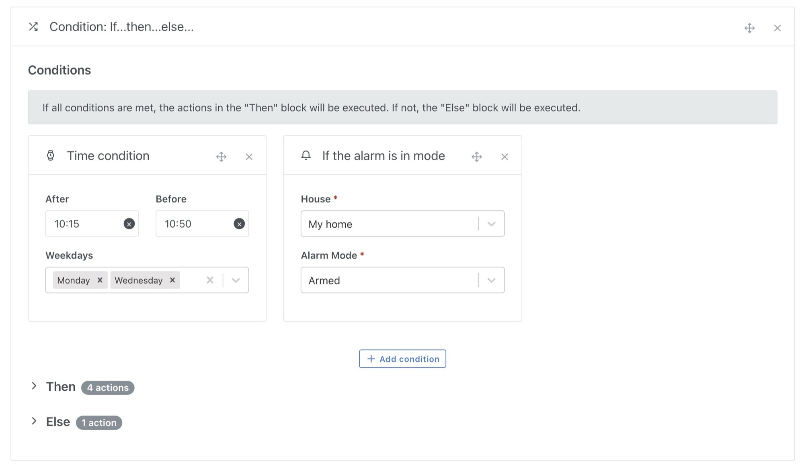
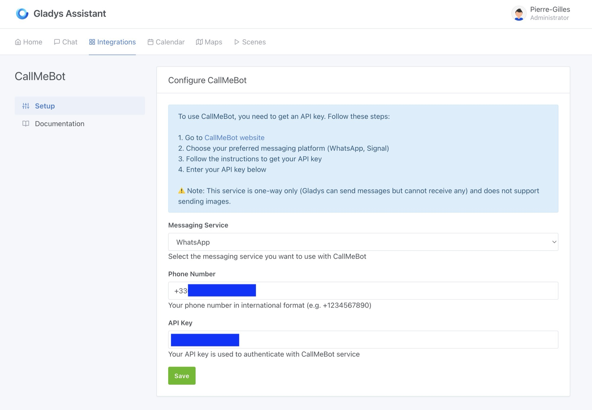

Ich freue mich, das Release von Gladys Assistant v4.55.0 anzukündigen – ein Update voller wichtiger Verbesserungen, die dein Smart Home noch intelligenter und flexibler machen.

## „Wenn … Dann … Sonst“-Bedingung in Szenen

Eines der am meisten erwarteten Features ist endlich da!

Du kannst deinen Szenen jetzt „Wenn … Dann … Sonst“-Bedingungen hinzufügen und so fortgeschrittene Szenarien mit mehreren Ausführungspfaden erstellen. Damit hast du deine Automatisierungen feiner im Griff, ohne mehrere Szenen anlegen zu müssen.

{/* truncate */}

### Anwendungsbeispiele:

- **Wenn** die Temperatur 25 °C übersteigt, **dann** schalte den Ventilator ein, **sonst** schließe die Jalousien.
- **Wenn** jemand zu Hause ist, **dann** schalte das Licht ein, **sonst** aktiviere den Abwesenheitsmodus.

Ich bin gespannt, wie du dieses Feature nutzt!

## Nachrichten an WhatsApp und Signal mit CallMeBot senden

Du möchtest Benachrichtigungen direkt auf WhatsApp oder Signal erhalten?

Dank der CallMeBot-Integration geht das jetzt!

Du kannst sofortige Benachrichtigungen an diese Plattformen senden, um in Echtzeit über Ereignisse in deinem Zuhause informiert zu bleiben.

Perfekt, um bei einem Einbruch oder einem Wasserschaden sofort gewarnt zu werden!

## Weitere Verbesserungen

- **Bessere Bildqualität der Kameras**: Die Auflösung wurde auf 1280 px erhöht – für eine schärfere Anzeige im Dashboard und in Telegram-Nachrichten.
- **Fehlende Einheiten in Dashboard-Diagrammen behoben**: Beim Bearbeiten eines Diagramms werden die Einheiten der Gerätefunktionen jetzt korrekt angezeigt. Falls in deinen Diagrammen Einheiten fehlen, wähle die Funktionen einmal ab und wieder aus. Entschuldige die Unannehmlichkeiten 🙏
- **Deutschsprachige Nutzer werden jetzt zur englischen Dokumentation weitergeleitet**, für eine bessere Zugänglichkeit.

## Jetzt aktualisieren!

Diese Version bringt noch mehr Flexibilität und Power in Gladys Assistant.

Wenn du Watchtower nutzt, aktualisiert sich Gladys innerhalb der nächsten 24 Stunden automatisch.
