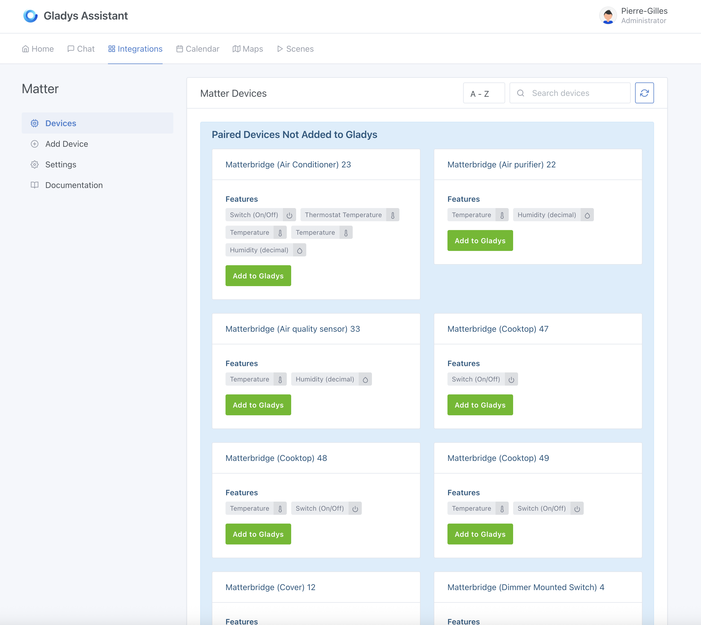
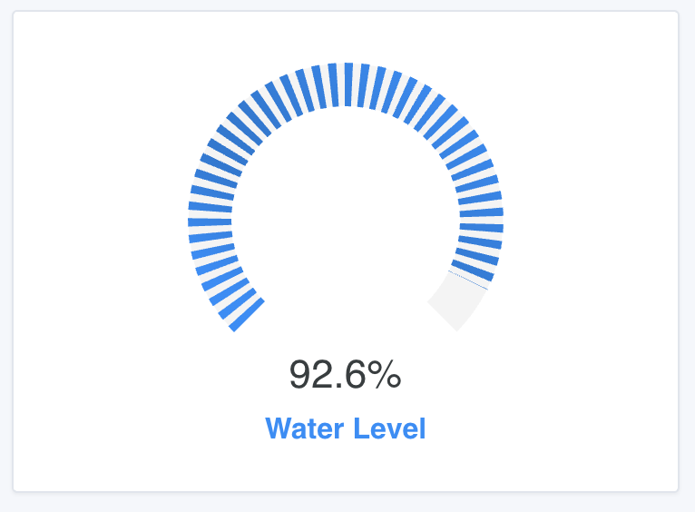
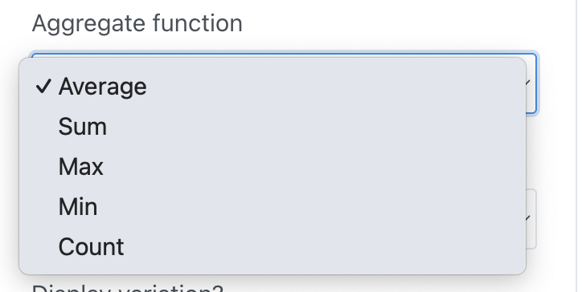
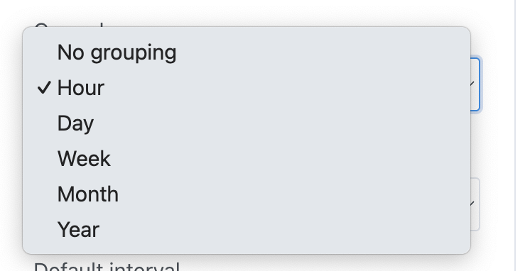
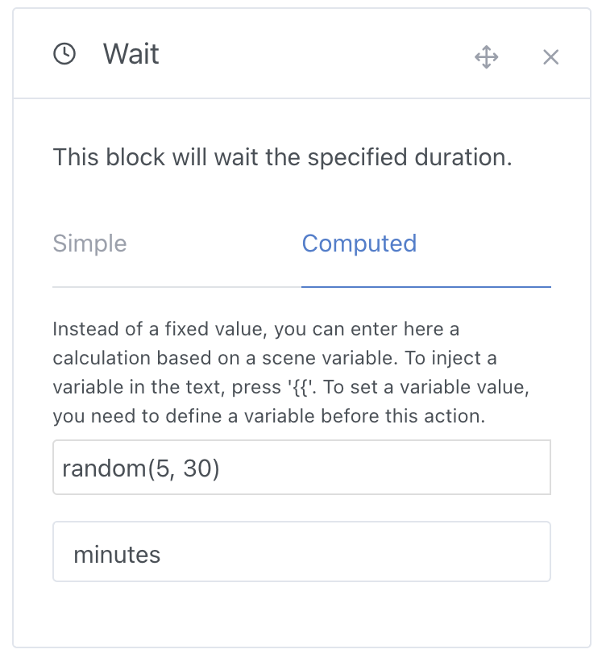
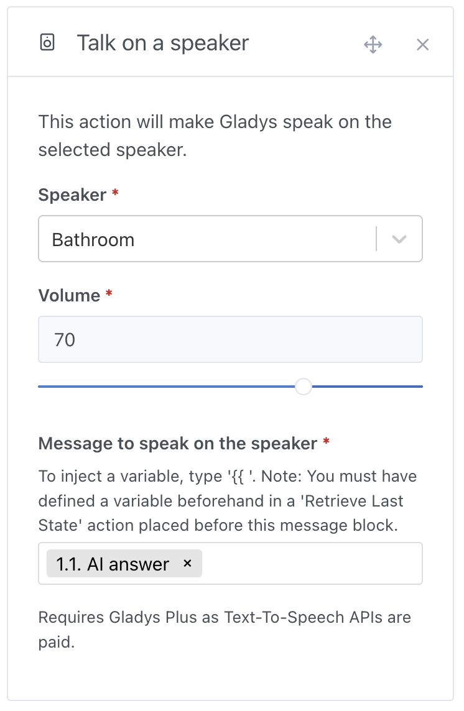
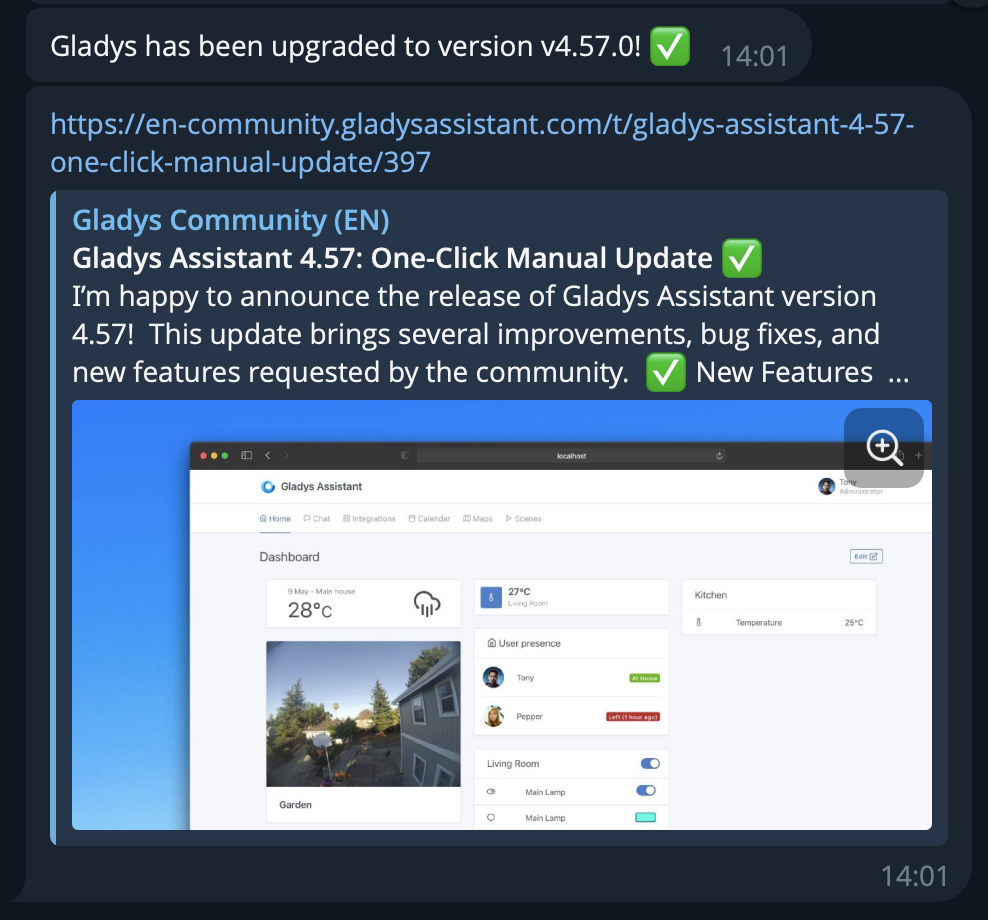
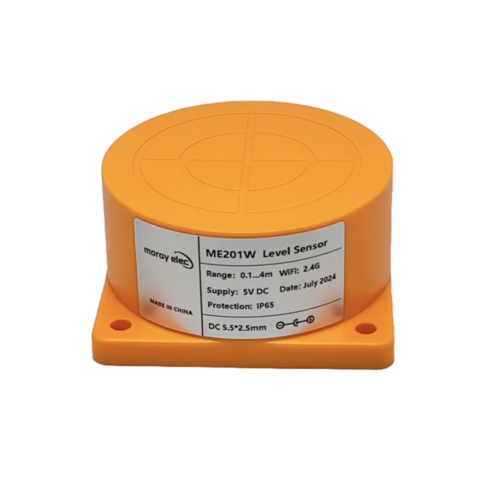
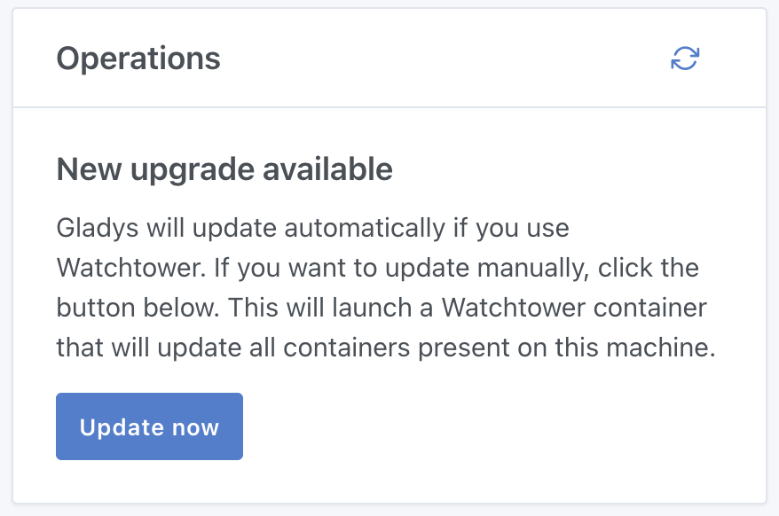

Wenn du in letzter Zeit im Gladys-Forum unterwegs warst, hast du es sicher bemerkt: Die letzten Wochen waren besonders lebhaft!

Heute freue ich mich sehr, **Gladys Assistant 4.58** zu veröffentlichen. Diese Version bringt Matter-Unterstützung mit, aber das ist bei Weitem nicht das einzige Spannende daran 😄

{/* truncate */}

## Matter-Integration

Wie ich schon in meinem [Jahresrückblick 2024](/de/blog/2024-year-in-review/) erwähnt habe, bin ich überzeugt, dass Matter eine kleine Revolution in der Smart-Home-Welt ist – und zwar eine, die **äußerst positive Auswirkungen auf Gladys** haben wird.

Das Protokoll ist offen, funktioniert komplett lokal und sorgt endlich dafür, dass Geräte verschiedenster Marken eine gemeinsame Sprache sprechen.

Schluss mit proprietären Protokollen, Drittanbieter-Apps, Cloud-APIs und Daten, die auf fremden Servern landen 😎

Ich sage, das Protokoll ist offen, weil jeder ein Matter-Gerät bauen kann, sogar im DIY-Stil.

Ein hervorragendes Open-Source-Projekt ist zum Beispiel [Matterbridge](https://github.com/Luligu/matterbridge), das Geräte ohne Matter-Unterstützung in ein Matter-Netzwerk einbindet. Damit werden unter anderem Geräte von **Shelly**, **Somfy Tahoma**, **Zigbee2MQTT** oder **Home Assistant** Matter-kompatibel.

Dank dieses Projekts sind all diese Geräte damit automatisch auch mit Gladys Assistant kompatibel!

Wer von euch eher exotische Geräte hat, kann sogar ein kleines Matterbridge-Plugin programmieren, um seinem Gerät Matter-Unterstützung zu verpassen und es so ganz einfach in Gladys Assistant einzubinden.

Kurz gesagt: Die Integration ist ab sofort verfügbar:

Mein Ziel ist es, 100 % der Matter-Geräte abzudecken, und ich freue mich über dein Feedback, damit wir das gemeinsam erreichen.

Um mit der Matter-Integration loszulegen, kannst du diesem Tutorial folgen:

👉 [Matter-Geräte in Gladys Assistant einbinden](/de/docs/integrations/matter/)

## Gauge-Widget im Dashboard

Du kannst jetzt ein „Gauge“-Widget zu deinem Dashboard hinzufügen – praktisch, um den Füllstand eines Tanks, den Akkustand eines Geräts und vieles mehr darzustellen!

## Verbessertes „Diagramm“-Widget

Das „Diagramm“-Widget unterstützt jetzt eigene Aggregationsfunktionen:

Außerdem kannst du nach Zeitintervall gruppieren: Stunde, Tag, Woche, Monat, Jahr:

Mit diesen Verbesserungen kannst du deine Daten noch besser darstellen, zum Beispiel:

- Die **kumulierte** Niederschlagsmenge **pro Tag** anzeigen
- Die monatliche **Summe** des Stromverbrauchs anzeigen
- Die **Anzahl** der empfangenen Sensorwerte **pro Woche** anzeigen
- Den **Minimalwert** deines Batteriespeichers **pro Tag** anzeigen

Die Möglichkeiten sind endlos!

## Die Szenen-Aktion „Warten“ unterstützt dynamische Werte

Ab sofort kannst du im Block „Warten“ Variablen einfügen und Berechnungen durchführen.

Wenn du zum Beispiel zufällig zwischen 5 und 30 Minuten warten möchtest, kannst du diese Funktion verwenden:

Super praktisch, um Anwesenheit zu simulieren!

Du kannst auch eine Variable aus einem Sensor oder sogar aus der Gladys-KI einfügen …

## Das Ergebnis einer KI-Anfrage nutzen

In Szenen kannst du mit unserem Block „KI fragen“ der künstlichen Intelligenz eine Frage stellen und dir eine Einschätzung zu einer Situation holen.

Das ist die echte „proaktive KI“, von der wir alle geträumt haben!

Mit dieser Aktion kannst du zum Beispiel ein Auto auf einem Kamerabild erkennen oder einen Sensorwert analysieren lassen, ohne selbst eingreifen zu müssen.

Die Antwort der KI wird jetzt in eine Szenenvariable geschrieben, die du in allen anderen Blöcken verwenden kannst – etwa, um sie über einen Lautsprecher ausgeben zu lassen:

## Benachrichtigung bei Gladys-Updates

Ab sofort schickt dir Gladys eine Benachrichtigung, sobald es sich aktualisiert hat.

Die Benachrichtigung geht an die Gladys-Administratoren, in ihrer Sprache und über die eingerichteten Kommunikationswege: Telegram, WhatsApp, Signal oder NextCloud Talk.

## Alarm: Teilaktivierung sperrt jetzt deine Tablets

Wenn du den Alarm in Gladys nutzt und nachts oder beim Mittagsschlaf die Teilaktivierung einschaltest: Ab sofort werden dabei alle Tablets im Haus gesperrt, damit ein möglicher Einbrecher nicht auf deine Hausautomation zugreifen kann, während du schläfst!

Konkret: Sobald der Modus „Teilaktivierung“ aktiv ist, zeigen alle Tablets im Haus diese Ansicht, um deine Installation zu schützen:

## Zigbee2MQTT: Unterstützung für den Füllstandssensor Tuya ME201WZ

Wenn du den Füllstand eines Tanks in Echtzeit messen und benachrichtigt werden möchtest, wenn er zu niedrig oder zu hoch ist, kannst du jetzt den [Zigbee-Sensor Tuya ME201WZ](https://www.domadoo.fr/fr/produits-compatibles-jeedom/7616-moray-capteur-de-niveau-d-eau-liquide-carburant-zigbee-tuya-me201wz.html?domid=17) verwenden, der vollständig von Gladys unterstützt wird 🙂

## ZWaveJS: Unterstützung für Energiemessung

Geräte mit Energiemessung, wie der ZW075 AEON Labs Smart Switch Gen5, werden jetzt von unserer Z-Wave-Integration auf Basis von ZWaveJS unterstützt.

Danke an @Sescandell für die Entwicklung!

## Und das ist noch nicht alles!

Diese Version bringt noch viele weitere Verbesserungen, darunter:

- **HomeKit**: Zubehörnamen werden auf maximal 64 Zeichen begrenzt (gemäß Spezifikation). Danke an @bertrandda für die Entwicklung 🙏
- **MQTT** & **Zigbee2MQTT**: schnellere Suche auf der Geräteseite.
- **Szenen**:
  - Die erste Bedingung in einer Gruppe mit mehreren Bedingungen kann jetzt gelöscht werden.
  - Neue Leiste am unteren Rand zum Speichern und Testen einer Szene + Bestätigung vor dem Löschen. Danke an @cicoub13 🙏
  - Neuer Button, um eine Aktionsgruppe einzufügen.
  - Filter bleiben nach dem Löschen einer Szene erhalten.
- **Dashboard**:
  - Neuer Button, um ein Widget an einer bestimmten Position einzufügen.
  - MQTT-Geräte, die keine Sensoren, aber auch nicht steuerbar sind, werden als Sensoren angezeigt.
  - Anzeige der MQTT-Platzhalter in Szenen korrigiert.
  - Das Widget zur Lichtsteuerung erscheint nur, wenn es mehr als zwei Lampen gibt.
- **Lokale Websockets**: Fehler behoben, der visuelles Flackern im Dashboard verursacht hat.

Das vollständige CHANGELOG findest du [auf GitHub](https://github.com/GladysAssistant/Gladys/releases/tag/v4.58.0).

Danke an alle Mitwirkenden und an alle Tester, die mir bei diesem Release sehr geholfen haben – besonders an @mutmut, der mich bei der Matter-Unterstützung enorm unterstützt hat.

## Wie aktualisiere ich?

Gladys aktualisiert sich automatisch, wenn du Watchtower verwendest.

Ansonsten kannst du unseren neuen Button nutzen, um Gladys mit einem Klick zu aktualisieren:

Dieser Button ist seit Gladys Assistant v4.57 im Tab `Einstellungen` → `System` verfügbar.

## Du möchtest mit Gladys loslegen?

Wenn du Einsteiger bist und eine einfache, vollständige Lösung suchst, habe ich ein ideales Kit für einen entspannten Start zusammengestellt:

- Ein **leistungsstarker Mini-PC**: 4 Kerne, 8/16 GB RAM, 256/500 GB SSD
- Zugang zu einem **kompletten Kurs**, in dem ich dir mein Setup Schritt für Schritt zeige
- Ein Jahr **Gladys Plus** mit automatischen Backups, verschlüsseltem Fernzugriff und mehr

Das alles ab 165,98 €, derzeit nur mit Versand [innerhalb Frankreichs](https://gladysassistant.com/fr/starter-kit/).
(Schreib mir, wenn du einen Versand in ein anderes Land möchtest!)

Mit diesem Kit sparst du Zeit, unterstützt ein Open-Source-Projekt und bekommst eine Lösung, die auf Langlebigkeit ausgelegt ist 😎

Bis bald bei Gladys! 👋

Pierre-Gilles
