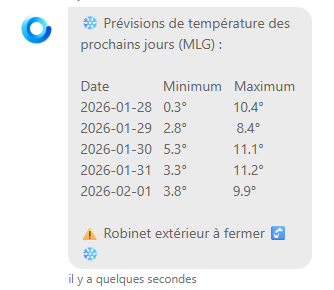

Hallo zusammen,

eine neue Version von Gladys ist da, mit mehreren Verbesserungen und Korrekturen – darunter die Möglichkeit, **Matterbridge** mit einem Klick zu starten und so die Tür zu vielen weiteren kompatiblen Geräten zu öffnen.

{/* truncate */}

## 🆕 Was ist neu

### Matterbridge-Integration

Gladys kann jetzt einen **Matterbridge-Container mit einem einzigen Klick** starten und öffnet damit die Tür zu vielen weiteren kompatiblen Geräten.

Du willst sehen, wie ich diese Integration mit KI gebaut habe? Ich erkläre alles auf YouTube:

📖 [Dokumentation zu Matterbridge](/de/docs/integrations/matterbridge/)

⚠️ Hinweis: Wenn auf deiner Instanz bereits Matterbridge läuft, kann ein Start über Gladys zu einem Portkonflikt führen. Es bringt keinen echten Vorteil, Matterbridge über Gladys zu betreiben, wenn du es bereits selbst außerhalb von Gladys eingerichtet hast.

### Lieblings-Integrationen

Du kannst jetzt deine Lieblings-Integrationen markieren, um sie schneller wiederzufinden.

### Verbesserungen für Tasmota

Automatische IP-Erkennung über MQTT, ein direkter Link zur Weboberfläche des Geräts und eine bessere Sortierung bei der Suche nach Geräten.

## 🐛 Korrekturen & Verbesserungen

- **Widget für die Raumtemperatur:** Ausreißer bei den Temperaturwerten werden jetzt ausgeschlossen, und die Fahrenheit-Umrechnung des Maximalwerts ist korrigiert.
- **Chat:** Leerzeichen in Nachrichten bleiben dank `pre-wrap` jetzt korrekt erhalten:

- **DuckDB** auf 1.4.4 aktualisiert.
- Tippfehler in den Übersetzungen korrigiert.
- Robustheit des MCP-Dienstes verbessert.

---

Danke an alle Contributors: @bertrandda, @mutmut, @Will_71, @qleg und @Terdious für diese tolle Gemeinschaftsarbeit! 🙌

Viel Spaß beim Updaten! 🚀
