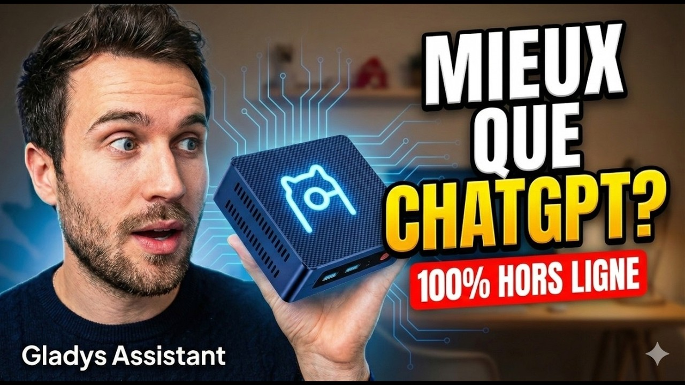

Hallo zusammen,

Kann man wirklich ein leistungsfähiges KI-Modell lokal auf einem kleinen Mini-PC betreiben, ohne irgendwelche Daten in die Cloud zu schicken? Ich habe es ernsthaft ausprobiert und zeige dir alles in einem neuen Video.

{/* truncate */}

Lokale KI ist ein Thema, das dem Gladys-Projekt besonders am Herzen liegt: Privatsphäre zuerst, deine Daten bleiben zu Hause. In diesem Video zeige ich, wie ich ein KI-Modell auf einem Mini-PC zum Laufen gebracht habe, welche Hardware dafür nötig ist und was du realistischerweise erwarten kannst.

Wenn du Fragen hast, stell sie gerne in den Kommentaren auf YouTube – das hilft wirklich bei der Sichtbarkeit 😉
