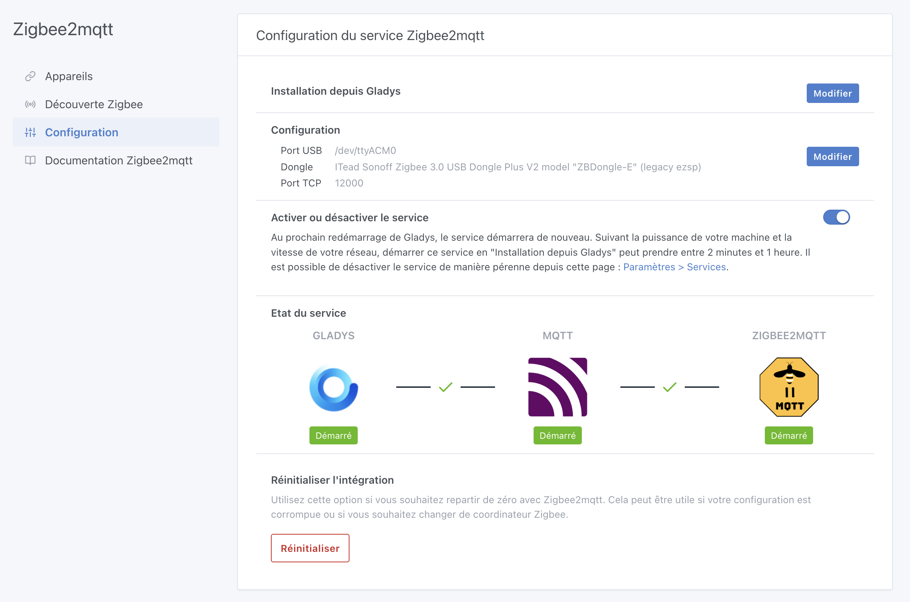
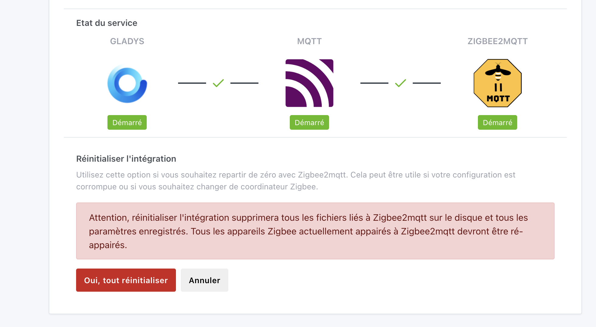

Hallo zusammen,

Eine neue Version von Gladys ist da – mit dem Fokus auf UX- und Stabilitätsverbesserungen für die Integrationen **Zigbee2mqtt** und **MQTT**.

{/* truncate */}

## 🔧 Was sich in diesem Release ändert

### Ein Reset-Button für Zigbee2mqtt

In der Zigbee2mqtt-Integration gibt es einen neuen Button **„Zurücksetzen“**. Damit können Nutzer mit einer beschädigten Integration – oder die einfach den Dongle wechseln möchten – die Integration mit einem einzigen Klick komplett zurücksetzen.

In diese Richtung möchte ich das Projekt weiterentwickeln: **Alles soll über die Oberfläche machbar sein, ohne jemals eine Kommandozeile anfassen zu müssen.** Da das [Starter-Kit](/de/starter-kit/) immer beliebter wird, ist es entscheidend, dass Gladys für alle zugänglich bleibt – unabhängig vom technischen Kenntnisstand.

⚠️ Nutze diesen Button mit Bedacht: Er löscht alle Daten der Zigbee2mqtt-Integration endgültig, und wenn du bereits Geräte gekoppelt hast, musst du sie alle erneut koppeln!

### Zigbee2mqtt auf 2.9.1 aktualisiert

Gladys liefert jetzt die neueste Version von Zigbee2mqtt (2.9.1) mit. [Zum Changelog](https://github.com/Koenkk/zigbee2mqtt/releases).

### Verbesserte Oberfläche für Zigbee2mqtt/MQTT

Die Buttons in der Geräteliste wurden überarbeitet, damit sie sich auf dem Smartphone besser bedienen lassen. Danke an [@Will_71](https://community.gladysassistant.com/) für diesen Beitrag!

---

Wie gewohnt erfolgt das Update automatisch innerhalb von 24 Stunden. Um es zu erzwingen, gehe zu **Einstellungen → System**.
