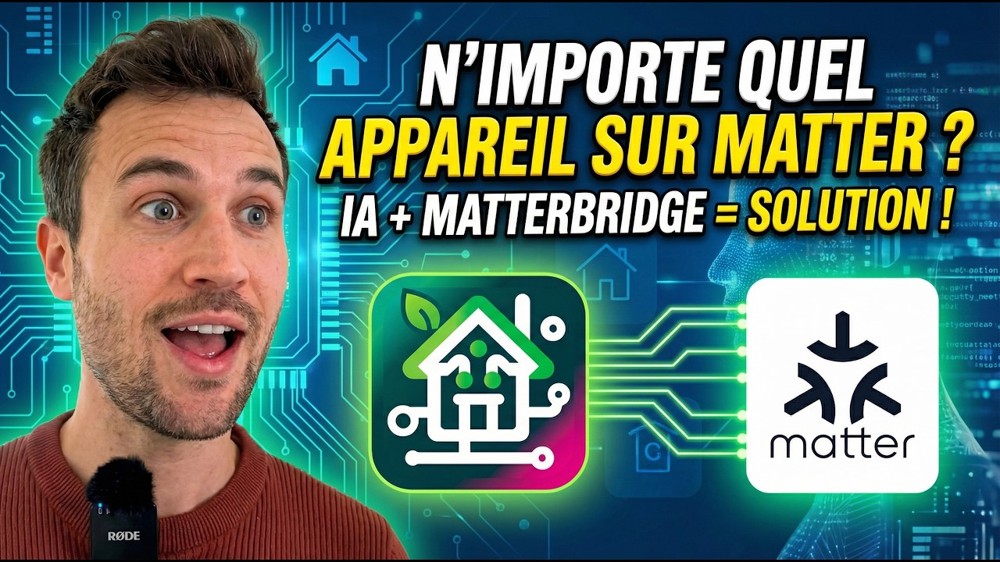
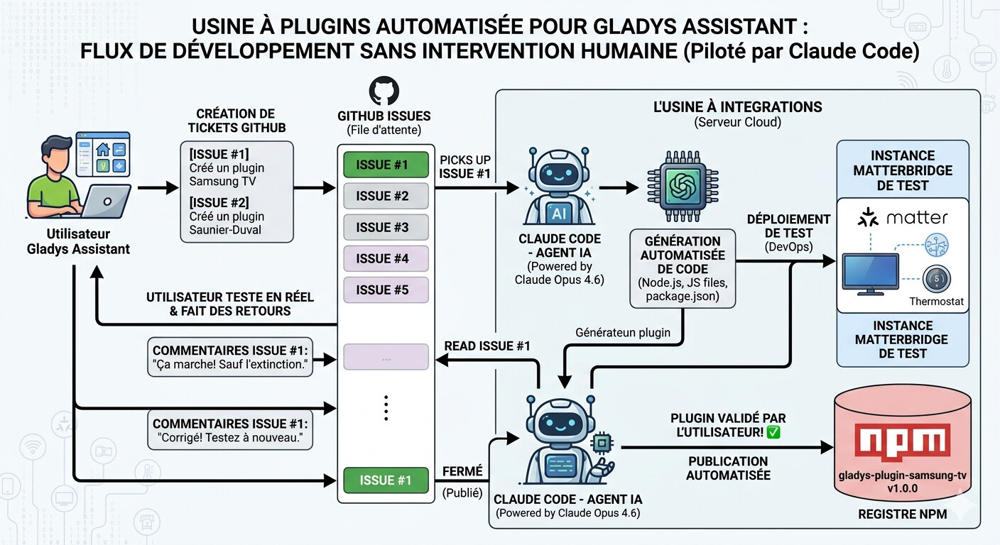

Hallo zusammen,

Ich habe letzte Woche viel Zeit damit verbracht, mit Matterbridge herumzuexperimentieren, und hatte dabei einen echten Aha-Moment, den ich mit dir teilen möchte: Wir werden **jedes Gerät** Matter-kompatibel – und damit Gladys-kompatibel – machen können, ohne eine einzige Zeile Code zu schreiben.

{/* truncate */}

:::info[Dieser Artikel beschreibt nicht mehr den empfohlenen Weg]
Seit der Veröffentlichung dieses Beitrags hat Gladys **externe Integrationen** bekommen: Integrationen, die als Docker-Container verpackt, auf GitHub veröffentlicht und mit einem Klick aus dem Katalog in Gladys installiert werden. Sie sind jetzt der empfohlene Weg, um ein Gerät hinzuzufügen, das nicht nativ unterstützt wird – und jeder kann eine erstellen, in jeder Programmiersprache und ohne Review.

👉 [Den Katalog der externen Integrationen durchstöbern](/de/docs/integrations/external/) oder [erfahren, wie du selbst eine baust](/de/docs/dev/external-integrations/).

Dieser Artikel bleibt zur Dokumentation erhalten.
:::

## Ein bisschen Kontext

Ich habe dir schon von Matterbridge erzählt: ein Projekt, mit dem du Plugins installieren kannst, um Geräte ohne Matter-Unterstützung in Matter einzubinden. Schon heute kannst du dank Matterbridge in Gladys Folgendes nutzen:

- [Somfy-Rollläden](/de/docs/integrations/external/overkiz/)
- [Shelly-Geräte](/de/docs/integrations/external/shelly/) (Generation 1, 2 und 3)
- und bald Roborock-Saugroboter

Aber Matterbridge ist noch jung und hat nicht für alles ein Plugin.

## Das Problem, das es löst

Bei Gladys habe ich immer darauf gesetzt, große, maßgeschneiderte Integrationen zu bauen und viel Zeit in die Nutzererfahrung und die Oberfläche zu stecken. Das Problem: Manche von euch haben sehr spezielle Bedürfnisse – Nischengeräte, die teilweise gar nicht mehr verkauft werden. Bei solchen Produkten lässt sich der Entwicklungsaufwand für eine native Integration, die nur einer Handvoll Nutzer dient, kaum rechtfertigen.

**Was wäre, wenn diese Integrationen einfach Matterbridge-Plugins wären, die von einer KI entwickelt werden?**

Das Plugin-System von Matterbridge ist klar definiert, gut dokumentiert und voller Beispiele. Und diese Integrationen gibt es oft schon anderswo als Open Source (Node-RED, Home Assistant): Wir können die KI einfach bitten, zum Beispiel ein Node-RED-Plugin in ein Matterbridge-Plugin zu übersetzen. Da muss nichts erfunden werden, es ist einfach nur „Code übersetzen“!

## Was ich getestet habe

Ich habe ein Matterbridge-Plugin für meine Mitsubishi-Klimaanlage gebaut, **ohne eine einzige Zeile Code zu schreiben.** Hier zeige ich das Ganze:

## Und jetzt?

Der logische nächste Schritt: **Was, wenn wir die Erstellung von Matterbridge-Plugins komplett automatisieren?** Stell dir eine „Plugin-Fabrik“ vor, gesteuert von Claude Code und auf einem Server laufend, die GitHub-Tickets aufgreift und Plugins ganz ohne menschliches Zutun entwickelt.

Mit so einem System könnten wir die Entwicklung von Integrationen industrialisieren und den Abstand zwischen Gladys und Projekten wie Home Assistant schließen. Ich halte das ehrlich für eine Revolution, und es bestätigt meine Entscheidung, dieses Jahr stark in Matter zu investieren – denn das ist wirklich die Zukunft des vernetzten Zuhauses.

Was meinst du dazu?
