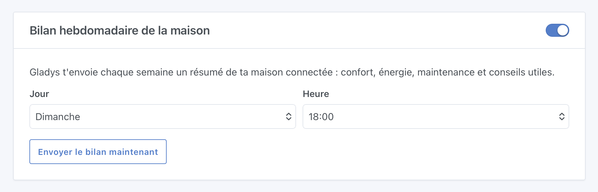
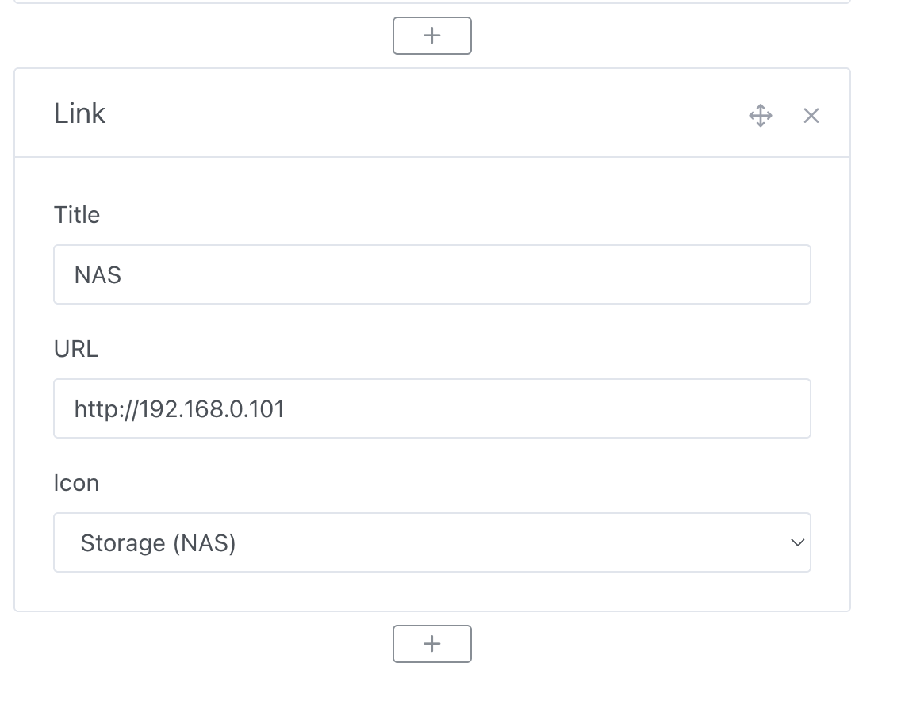
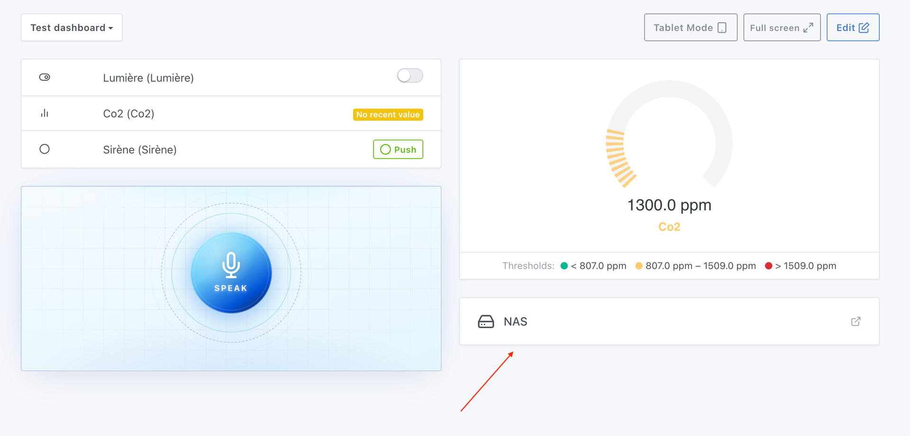
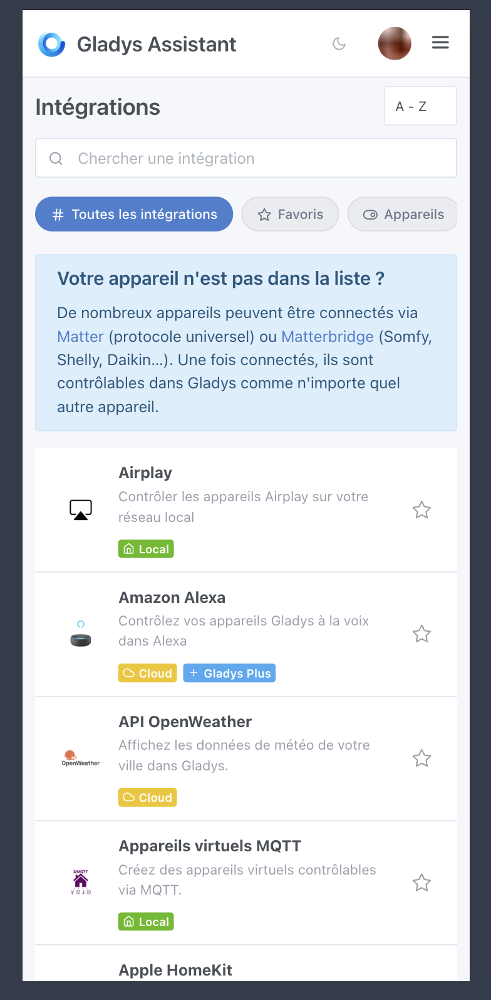

Hallo zusammen 🙂

Ich habe gerade Gladys Assistant 4.78 veröffentlicht! Hier sind die Neuerungen, angefangen mit dem Highlight: ein **KI-gestützter Wochenbericht** über dein Zuhause.

{/* truncate */}

## 🤖 KI-Wochenbericht

Das Hauptfeature dieser Version: der Wochenbericht über dein Zuhause. Jede Woche kann dir Gladys eine persönliche Zusammenfassung deines Smart Homes schicken: Komfort, Energieverbrauch, nicht mehr erreichbare Sensoren, Trends und praktische Tipps.

Standardmäßig wird der Bericht jeden Sonntag um 18 Uhr verschickt. Das lässt sich in der Integration „Künstliche Intelligenz" einstellen:

Hier ein echtes Beispiel für einen Bericht aus meinem eigenen Zuhause:

> Hallo, hier ist deine wöchentliche Zusammenfassung für dein Zuhause für den Zeitraum vom 2. bis 8. Juni 2026.
>
> Dein gesamter Stromverbrauch lag diese Woche bei 55,99 kWh, was Kosten von 8,26 € entspricht. Im Vergleich zur Vorwoche, mit einem Verbrauch von 59,12 kWh und Kosten von 9,36 €, ist ein Abwärtstrend zu erkennen. Die Steckdose der Waschmaschine im Hauswirtschaftsraum hat im Zeitraum 2,11 kWh verbraucht.
>
> Was die Wartung deiner Geräte angeht, sind mehrere Sensoren stumm und benötigen deine Aufmerksamkeit. Der CO2-Sensor im Büro hat seit mehreren Monaten keine Daten mehr gesendet. Außerdem ist der Bewegungsmelder im Badezimmer seit 5 Wochen inaktiv, und der Präsenzmelder in der Toilette ist schon sehr lange offline.

Natürlich können wir diesen Bericht weiterentwickeln, wenn du Ideen hast!

## 📊 Dashboard: Link-Widget

Du kannst jetzt ein Link-Widget zu deinem Dashboard hinzufügen, um mit einem Klick eine externe Oberfläche zu öffnen: Zigbee2mqtt, Tasmota, die Oberfläche deines Routers, ein NAS, eine Kamera usw.

Jeder Link ist anpassbar: Titel, URL und Icon (Website, Server, NAS, WLAN, Weboberfläche…):

Praktisch, um alle deine Zugänge zentral in Gladys zu haben.

## 🔌 Integrationsliste: neu gestaltet auf dem Smartphone

Die Integrationsseite wurde überarbeitet, damit die Navigation auf dem Smartphone übersichtlicher und angenehmer ist.

## 🧠 Das alte lokale „Gehirn" fliegt raus

Das alte lokale KI-System (vorab hinterlegte Fragen/Antworten) wurde entfernt. Es stammte aus einer Zeit, in der es KI noch nicht gab, und hinterließ bei jemandem, der Gladys zum ersten Mal installiert, einen schlechten ersten Eindruck. Durch das Entfernen dieses alten Codes wird Gladys schlanker, eine nicht mehr benötigte NLP-Bibliothek fällt weg, und Gladys startet schneller 🙂

## ⚡ Energie-Monitoring

Ein Gruppierungsfehler im Widget für den monatlichen/jährlichen Verbrauch wurde behoben. Die Daten sollten über diese Zeiträume jetzt korrekt angezeigt werden.

## 🎬 Szenen

Wenn du in einem Szenen-Auslöser „Änderung des Gerätezustands" eine Geräteeigenschaft auswählst, sind Geräte ohne Raum jetzt unter der Kategorie „Kein Raum" sichtbar. Keine „Geister"-Geräte mehr, die sich nicht auswählen ließen 🙂

## 📡 Zigbee2mqtt

Zwei Neuerungen für Zigbee2mqtt-Nutzer:

- **DEVELCO-Keypad:** Unterstützung der Keypad-Aktionen (Unscharf schalten, Scharf schalten Tag/Nacht/alle Zonen, Ausgangsverzögerung, Notfall).
- **Alarmsirenen:** neue Aktionen `trigger_alarm` und `stop_alarm` (z. B. Bosch-Außensirene), nutzbar in deinen Szenen und Automatisierungen.

---

Wie immer erfolgt das Update innerhalb von 24 Stunden automatisch, wenn du Watchtower verwendest, oder du startest es mit einem Klick in den Einstellungen.

Danke an die ganze Community für das Feedback, die Tests und die Vorschläge. Ich bin sehr gespannt, wie der KI-Wochenbericht bei euch zu Hause aussieht!

Vollständiges Changelog: [v4.77.0 → v4.78.0](https://github.com/GladysAssistant/Gladys/compare/v4.77.0...v4.78.0)
