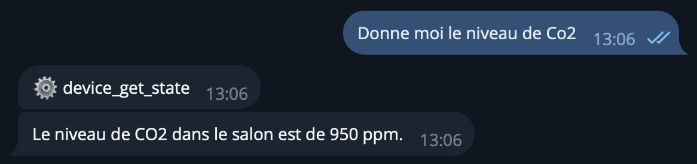
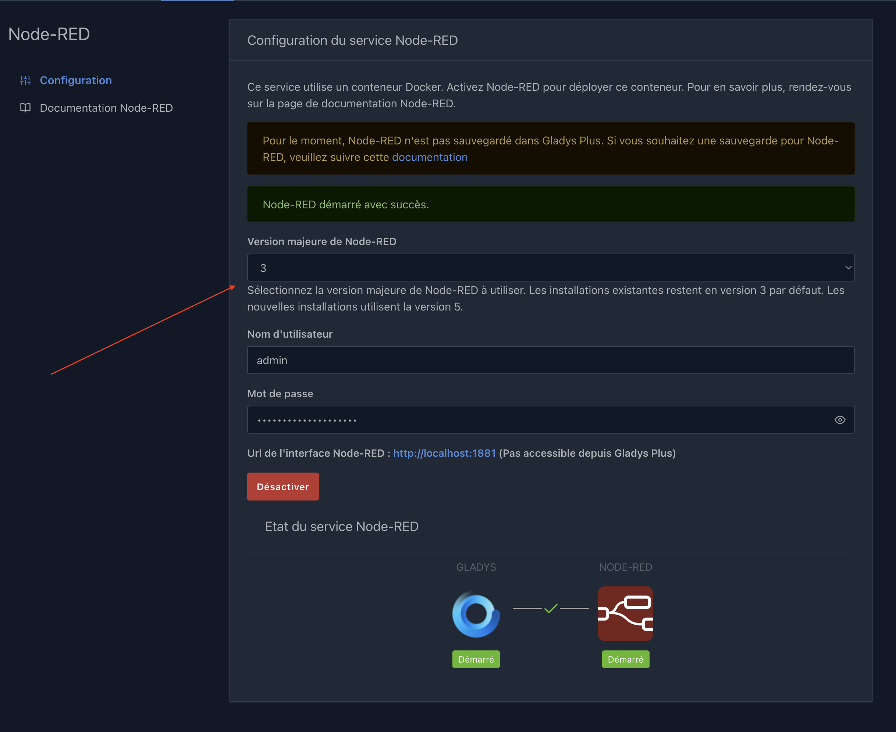

Hallo zusammen,

Gladys v4.79 ist da 🙂 – mit einem klügeren KI-Agenten, einem besseren Sprachassistenten und Unterstützung für mehr Matter-Geräte.

{/* truncate */}

## 🤖 Künstliche Intelligenz

Diese Version bringt mehrere Verbesserungen für den KI-Agenten:

- **Erstellen von Szenen:** Schema korrigiert und Timeout erhöht, um einen Bug beim Erstellen von Szenen zu beheben, den @GBoulvin und @Jluc gemeldet hatten.
- **Bessere Fehlerbehandlung:** klarere Rückmeldungen, wenn die KI nicht antwortet.
- **Tool-Aufrufe über Telegram:** Du siehst die Tool-Aufrufe jetzt auch in Telegram, genau wie im Web.

- **Neue Tools:**
  - **Web Request:** Der Agent kann APIs oder Webseiten abfragen. Das habe ich für meinen eigenen Bedarf umgesetzt, und es ist unglaublich praktisch!
  - **Compare Times:** vergleicht Uhrzeiten.

Diese neuen Tools ermöglichen sehr mächtige Dinge, zum Beispiel die Öffnungszeiten eines Geschäfts abzurufen und dir zu sagen, ob es gerade geöffnet hat! Super praktisch in Szenen über die Aktion „Die KI fragen“. Die Möglichkeiten sind endlos.

## 🎙️ Sprachassistent

- **Stopp-Button**, um eine laufende Antwort zu unterbrechen.
- **Mikrofonerkennung:** Wenn kein Ton aufgenommen wurde, zeigt Gladys jetzt eine Fehlermeldung an.

## 🏠 Matter

Erweiterte Unterstützung für neue Gerätetypen: Staubsauger, NO₂-Sensoren (Stickstoffdioxid-Index) und Ventilatoren.

## 📡 Zigbee2mqtt

- Update auf Zigbee2mqtt 2.12.0
- Unterstützung für die Fernbedienung SONOFF SNZB-01M (4 Tasten)

## 🔧 Node-RED

Mit einer Versionsauswahl kannst du direkt aus der Gladys-Oberfläche auf eine neue Hauptversion von Node-RED wechseln.

Praktisch für den Umstieg auf v5, die gerade erschienen ist! ⚠️ Stell sicher, dass die Module, die du nutzt, mit v5 kompatibel sind.

## 🎬 Szenen

- Breiteres Wertefeld für Sensor-Schwellenwerte
- Ein Zurück-Button für eine einfachere Navigation im Szenen-Editor

## ☁️ Gladys Plus

Wenn ein Remote-Nutzer in Gladys Plus gelöscht wird, wird der entsprechende lokale Nutzer auf deiner Instanz automatisch gelöscht.

---

📋 [Vollständiges Changelog](https://github.com/GladysAssistant/Gladys/releases/tag/v4.79.0)

Wie immer erfolgt das Update automatisch innerhalb von 24 Stunden, wenn du Watchtower nutzt, oder du startest es manuell über **Einstellungen → System**. Viel Spaß beim Updaten! 🎉
