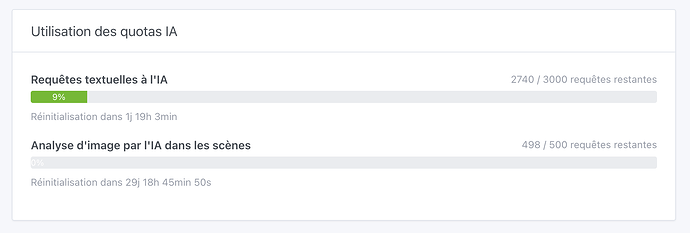
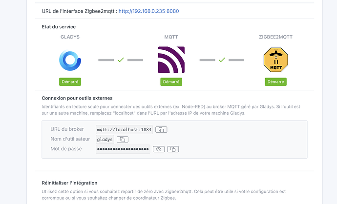

Hallo zusammen!

Version 4.81 ist da 😀 Dieses Release bringt die Steuerung von Rollläden für den KI-Agenten und Alexa, eine neue Anzeige für das KI-Kontingent, mehrere Verbesserungen für Zigbee2MQTT und jede Menge Fixes.

{/* truncate */}

## 🪟 Rollläden

Rollläden bekommen in dieser Version viel Aufmerksamkeit:

- 🤖 Mit dem neuen Tool `device.set-shutter` kann der KI-Agent deine Rollläden direkt steuern: öffnen, schließen, stoppen oder auf eine beliebige Position zwischen 0 und 100 % fahren. Du kannst Gladys jetzt einfach bitten, „die Rollläden im Wohnzimmer halb zu schließen“.
- 🗣️ Rollläden und Vorhänge lassen sich jetzt auch über **Alexa** steuern, sowohl Öffnen/Schließen als auch die Position.

## 🤖 KI

Eine neue Kontingent-Anzeige gibt dir vollen Überblick über deine KI-Nutzung: Unter **Integrationen → Künstliche Intelligenz** siehst du jetzt deine verbleibenden Text- und Bildanfragen, die Daten, an denen sie zurückgesetzt werden, und deinen Status in Echtzeit. Kein Rätselraten mehr, wie viel du noch übrig hast.

## 📡 Zigbee2MQTT

Zwei schöne Verbesserungen für Zigbee-Nutzer:

- 🔑 Die Oberfläche zeigt jetzt deine MQTT-Zugangsdaten an (Host, Port, Benutzername und Passwort), mit einem Schalter zum Ein- und Ausblenden des Passworts und Kopieren per Klick. So lassen sich externe Tools viel einfacher anbinden.
- 🔌 Unterstützung für mehrere fehlende Koordinator-Typen (Dongles) hinzugefügt, darunter Modelle von Home Assistant, SONOFF, SMLIGHT, Texas Instruments und ZigStar.

## 🎬 Szenen

Die Aktionen **KI fragen**, **Nachricht senden** und **Kamerabild senden** wählen jetzt automatisch den ersten verfügbaren Benutzer bzw. die erste verfügbare Kamera aus, statt die Felder leer zu lassen. Eine Sache weniger, die du beim Erstellen einer Szene konfigurieren musst.

## 💡 Philips Hue

Ein Bug wurde behoben, bei dem neu gekoppelte Hue-Lampen erst nach einem Neustart von Gladys steuerbar waren. Die Bridge synchronisiert sich jetzt automatisch neu, sodass neue Lampen sofort verfügbar sind.

## 🐛 Fixes

- ✏️ Die Verarbeitung von Akzenten und Sonderzeichen in Szenen-Nachrichten, KI-Prompts, Sprachbenachrichtigungen und SMS wurde korrigiert.
- 🌡️ Die Systemeinstellungen zeigen jetzt deine **CPU-Temperatur** an, mit farblich markierten Schwellenwerten und automatischer Aktualisierung alle 30 Sekunden.

## ❤️ Danke an die Mitwirkenden

Ein großes Dankeschön an @Will_71 und @bertrandda für ihre Beiträge zu diesem Release. Und danke an die ganze Gladys-Community für euer Feedback, eure Tests und eure Ideen, die das Projekt voranbringen! 🚀

Wie immer aktualisiert sich Gladys innerhalb von 24 Stunden automatisch, wenn du Watchtower verwendest, oder du erledigst das mit einem Klick in den Einstellungen. Hier findest du die [vollständigen Release Notes](https://github.com/GladysAssistant/Gladys/releases/tag/v4.81.0).
