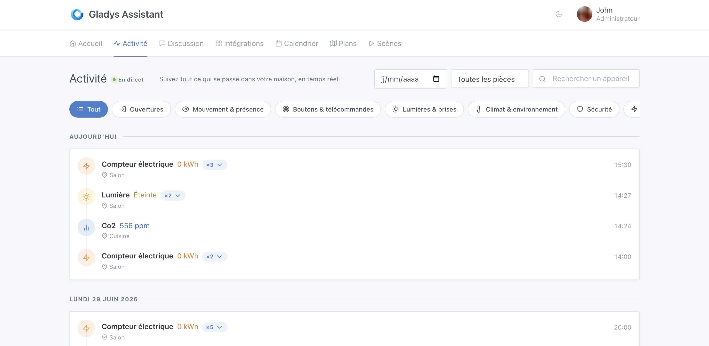
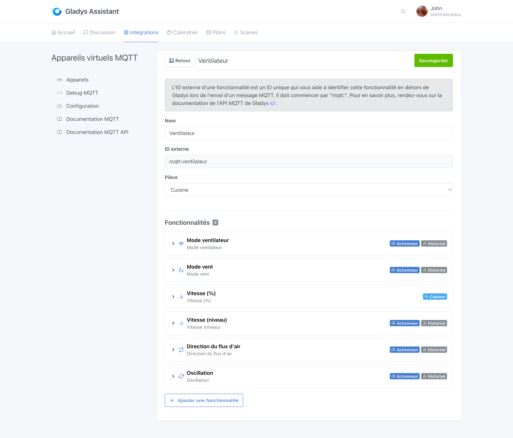
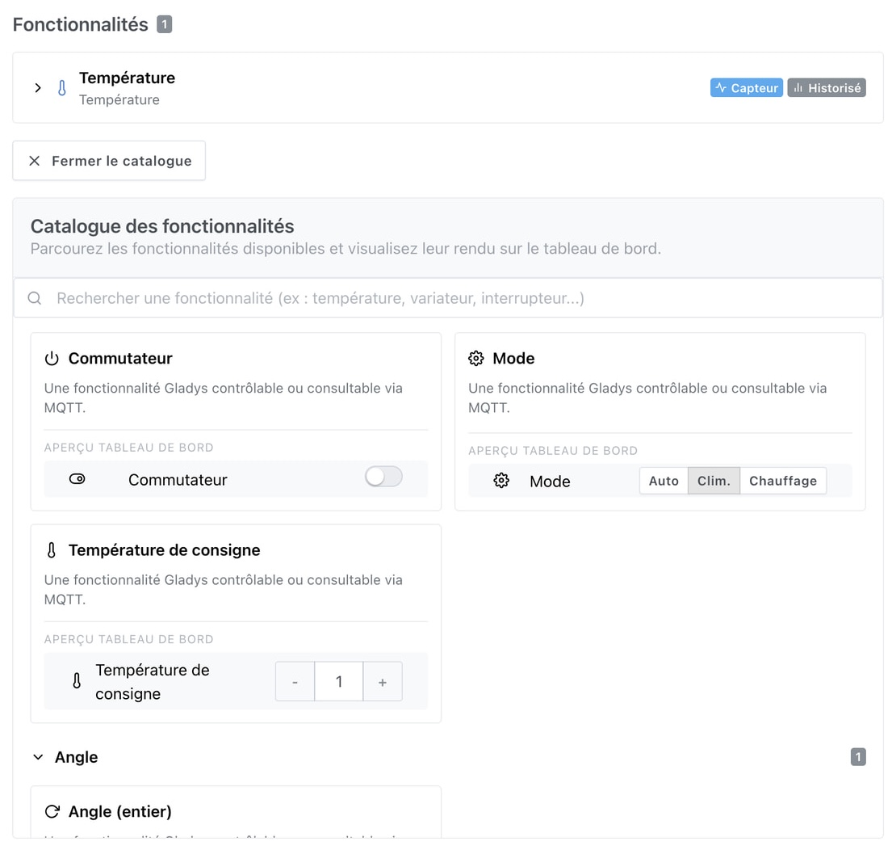
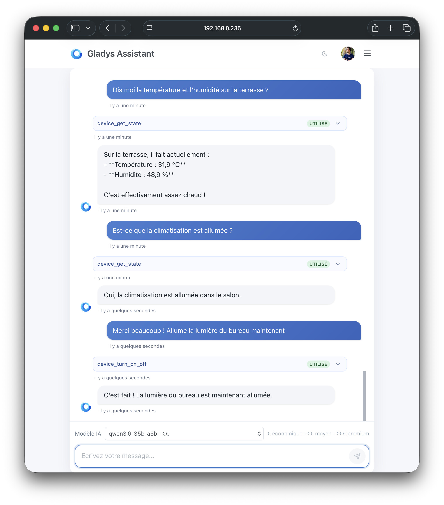

Hallo zusammen!

Heute veröffentliche ich eines der bislang größten Releases des Jahres, und das hat einen echten Grund.

Wir stehen ganz klar an einem Wendepunkt in der Art, wie Software entwickelt wird: KI-Modelle werden immer leistungsfähiger, und die Werkzeuge, um sie im Alltag zu nutzen, sind endlich ausgereift. In den letzten zwei Wochen haben zwei davon meine Arbeitsweise an Gladys verändert.

**Claude Fable 5**, das Flaggschiffmodell von Anthropic, das in den USA vorübergehend eingeschränkt wurde, weil seine Fähigkeiten die Behörden beunruhigten. Damit konnte ich sehr technische Themen angehen, für die ich sonst ganze Tage gebraucht hätte, und große Features wie das Aktivitätsjournal umsetzen, das ich weiter unten vorstelle.

**Die Cloud-KI-Agenten von Cursor**, steuerbar vom Smartphone aus. Vor etwa zehn Tagen hat Cursor seine iOS-App gestartet: Du kannst jetzt eine Entwicklungsaufgabe direkt vom Handy an einen Agenten übergeben und ihn selbstständig arbeiten lassen, ganz ohne Computer. Die komplette Neugestaltung der MQTT-Integration wurde **vollständig** von einem Cursor-Agenten erledigt, während ich unterwegs war.

{/* truncate */}

## 🏠 Neue Aktivitätsseite: der Verlauf deines Zuhauses, live

Das Highlight dieses Releases: ein neuer Tab **Aktivität**, der eine visuelle Zeitleiste von allem zeigt, was in deinem Zuhause passiert – Türöffnungen, Bewegungserkennungen, Lampen, die an- und ausgehen, Sensorwerte und mehr.

Was diese Seite im Alltag so nützlich macht:

- Zeitleiste nach Tagen gruppiert („Heute“, „Gestern“, dann vollständige Daten) mit farbigen Symbolen je Ereignisfamilie.
- **Gruppierung von Ereignisserien**: Aufeinanderfolgende Zustände desselben Sensors werden zu einer einzigen Zeile mit einem `×N`-Badge zusammengefasst, die sich aufklappen lässt, um jedes Vorkommen mit Zeitstempel zu sehen. Unverzichtbar bei Installationen mit 100 bis 200 Geräten.
- Filter nach Familie (Öffnungen, Bewegung & Anwesenheit, Taster, Licht, Klima, Sicherheit, Energie und mehr), Raumauswahl und Gerätesuche.
- **Echtzeit**, mit einer schwebenden „N neue Ereignisse“-Pille, wenn du nach unten gescrollt hast.
- Endloses Scrollen mit Paginierung.

## 📡 MQTT: komplett neu gestaltete Verwaltung virtueller Geräte

Die MQTT-Integration bekommt eine große UX-Überarbeitung, inspiriert vom Feedback der Community ([Forum](https://community.gladysassistant.com/t/catalogue-des-features-supportees-en-mqtt/8452)):

- **Kompakte Liste** der Geräte, nach Räumen gruppiert.
- **Funktionskatalog** mit realistischer Dashboard-Vorschau und Suche.
- **Automatisch erzeugte externe IDs** (`mqtt:{slug}-{4chars}`), jederzeit bearbeitbar.
- **Kopieren**-Button für MQTT-Kennungen und URLs.

## 🤖 KI: Modellauswahl und besserer Kontext

Ich treibe den KI-Agenten in Gladys weiter voran, weil ich überzeugt bin, dass er die Zukunft der Hausautomation ist: dein Zuhause per Sprache oder Text steuern, beliebige Aktionen ausführen, deine Sensoren abfragen.

Dieses Release bringt eine **KI-Modellauswahl** im Chat. Du kannst die verschiedenen Scaleway-Modelle (Mistral, Llama, Qwen, Gemma und mehr) testen und ihre Antworten in echten Situationen bei dir zu Hause vergleichen. Eine Kostenanzeige (€, €€, €€€) hilft dir bei der Orientierung.

Sobald das beste Modell feststeht, rechne ich nach, wie ich es dauerhaft und für das Projekt tragfähig in Gladys Plus integrieren kann. Bis dahin: Teste es und teile dein Feedback im Forum!

Weitere KI-Verbesserungen:

- **Reichhaltigerer Kontext**: Irrelevante Tool-Aufrufe und Nachrichten werden aus dem Kontext ausgeschlossen, für bessere Antworten.
- Schema der Aktion „Gerät ein-/ausschalten“ korrigiert.
- Erweiterte Debug-Datei (letzte 50 Nachrichten).

## ⚡ Tuya: Unterstützung für Smart Meter

- Unterstützung für **Tuya-Smart-Meter**, sowohl über die Cloud als auch lokal.
- Auslesen über die **Thing Model Shadow**-API für Geräte ohne Legacy-Spezifikationen.
- Messwerte: Gesamtleistung, Wirk-/Blindenergie, Spannung, Stromstärke.
- Saubere Anzeigenamen (Tippfehler in Tuya-Codes landen nicht mehr in der Oberfläche).
- Eine Test-Infrastruktur auf Basis von Fixtures, um das Hinzufügen neuer Tuya-Geräte zu industrialisieren.

## 📱 Oberfläche & Dashboard

Das **Gauge**-Widget unterstützt jetzt einen eigenen Namen, um mehrere Gauges desselben Geräts auseinanderzuhalten (zum Beispiel zwei MQTT-Wassertanks). Außerdem haben wir behoben, dass das Scrollen auf dem Handy hängen blieb, wenn man den Finger auf einem Gauge abgelegt hat.

Auf dem Handy sind Aktionsbuttons und Kopfzeilen jetzt auf vielen Seiten (Integrationen, Einstellungen und mehr) responsiv: Buttons werden auf Mobilgeräten untereinander gestapelt, und Button-Gruppen brechen besser um.

## 🔧 Integrationen & Fehlerbehebungen

| Integration | Änderung |
|-------------|--------|
| **Z-Wave JS** | Integration nach einem ZWaveJS-Update repariert |
| **Matter** | matter.js von 0.17.3 auf 0.17.4 aktualisiert |
| **Klimaanlage** | Behoben, dass der Klimamodus seit v4.79.0 als Lüftermodus angezeigt wurde |
| **iOS** | Der Dark Mode wird beim Start der App nicht mehr überschrieben |
| **Szenen** | Nachrichten mit Sonderzeichen verursachen keine Anzeigefehler mehr |

## 🛠️ Unter der Haube (für Mitwirkende)

- **Migration des Frontends von preact-cli (webpack) auf Vite**: schnellerer Start in der Entwicklung, besseres HMR, ein modernisierter Build. Für Endnutzer ändert sich nichts, aber es ist eine gesündere technische Basis für alles, was kommt.
- Neues Feld `supported_options` an DeviceFeature: Integrationen können jetzt die von einer Funktion unterstützten Modi und Werte angeben (zum Beispiel Saugroboter-Modi).
- Erweiterte Entwicklerdokumentation (`AGENTS.md`).

## ❤️ Danke an die Mitwirkenden

Danke an @Terdious, @Will_71, @Sescandell und @bertrandda für ihre Beiträge und an die ganze Community für das Feedback zu MQTT, zum Aktivitätsjournal und zur mobilen UX.

Ein Wort auch an die Abonnenten von [Gladys Plus](https://gladysassistant.com/de/plus/): Dank euch kann ich die KI-Werkzeuge bezahlen, die all das möglich machen. Wenn du Gladys noch schneller voranbringen möchtest, ist Gladys Plus der beste Hebel. Neben der Unterstützung des Projekts schaltest du die erweiterten Funktionen frei: Backups, KI-Agent, Fernzugriff, Sprachassistenten, MCP-Integration, Enedis und vieles mehr.

Wie immer aktualisiert sich Gladys innerhalb von 24 Stunden automatisch, wenn du Watchtower verwendest, oder du erledigst es mit einem Klick in den Einstellungen. Hier findest du die [vollständigen Release Notes](https://github.com/GladysAssistant/Gladys/releases/tag/v4.82.0).
