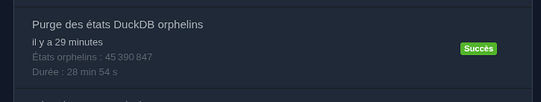
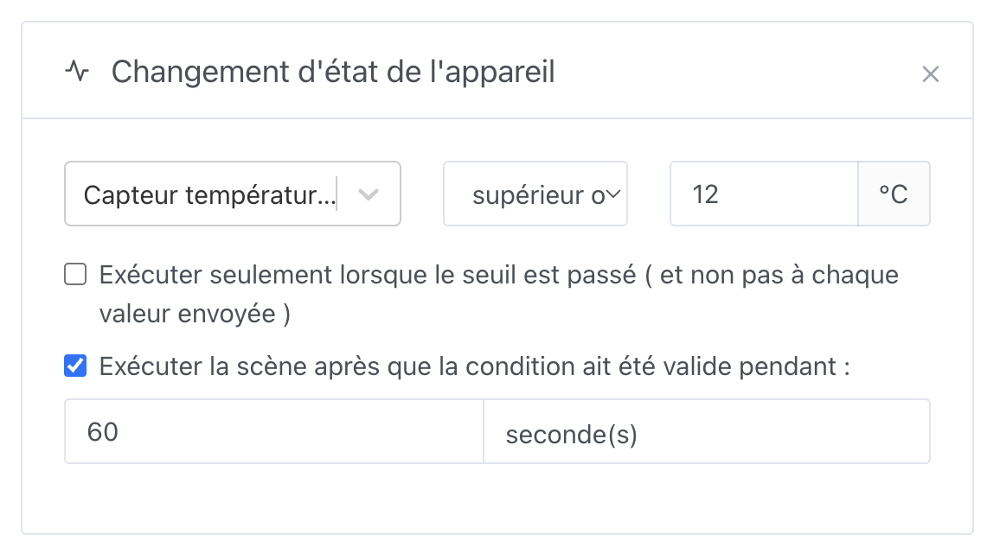

Hallo zusammen!

Version **4.83.0** ist verfügbar! Nach dem großen Release 4.82 (Aktivitätsjournal + MQTT) konzentriert sich diese Version auf **Zuverlässigkeit**, **Performance** und ein paar sehr konkrete Verbesserungen für den Alltag – vor allem für Installationen mit sehr viel Verlauf und für Gladys Plus.

{/* truncate */}

## ⚡ Aktivitätsseite: sofortige Anzeige, auch bei großen Datenbanken

Bei einer Installation mit Hunderten Millionen Zuständen konnte das Filtern der Aktivität nach einer selten vorkommenden Kategorie (Öffnungen, Taster …) die Oberfläche für mehrere Dutzend Sekunden einfrieren.

Die Seite **Aktivität** lädt den Verlauf jetzt in schrittweisen Zeitfenstern: Die ersten Ereignisse werden sofort angezeigt, und die Suche läuft im Hintergrund weiter, mit einem Banner wie „Suche nach Aktivität – `{month}` …“.

Bei einer Datenbank mit **448 Millionen Zuständen** zeigt ein Filter „Öffnungen“, der vorher 20–33 s für eine Antwort brauchte, die ersten Ergebnisse jetzt in ~100 ms an.

Danke an @Terdious für diese Arbeit!

## 🧹 Automatische Bereinigung verwaister Zustände (DuckDB)

Seit der Migration der Verläufe nach DuckDB sorgte ein Bug dafür, dass das Löschen über „Verlauf nicht mehr speichern“ bei einer Funktion sowie in manchen Fällen das Löschen von Geräten die Zustände in DuckDB nicht korrekt aufgeräumt hat.

Das Ergebnis: „Zombie“-Zustände (Funktionen ohne Verlauf oder bereits gelöschte Funktionen) konnten sich jahrelang ansammeln, ohne dass es jemand bemerkt hat – bis das Aktivitätsjournal kam.

Dieses Release behebt das Löschen und startet **einmalig beim Start** einen Hintergrundjob, der verwaiste Zustände behutsam bereinigt (in Batches, mit Pausen), um die CPU nicht zu überlasten und den Rest von Gladys nicht zu blockieren.

Auf einer Testinstallation wurden **45 Millionen** verwaiste Zustände gelöscht. Den Fortschritt kannst du unter **Einstellungen → Aufgaben** verfolgen.

Nochmals danke an @Terdious!

## 🔐 Gladys Plus: 2FA-Ablauf überarbeitet

Der gesamte Ablauf der Zwei-Faktor-Authentifizierung von Gladys Plus wurde überarbeitet, um viele kleine unangenehme Fälle besser abzufangen, die gemeldet worden waren (fehlende Konfiguration, falsche Codes, Zurückgehen usw.).

Gib gerne Feedback zur 2FA. Mir ist es wirklich wichtig, dass sie für Einsteiger einfacher wird, und ich weiß, dass die Authentifizierungsschritte für nicht-technische Nutzer noch etwas kompliziert sind.

Ein nächster Schritt wäre, **Wiederherstellungscodes** hinzuzufügen, damit du die 2FA selbst zurücksetzen kannst, wenn du dein Handy oder deine Authentifizierungs-App verlierst.

## 🛟 Gladys-Plus-Wiederherstellung: kein temporäres Konto mehr

Beim Wiederherstellen eines Backups über den Registrierungsbildschirm hat Gladys bisher ein temporäres lokales Konto mit fest einprogrammierten Zugangsdaten angelegt. Wurde der Vorgang unterbrochen oder schlug er fehl, konnte dieses Konto bestehen bleiben, die Registrierung blockieren … und eine Instanz in einem ziemlich unangenehmen Zustand zurücklassen.

Dieses temporäre Konto wurde **entfernt**. Die Wiederherstellung funktioniert jetzt, ohne einen lokalen Benutzer anzulegen, und Instanzen, die bereits durch ein altes temporäres Konto „blockiert“ sind, werden beim Start automatisch repariert.

## 🎬 Szenen: Dauer in Sekunden beim Zustands-Auslöser

Beim Auslöser **Gerätezustand ändert sich** bot die Option „ausführen, nachdem die Bedingung gültig ist seit …“ nur **Minuten** an.

Jetzt kannst du **Sekunden** oder **Minuten** wählen – praktisch, um schnell zu reagieren (z. B. „wenn 10 Sekunden lang Bewegung erkannt wird“).

Bestehende Szenen bleiben standardmäßig bei Minuten.

## 🖥️ Oberfläche

- **Dashboard**: Widget-Typen werden jetzt alphabetisch nach der Sprache der Oberfläche sortiert (danke @Will_71)
- **Szenen**: Dasselbe gilt für die Listen der Auslöser und Aktionen (danke @Will_71)
- **MQTT**: Zu großer vertikaler Abstand in der Geräteliste korrigiert
- **Aktivität**: Horizontales Scrollen der Filter unter Windows verbessert
- **Szenen**: Eine schwarze Lücke bei mehrzeiligen Variablen-Chips behoben
- **HomeKit**: Farbtemperaturwerte außerhalb des gültigen Bereichs (z. B. bei LED-Streifen) werden jetzt auf den maximalen HomeKit-Wert (500 Mired) begrenzt, was HAP-Warnungen wie „characteristic was supplied illegal value“ vermeidet

## 🛠️ Technisches

- **DuckDB-Migration**: Wechsel vom (veralteten) Paket `duckdb` zu `@duckdb/node-api`. Gleiche Engine, gleiche `.duckdb`-Dateien: **keine Datenmigration** auf Nutzerseite. Vorkompilierte Binaries ersetzen die native Kompilierung.
- Automatische Veröffentlichung des Gladys-Plus-Frontends nach einem Produktions-Release

## ❤️ Danke an die Mitwirkenden

Ein großes Dankeschön an @Terdious und @Will_71 für ihre Beiträge zu dieser Version, und danke an die ganze Community für euer Feedback und eure Tests – besonders an diejenigen, die Gladys mit sehr großen Verlaufsdatenbanken betreiben: Dank euch können wir diese Performance unter realen Bedingungen bestätigen.

Wie immer aktualisiert sich Gladys innerhalb von 24 Stunden automatisch, wenn du Watchtower verwendest. Ansonsten kannst du das mit einem Klick in den Einstellungen erledigen.

Vergiss nicht, Telegram einzurichten, um auf deinem Handy benachrichtigt zu werden, wenn Gladys aktualisiert wird!

Die [vollständigen Release Notes findest du auf GitHub](https://github.com/GladysAssistant/Gladys/releases/tag/v4.83.0).
