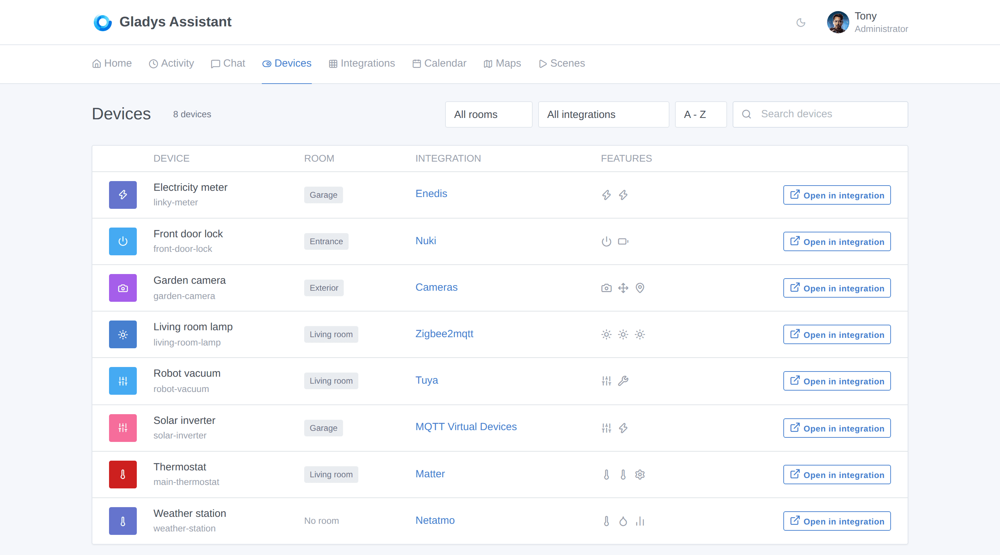
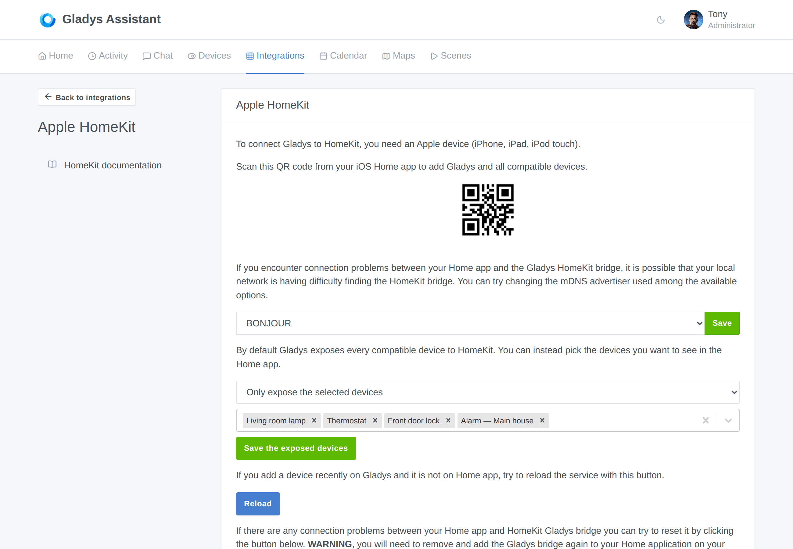
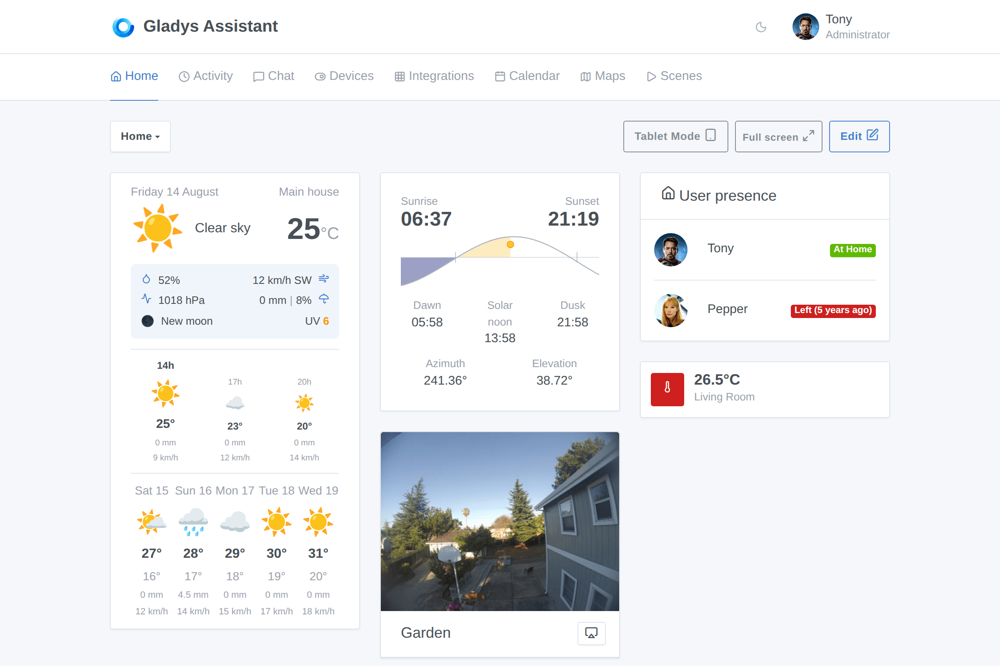
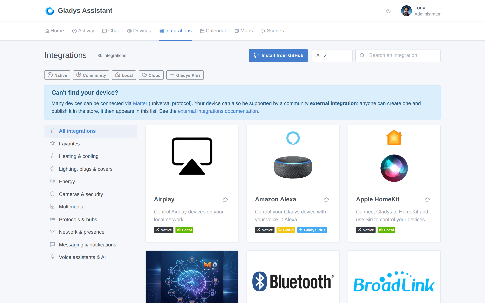
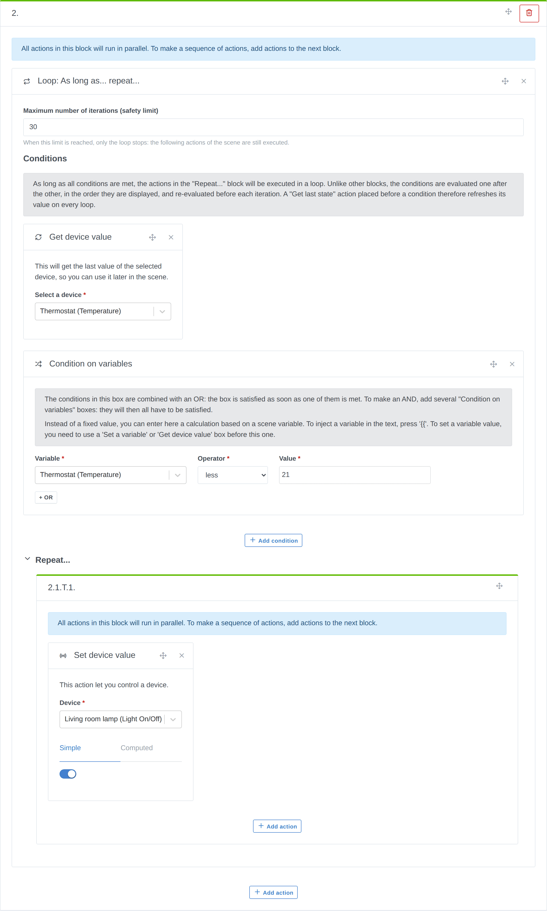
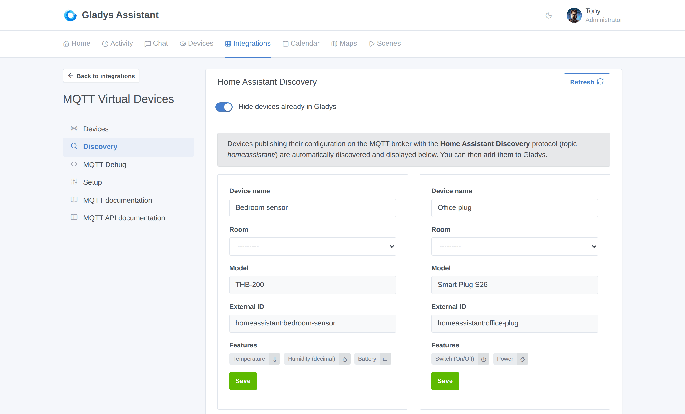

Hallo zusammen!

Version **4.86.0** ist da, und sie lässt sich ganz einfach beschreiben: Es ist das **größte Release in der Geschichte des Projekts**. 🚀

Die Zahlen sprechen für sich. In **7 Tagen** haben wir **68 Pull Requests** gemergt, dabei mehr als **1.000 Dateien** angefasst und rund **28.000 Zeilen Code** hinzugefügt. Zum Vergleich: Unsere bisher größten Releases kamen auf maximal **35 Pull Requests**, verteilt über zwei Wochen. Wir haben gerade **doppelt so viel in der halben Zeit** geschafft.

Und das ist kein einmaliger Ausreißer. Woche für Woche steigern wir die Produktivität dieses Projekts ein Stück weiter, und der Grund ist kein Geheimnis: **KI**. Von den 68 Pull Requests in diesem Release wurden **62 gemeinsam mit Claude geschrieben**. Spezifikationen, Implementierung, Tests, Code-Review, sogar die CI, die ihre eigenen Fehler behebt: KI steckt inzwischen überall in der Entwicklungsschleife von Gladys, und das Ergebnis ist ein Tempo, das dieses Projekt so noch nie erlebt hat.

👉 **Dieses Tempo kannst du live und Tag für Tag auf der [Seite zur Entwicklungsaktivität](/de/dev/) verfolgen**. Commits, Contributors, Streaks: Alles ist dort zu finden und wird automatisch aktualisiert.

Und jetzt schauen wir uns an, was tatsächlich bei dir zu Hause ankommt.

{/* truncate */}

## 📱 Eine neue Geräte-Seite

Bisher musstest du jede Integration einzeln durchgehen, um alle Geräte deines Gladys zu sehen. Damit ist jetzt Schluss.

Gladys hat jetzt im Hauptmenü eine Seite **Geräte**, die **alle Geräte deiner Instanz** an einem Ort auflistet:

- **Suche** nach Namen
- **Filter** nach Raum und nach Integration
- **Sortierung** von A–Z, Z–A oder nach Raum
- Auf einen Blick die **Funktionen** jedes Geräts sehen
- Mit **In Integration öffnen** direkt zum Gerät in seiner Integration springen

Klingt simpel, und genau darum geht es: Wenn du 60 Geräte auf 8 Integrationen verteilt hast, wird diese Seite zu der, die du ständig offen hast.

## 🍏 HomeKit wird zum vollwertigen Bürger

Das ist wahrscheinlich das größte Arbeitspaket in diesem Release. Die HomeKit-Bridge hat sich von „Lampen und Sensoren“ zu **fast allem, was Gladys steuern kann**, entwickelt.

Neu in der Home-App auf deinem iPhone verfügbar:

- **Thermostate** (mit Modi und Betriebszustand)
- **Schlösser**
- **Ventilatoren**
- **Taster**
- **Rauchmelder**
- **Anwesenheitssensoren**, als HomeKit-*Belegungssensoren* bereitgestellt
- **Gerätebatterien**, damit iOS dich warnt, bevor ein Sensor schlappmacht
- **Deine Alarmanlage**, als HomeKit-*Sicherheitssystem* bereitgestellt: Du kannst Gladys direkt aus der Home-App oder per Siri scharf- und unscharfschalten

Und weil es nicht immer gewünscht ist, alles freizugeben, kannst du jetzt **genau auswählen, welche Geräte in HomeKit sichtbar sind**:

Die Bridge startet beim Speichern automatisch neu, und **deine Kopplung bleibt erhalten**: Du musst Gladys nicht aus der Home-App entfernen und neu hinzufügen.

Nebenbei wurden auch zwei langjährige Bugs behoben: Thermostat-Modi werden jetzt korrekt zugeordnet, und HomeKit-Dienste werden anhand der Funktion statt des Gerätetyps ermittelt (was früher Geräte kaputt machte, die mehrere Kategorien kombinieren).

## 🌤️ Ein brandneues Wetter-Widget und ein Sonnen-Widget

Das Wetter-Widget wurde **komplett neu gestaltet** und zeigt jetzt deutlich mehr als nur die aktuelle Temperatur:

- **Stündliche Vorhersage** und **Tagesvorhersage**
- **Regen** (Menge und Wahrscheinlichkeit), **Wind** und Windrichtung
- **UV-Index**, **Luftdruck**, **Luftfeuchtigkeit**, **Mondphase**
- **Wetterwarnungen**
- Und eine **Auswahl des Anzeigemodus**: Du wählst die Blöcke, die du sehen willst, und das Widget zeigt nur diese an

Daneben zeigt ein brandneues **Sonnen-Widget** den Sonnenstand über deinen Tag hinweg: Sonnenaufgang, Sonnenuntergang, Morgendämmerung, Sonnenhöchststand, Abenddämmerung sowie den aktuellen Azimut und die Höhe, dargestellt als Horizontkurve.

Kleines, aber feines Detail auf den Dashboards: **Diagramm-Tooltips folgen jetzt deinem Mauszeiger**, statt die Kurve zu verdecken, die du gerade lesen willst.

## 🧩 Ein Integrationskatalog, in dem man endlich stöbern kann

Mit den nativen Integrationen plus bereits **45 veröffentlichten externen Community-Integrationen** brauchte der Katalog eine echte Struktur. Jetzt hat er eine:

- **Stöbern nach Kategorie**: Heizen & Kühlen, Beleuchtung, Energie, Kameras & Sicherheit, Multimedia, Protokolle & Hubs, Netzwerk & Anwesenheit, Messaging, Sprachassistenten & KI…
- **Facettenfilter**: Nativ, Community, Lokal, Cloud, Gladys Plus
- **Sortierung nach Neueste zuerst**, um zu sehen, was die Community diese Woche veröffentlicht hat
- Badges für **Neu** und **Bald veraltet**
- **Akzentunabhängige Suche** (die Eingabe „camera“ findet auch „caméra“)
- Deine Filter und deine Sortierung **bleiben erhalten**, wenn du von einer Integrationsseite zurücknavigierst

Und wenn eine Suche nichts findet, verweist Gladys dich jetzt auf die **externen Integrationen**: der empfohlene Weg, Kompatibilität für ein neues Gerät hinzuzufügen, den du [an einem Nachmittag selbst bauen kannst](/de/docs/dev/external-integrations/).

## 🎬 Szenen: Schleifen, Variablen und Kalender

Szenen haben ihr größtes Upgrade seit Langem bekommen.

- **Schleifen.** Ein neuer Block **„Solange… wiederhole…“** wiederholt eine Gruppe von Aktionen, solange ihre Bedingungen erfüllt sind. Die Bedingungen werden vor jedem Durchlauf neu ausgewertet, sodass eine Aktion „Letzten Zustand abrufen“ vor einer Bedingung ihren Wert in jedem Durchlauf aktualisiert. Eine **maximale Anzahl an Durchläufen** dient als Sicherheitsgrenze.
- **Variable setzen.** Eine neue Aktion definiert eine Variable (fester Text oder eine Berechnung), die in allen folgenden Aktionen der Szene wiederverwendet werden kann.
- **Kalendertermine abrufen.** Eine neue Aktion holt die Termine des Tages, von morgen oder der nächsten X Stunden aus deinen geteilten Kalendern und übergibt den folgenden Aktionen einen fertigen Satz, die Anzahl der Termine und die Terminliste. Perfekt für eine Morgenansage über deinen Lautsprecher.
- **Mehrfachauswahl im Gerätezustands-Auslöser.** Ein Auslöser kann jetzt **mehrere Funktionen desselben Typs** überwachen: Die Szene startet, sobald eine davon zutrifft.
- **Wähle den Kanal** der Aktion „Nachricht senden“, statt immer an alle konfigurierten Messaging-Dienste zu senden.
- **Sende Text an ein Gerät** direkt aus der Aktion „Gerät steuern“.
- Wertelisten im Editor zeigen jetzt **lesbare Bezeichnungen** statt roher Zahlen.

## 📡 MQTT: Home Assistant Discovery

Eine große Sache für MQTT-Nutzer: Gladys versteht jetzt das **Home Assistant Discovery**-Protokoll.

Jedes Gerät, das seine Konfiguration auf dem Topic `homeassistant/` deines Brokers veröffentlicht, wird **automatisch erkannt** und in einem neuen Tab **Discovery** angezeigt. Du gibst ihm einen Namen, wählst einen Raum und fügst es mit einem Klick zu Gladys hinzu.

In der Praxis bedeutet das: Eine riesige Zahl an ESPHome-, Tasmota-, Zigbee2MQTT- und DIY-Geräten taucht jetzt **ganz ohne manuelle Konfiguration** in Gladys auf.

## 🎥 Kameras: PTZ-Steuerung

Motorisierte Kameras lassen sich jetzt **aus Gladys heraus bewegen**. Ein Kamera-Gerät kann Folgendes bereitstellen:

- Eine Funktion **Bewegung** (Schwenken links/rechts, Neigen hoch/runter, Zoom rein/raus, Stopp)
- **Presets**, die du selbst definierst (Name + an die Kamera gesendeter Wert), um einen Bildausschnitt wie „Eingang“ oder „Garten“ abzurufen
- Funktionen für die **Position** von Schwenken, Neigen und Zoom

Ein Steuerkreuz und eine Preset-Auswahl erscheinen in der Live-Ansicht des Kamera-Widgets und im Raum-Widget. Du wählst aus, welche Bewegungen deine Kamera tatsächlich unterstützt, sodass nur die funktionierenden Tasten angezeigt werden.

Ebenfalls behoben: Kameras behalten im **Vollbild im Dark Mode ihre echten Farben**.

## ⚡ Energie: Solarproduktion und Netzflüsse

Gladys bildet jetzt den kompletten Energiefluss eines Hauses ab, mit neuen Kategorien für Gerätefunktionen:

- **Produktionssensor**: Erzeugungsleistung (deine Solarpanels)
- **Netzsensor**: Bezugsleistung, Einspeiseleistung, vorzeichenbehaftete Netzleistung (Bezug +, Einspeisung −) sowie Zählerstände für Bezug und Einspeisung
- **Hausverbrauchssensor**: Leistung und Zählerstand des Hausverbrauchs, einschließlich Inselbetrieb

Außerdem kann Gladys jetzt **einen Produktionszählerstand aus Zählerablesungen berechnen**, genauso wie es das bereits für den Verbrauch tat. So bekommst du einen sauberen Produktionsverlauf, selbst von Geräten, die nur einen rohen Zählerstand melden.

## 🧠 Neue Typen von Gerätefunktionen

Für Integrationen und für virtuelle MQTT-Geräte sind mehrere neue Bausteine hinzugekommen:

- Funktionstypen **Text** und **Auswahl**. Mit „Auswahl“ definierst du deine eigene Liste von Optionen (Szenen, Modi, Quellen…) mit einer lesbaren Bezeichnung und dem Wert, der an dein Gerät gesendet wird.
- Eine Kategorie **Wartung**, um die Restlebensdauer von Verbrauchsmaterial (Saugroboter-Bürste, Filter…) im Blick zu behalten.
- Sensoren für **NO2, O3 und SO2**, ergänzend zu den bestehenden Luftqualitätskategorien.
- Eine **Schrittweite für den Sollwert pro Funktion**, vom Gerät vorgegeben: Dein Thermostat kann jetzt in 0,5-°C-Schritten regeln, wenn es das unterstützt, statt fest in 1er-Schritten.

## 🤖 Die KI lernt weiter

Der KI-Assistent von Gladys kann jetzt im Chat **Wetterfragen beantworten**: „Wie wird das Wetter morgen?“ wird anhand deines konfigurierten Wetteranbieters beantwortet, so wie es bereits bei Fragen zu Temperatur oder Luftfeuchtigkeit der Fall war.

Ebenfalls behoben: Wenn du eine Frage zum ganzen Haus statt zu einem bestimmten Raum stellst, kommt die KI nicht mehr durcheinander, worauf du dich beziehst.

## 🏠 Haus: Finde deine Adresse per Eingabe

Um den Standort deines Hauses festzulegen, musst du nicht mehr auf einer Karte suchen: **Tippe deine Adresse ein, und Gladys findet sie**. Die Suche basiert auf OpenStreetMap (Nominatim), und Gladys weist dich klar darauf hin, dass die eingegebene Adresse an diesen Drittanbieterdienst gesendet wird.

## 🔌 Integrationen und externe Integrationen

- **Externe Integrationen** können jetzt **aus einem lokal gebauten Docker-Image** installiert und aktualisiert werden. Keine Registry nötig, was die Entwicklung deutlich beschleunigt.
- Eine neue **Wake-on-LAN-Berechtigung**: Eine Integration kann anfragen, über Gladys Magic Packets in deinem lokalen Netzwerk zu senden, und du genehmigst das ausdrücklich.
- Docker-Images, die von externen Integrationen zurückgelassen wurden, werden jetzt **aufgeräumt**.
- Ein neues Konfigurationsfeld **Konto verknüpfen**, für Anbieter, die kein OAuth2 verwenden.
- **Zigbee2MQTT**: Unterstützung für die Funktionen des HS1SA-E, die Neustart-Richtlinie des Containers wird beim Start abgeglichen, und die Szenen-Aktion macht jetzt deutlich, dass das Topic das Präfix `zigbee2mqtt/` enthalten muss.
- **Z-Wave JS UI**: Die eingebaute Integration ist im Katalog jetzt als **veraltet** markiert, und jedes ihrer Geräte bekommt einen Button **Migrieren**, um es samt Verlauf in eine andere Integration zu übertragen.
- Veröffentlichte MQTT- und Zigbee2MQTT-Payloads werden jetzt **geloggt**, mit einer Warnung bei ungültigem JSON. Das Debuggen einer Automatisierung ist damit viel einfacher geworden.

## 🛠️ Unter der Haube

Hier zeigt sich das KI-getriebene Tempo besonders deutlich. In einer Woche:

- **Gladys läuft jetzt auf Node.js 24.**
- **Server-Tests laufen parallel**, ein Worker pro Kern, mit einem Snapshot-basierten Datenbank-Reset und Sandboxes pro Datei. Die Testsuite ist vom Flaschenhals zum Nicht-Thema geworden.
- Der **Cypress-CI-Job** wurde verschlankt und gecacht.
- **Sicherheit**: Alle Abhängigkeits-Warnungen mit hohem und kritischem Schweregrad wurden gepatcht.
- Sequelize wurde auf 6.29 aktualisiert.
- Formeln in Szenen-Bedingungen **schlagen jetzt sicher fehl** (fail closed), mit einer festgelegten Menge an Operatoren.
- Und die CI führt jetzt einen **täglichen automatischen Fix-Durchlauf** aus: Feedback des Review-Bots startet Claude-Code-Cloud-Sessions, die den Fix selbst öffnen.

Dazu kommt eine lange Liste an Korrekturen in der Oberfläche: Die Boost-Steuerung des Warmwasserbereiters läuft auf schmalen Dashboard-Karten nicht mehr über, Drag & Drop funktioniert mit der Maus auf Touchscreen-PCs, Bewegungsmelder zeigen ihre letzte Zustandsmeldung nicht mehr als letzte Bewegung an, binäre Taster sind mit der Aktion beschriftet, die sie auslösen, und das Integrations-Badge ist im mobilen Menü korrekt ausgerichtet.

## 🚀 Warum dieses Tempo wichtig ist

Ich möchte klar sagen, was hier gerade passiert, denn das ist der wichtigste Teil dieses Releases.

Ein Release dieser Größe war früher ein Aufwand von **mehreren Monaten**. Dieses hat **eine Woche** gedauert, und zwar ohne Abkürzungen: Die Spezifikationen sind geschrieben, die Tests sind da, der Code ist reviewt, und die Testsuite ist dabei sogar *schneller* geworden. KI hat den Teil der Arbeit entfernt, der reine Reibung war: Boilerplate, Tests, Refactorings, Review-Durchläufe, CI-Verkabelung.

Was das für dich bedeutet, ist einfach: **Die Funktionen, die du dir im Forum wünschst, kommen jetzt in Tagen statt in Quartalen**. Mehrere Punkte in diesem Release stammen direkt aus einem Forumsthread dieser Woche.

👉 **[Verfolge das Tempo des Projekts auf der Seite zur Entwicklungsaktivität](/de/dev/)**. Sie wird automatisch aktualisiert und ist ehrlich gesagt meine Lieblingsseite auf der Website geworden.

## ❤️ Danke

Ein riesiges Dankeschön an alle, die zu diesem Release beigetragen haben: [@Dreamthy](https://github.com/Dreamthy), [@William-De71](https://github.com/William-De71), [@callemand](https://github.com/callemand), [@cicoub13](https://github.com/cicoub13), [@bertrandda](https://github.com/bertrandda), [@prohand](https://github.com/prohand), [@Terdious](https://github.com/Terdious), Stéphane Escandell und Anupam Mediratta.

Und danke an alle, die **externe Integrationen** veröffentlichen: Der Katalog ist in zwei Wochen von 20 auf **45 Community-Integrationen** gewachsen. Wenn dein Gerät noch nicht unterstützt wird, [kannst du die Integration jetzt selbst bauen](/de/docs/dev/external-integrations/).

Wie immer aktualisiert sich Gladys innerhalb von 24 Stunden automatisch, wenn du Watchtower verwendest. Ansonsten kannst du das Update mit einem Klick in den Einstellungen durchführen.

Denk daran, Telegram einzurichten, um eine Benachrichtigung auf dein Handy zu bekommen, wenn Gladys ein Update erhält!

[Die vollständigen Release Notes auf GitHub ansehen](https://github.com/GladysAssistant/Gladys/releases/tag/v4.86.0)
