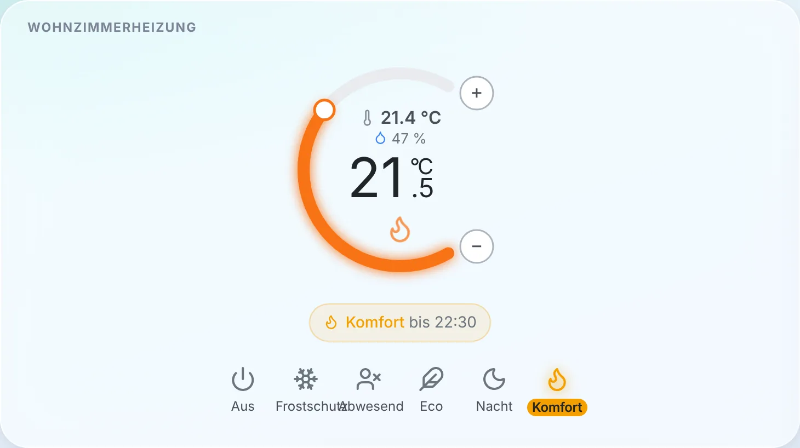
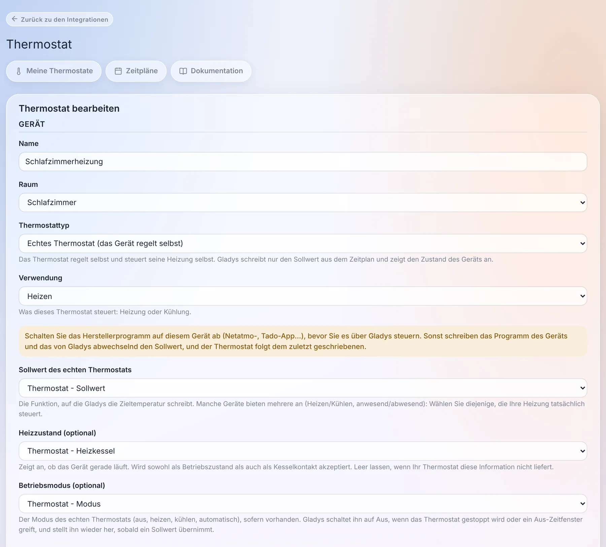
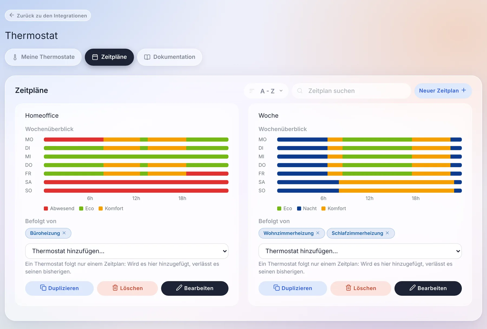
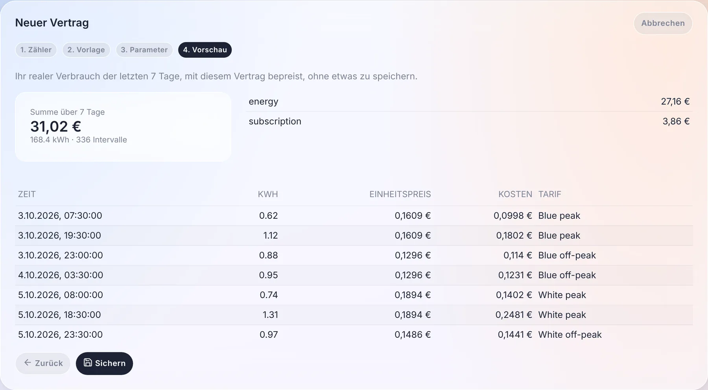
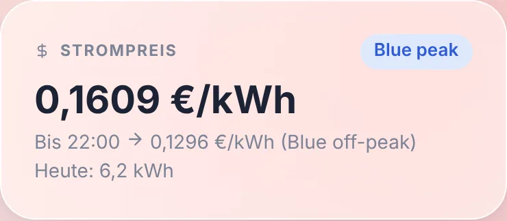
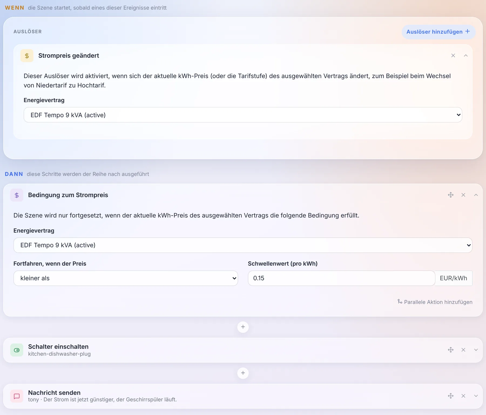
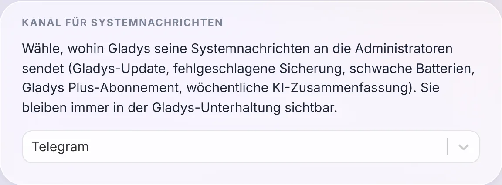
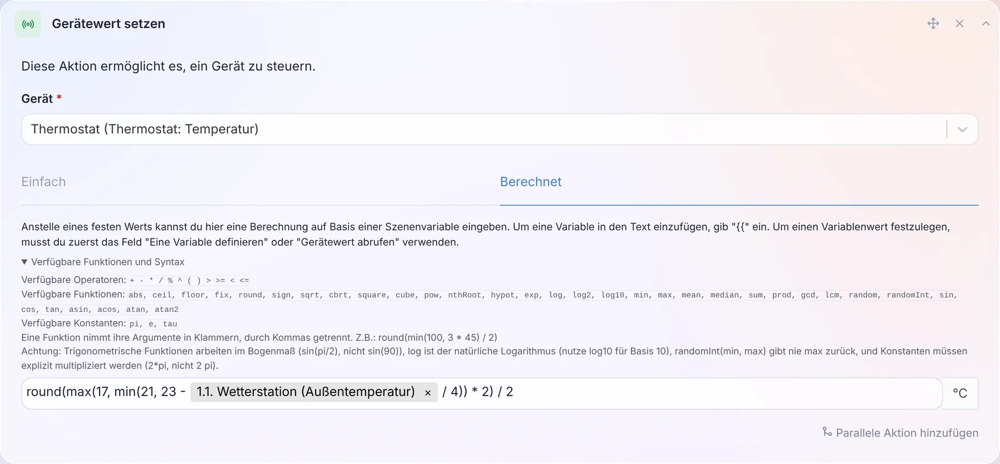
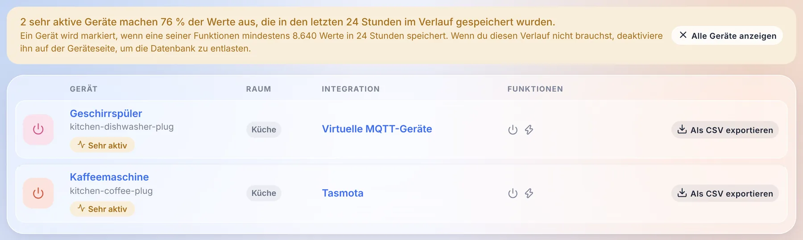

Hallo zusammen!

Heute gibt es eine neue Gladys-Version, die 5.2 🎉

Zwei große Brocken stecken in diesem Release, und beide drehen sich um dein Zuhause statt um die Oberfläche. Gladys kann jetzt **dein Thermostat sein** oder das programmieren, das du schon hast, mit Wochenplänen. Und **die Energieüberwachung öffnet sich für jeden Stromvertrag**: nicht mehr nur die drei französischen Verträge, die Gladys bisher kannte, sondern Zeitfenster, Jahreszeiten, Verbrauchsstufen und Spotpreise aus fast jedem Land.

{/* truncate */}

## Gladys wird zum Thermostat

Das war einer der ältesten Wünsche im Forum und wahrscheinlich die häufigste Installation in Frankreich: ein Elektroheizkörper, der über ein Relais oder eine smarte Steckdose geschaltet wird, irgendwo im Raum ein Temperatursensor und nirgends ein Markenthermostat. Bisher hieß die Antwort in Gladys: eine Szene pro Temperaturschwelle. Kein Zeitplan, keine Hysterese, und ein Heizkörper, der um 21 °C herum ständig an- und ausging.

Jetzt gibt es eine native **Thermostat**-Integration, und sie deckt zwei Fälle ab.

**Gladys ist das Thermostat.** Du wählst einen Temperatursensor und einen Schalter (ein Relais, eine Steckdose, einen Heizkesselkontakt), und Gladys regelt: Sie liest jede Minute die Temperatur und schaltet die Heizung ein und aus, um den Sollwert zu erreichen. Du hast die Wahl zwischen einer Hysterese (heizt unter 20,5 °C, stoppt über 21,5 °C) und einer TPI-Regelung, die einen Anteil eines festen Zyklus heizt, der proportional zur Abweichung ist. Letztere schont träge Heizkörper. Ein Fenstersensor schaltet die Heizung ab, sobald das Fenster aufgeht.

**Gladys programmiert dein vorhandenes Thermostat.** Ein Netatmo, ein Zigbee-Heizkörperthermostat, ein Matter- oder MQTT-Thermostat regelt sich schon sehr gut selbst. Was fehlte, war ein Zeitplan, der in Gladys lebt, neben dem Rest des Hauses, statt in der App des Herstellers. Gladys schreibt jetzt seinen Sollwert nach dem Zeitplan, schaltet seinen Modus bei Bedarf auf Aus und zeigt an, ob es gerade heizt.

Ein Detail, über das ich mich besonders freue: Wenn jemand am Rad des echten Thermostats dreht oder die Temperatur in der Hersteller-App ändert, sieht Gladys das und behandelt es als manuelle Änderung. Sie überschreibt sie nicht eine Minute später, was der klassische Bug von Thermostaten mit zwei Herren ist.

### Wochenpläne, pro Haus

Zeitpläne gehören zu einem Haus. Mit zwei Häusern hat jedes seine eigene „Woche“, und ein Thermostat kann nur einem Zeitplan seines Hauses folgen.

Unter der Haube ist ein Zeitplan eine Liste von **Umschaltpunkten**, wie bei Netatmo und Tado: „ab Montag 06:30 Komfort, bis zum nächsten Punkt“. Das klingt nach einem Detail, beseitigt aber eine ganze Familie von Bugs:

- eine Nacht von 22:30 bis 06:30 ist ein einziges Zeitfenster und nicht zwei Hälften, die um Mitternacht zusammengeklebt werden;
- es gibt weder Lücken noch Überschneidungen: Ein neues Zeitfenster verkürzt die, die es überdeckt, und das Löschen eines Zeitfensters verlängert das vorherige;
- ein Tag ohne eigenes Zeitfenster behält die letzte Voreinstellung des Vortags. Ein Büro-Zeitplan ohne Wochenend-Zeitfenster behält seine Freitagabend-Voreinstellung das ganze Wochenende über, und die Wochenübersicht zeigt genau das.

„Kopieren nach...“ kopiert einen Tag auf die anderen: Du legst den Montag an, kopierst ihn auf die ganze Woche, fertig.

### Das Widget und alles andere

Das neue Dashboard-Widget zeigt die Temperatur und die Luftfeuchtigkeit des Raums, groß den Sollwert und einen orangefarbenen Schein, wenn die Heizung läuft. Das Banner sagt, was das Thermostat gerade tut („Komfort bis 22:30“), und die Leiste unten bietet die Voreinstellungen: Aus, Frostschutz, Abwesend, Eco, Nacht, Komfort.

Eine Voreinstellung wählen oder am Rad drehen ist eine manuelle Änderung, die standardmäßig **bis zum nächsten Zeitfenster des Zeitplans** gilt, wie bei Tado oder Netatmo. Du kannst stattdessen auch eine feste Dauer einstellen. Und ohne Zeitplan bleibt eine manuelle Änderung bestehen, wie bei einem klassischen Thermostat.

Der Teil, der mir am wichtigsten ist, sieht man auf dem Bildschirm nicht: Voreinstellung, Modus und Sollwert sind **ganz normale Gerätefunktionen**. Eine Szene kann das Haus also auf „Abwesend“ stellen, wenn alle gehen, und die KI, MQTT, Gladys Plus und die Sprachassistenten sehen ein Thermostat wie jedes andere, mit seiner Voreinstellung und seinem Heizzustand.

Ein riesiges Dankeschön an [@William-De71](https://github.com/William-De71), der den Großteil dieser Integration geschrieben hat: 84 Commits und viel Geduld während des Reviews!

Die [Thermostat-Dokumentation findest du hier](/de/docs/integrations/thermostat).

## Energieverträge für jedes Land

Die Energieüberwachung von Gladys kannte drei Verträge: Grundtarif, Hoch-/Niedertarif und EDF Tempo. Alles andere erforderte einen Pull Request auf Gladys und ein neues Release. Ein Niedertarif am Wochenende, ein Sommer-/Wintertarif in den USA, die Stufen von Hydro-Québec, ein stündlicher Spotpreis in Norwegen: unmöglich.

In 5.2 ist ein Vertrag keine Preisliste mehr, sondern **ein Satz von Regeln**, die eine Tarif-Engine auswertet, die keinen Anbieter beim Namen kennt. Eine Regel kann von der Uhrzeit, dem Wochentag, der Jahreszeit, einem Datumsbereich, einem Tarifkalender (Tempo-Farbe, Feiertage, Spitzenlasttage), Verbrauchsstufen pro Tag, Monat oder Abrechnungsperiode oder der Spitzenleistung abhängen. Dazu kommen Fixkosten, prozentuale Steuern, Leistungspreise pro kW und Spotpreise mit Faktor und Aufschlag.

Die Engine wird mit echten Verträgen aus **12 Ländern** getestet: Frankreich, Belgien, Vereinigtes Königreich, Deutschland, Finnland, Norwegen, USA, Kanada, Australien, Japan, Südkorea und Indien.

### Ein Assistent und eine Vorschau mit deinem eigenen Verbrauch

Ein Vertrag wird in vier Schritten angelegt: der Zähler, die Vertragsvorlage (nach Land gefiltert, mit Suche), ihre Parameter und eine **Vorschau**.

Die Vorschau berechnet deinen realen Verbrauch der letzten 7 Tage mit dem Vertrag, ohne etwas zu speichern: die Summe, die Aufschlüsselung nach Bestandteilen und eine Auswahl an Intervallen mit dem jeweils angewendeten Preis. Wenn es nicht zu deiner Rechnung passt, weißt du es, bevor du speicherst.

Deine bestehenden Preise werden beim ersten Start **automatisch in Verträge umgewandelt**, ohne die Kostenhistorie anzutasten. Gladys prüft die Umwandlung selbst, indem sie die alte und die neue Berechnung über die letzten 7 Tage vergleicht, und markiert einen Vertrag, der abweicht.

### Der Preis auf dem Dashboard und in deinen Szenen

Ein neues Widget **Strompreis** zeigt den aktuellen Preis, die aktuelle Stufe, bis wann er gilt und den nächsten Preis sowie den heutigen Verbrauch.

Und weil Gladys den Preis jetzt zu jedem Zeitpunkt kennt, können Szenen ihn nutzen: ein Auslöser **„Strompreis geändert“** und eine Aktion **„Bedingung zum Strompreis“**. Den Geschirrspüler zu starten, wenn der Strom günstiger wird, braucht drei Bausteine:

### Ein Vertrag kann von überall kommen

Die Vorlagen kommen aus drei Quellen: dem [Community-Katalog](https://github.com/GladysAssistant/energy-contracts), den Gladys ohne Update herunterlädt, den internen Gladys-Diensten (EDF Tempo) und den **externen Integrationen**. Eine Integration kann jetzt Vertragsvorlagen deklarieren, Tarifkalender veröffentlichen (Tagesfarben, halbstündliche oder viertelstündliche Spotpreise, Feiertage) und für Verträge, die sich mit Regeln nicht ausdrücken lassen, die Kosten selbst berechnen.

Konkret: Eine Integration für Octopus Agile, Tibber oder Nord Pool kann jeder veröffentlichen, ohne Gladys anzufassen. Und wenn dein Vertrag fehlt, kannst du ihn im Assistenten auch selbst in JSON beschreiben und ihn dann als Vorlage exportieren, um ihn zu teilen.

Die [Dokumentation der Energieüberwachung](/de/docs/integrations/energy-monitoring) ist auf dem neuesten Stand.

## Wähle, wohin Systemnachrichten gehen

Gladys schickt Administratoren von sich aus Nachrichten: ein Update, eine fehlgeschlagene Sicherung, schwache Batterien, das Gladys-Plus-Abonnement, die wöchentliche KI-Zusammenfassung. Bisher gingen sie an alle Messaging-Kanäle, die du eingerichtet hattest.

Du wählst den Kanal jetzt unter `Einstellungen / System`: alle, nur Telegram oder nur die Gladys-Unterhaltung. In der Gladys-Unterhaltung bleiben sie ohnehin immer sichtbar.

Danke an [@cicoub13](https://github.com/cicoub13) dafür!

## 35 mathematische Funktionen in Szenen-Formeln

Die berechneten Werte in Szenen (warten, Gerätewert setzen, Variable definieren, Bedingungen, Lautsprecherlautstärke) kannten nur `+ - * / % ^` und fünf Funktionen. Jetzt sind es 35, plus 3 Konstanten: `min`, `max`, `mean`, `median`, `sum`, `sqrt`, `pow`, `log10`, `exp`, die trigonometrischen Funktionen, `pi` … Und ein Link „Verfügbare Funktionen und Syntax“ klappt die vollständige Liste direkt unter dem Feld auf.

Ein Sollwert, der der Außentemperatur folgt, zwischen 17 und 21 °C bleibt und auf das halbe Grad gerundet wird, passt also in eine Zeile, wie im Screenshot: `round(max(17, min(21, 23 - aussen / 4)) * 2) / 2`, wobei `aussen` die im vorherigen Schritt der Szene gelesene Temperatur ist.

Eine weitere Änderung: Eine Formel, die nicht berechnet werden kann, **stoppt jetzt die Szene**, statt sie mit dem vorherigen Wert weiterlaufen zu lassen.

[Die vollständige Liste steht in der Dokumentation](/de/docs/scenes/math-functions).

## Finde die Geräte, die deine Datenbank füllen

Manche Geräte senden alle paar Sekunden einen Wert. Eine smarte Steckdose, die zehnmal pro Minute ihre Leistung meldet und für immer in der Historie bleibt, wiegt am Ende mehr als der Rest des Hauses zusammen.

Die Geräteseite markiert sie jetzt: Ein Banner zeigt, welchen Anteil der Historie sie in den letzten 24 Stunden ausmachen, ein Filter zeigt nur sie an, und jede Geräteseite zeigt die Größe der Historie jeder Funktion. Wenn du diese Historie nicht brauchst, deaktiviere sie auf der Geräteseite, deine Datenbank wird es dir danken.

## Für Integrations-Entwickler

- **Kalender**: Ein neuer Integrationstyp `calendar` erlaubt es einer Integration, Kalender und ihre Termine in Gladys zu synchronisieren: ein CalDAV- oder Nextcloud-Server, iCloud, ein öffentlicher ICS-Feed (Stundenplan, Müllabfuhr, Spielpläne) … Sie erscheinen in der Kalenderansicht und funktionieren mit den Kalender-Auslösern der Szenen, genau wie die Kalender der CalDAV-Integration, und jeder Benutzer verknüpft sein eigenes Konto auf der Seite der Integration. Google Kalender und Outlook, die eine OAuth-Anmeldung pro Benutzer brauchen, folgen in einem zweiten Schritt.
- **Energieverträge**: die neue Fähigkeit `energy_contracts`, oben beschrieben.
- **Widgets**: Ein Widget-Button kann jetzt ein kleines Formular (höchstens 4 Felder) öffnen, bevor er seine Aktion sendet, zum Beispiel den Preis einer Pelletlieferung, eingetippt auf dem Wandtablet.
- **Häuser**: Ein Feld kann mit `source: "houses"` die Liste der Häuser in Gladys anbieten, in der Konfiguration, in Widgets und in Szenen.

Alles steht im [Entwickler-Leitfaden](/de/docs/dev/external-integrations/).

## Die Korrekturen und alles, was 5.1.x schon gebracht hat

Seit 5.1 sind vier Korrektur-Releases erschienen (5.1.1 bis 5.1.4). Das haben sie und dieses Release behoben:

- **Updates**: Wenn Gladys ihr neues Image nicht herunterladen kann, zeigt das Update jetzt den echten Docker-Fehler (Internetverbindung, Speicherplatz, Zeitüberschreitung) statt einer allgemeinen Meldung.
- **CalDAV**: Termine mit Parametern an ihren Eigenschaften und Zeitzonen im Format `GMT+hhmm` werden korrekt synchronisiert, und ein Termin, der sich nicht formatieren lässt, blockiert die anderen nicht mehr.
- **Zigbee2MQTT**: Der mitgelieferte Container wird auf 2.14.2 aktualisiert.
- **Broadlink**: Der Schalter smarter Steckdosen bleibt mit dem echten Zustand der Steckdose synchron.
- **Saugroboter**: Die Steuerungen für Reinigungs- und Betriebsmodus bieten nur die Optionen an, die das Gerät unterstützt.
- **Kamera-Widget**: Es werden nur die Textzustände der Bildfunktion angezeigt.
- **Integrationen**: Geheime Felder von Aktionen lassen sich eingeben, die Standardwerte von Aktionsfeldern werden angewendet, Zahlenfelder akzeptieren Dezimalzahlen, und Widget-Buttons behalten ihre Farben im Dunkelmodus.
- **Anmeldung**: Nach einer lokalen Anmeldung bringt dich Gladys zurück auf die Seite, die du öffnen wolltest.
- **Datenbank**: Die tägliche Bereinigung behält die 1.000 neuesten Nachrichten pro Benutzer und die 2.000 neuesten Hintergrundaufgaben, diese Tabellen wachsen also nicht mehr endlos.
- **Sicherheit**: Die Standort- und Anwesenheitsrouten eines Benutzers sind jetzt diesem Benutzer und den Administratoren vorbehalten, und mehrere Abhängigkeiten wurden aktualisiert, um npm-Sicherheitswarnungen zu beheben.
- **Gladys Plus**: Die Versionsprüfung wird nur noch von den offiziellen Release-Images gesendet, und die Preisseite stellt die mit 5.1 eingeführte E-Mail-Warnung bei Ausfall vor.

Das macht 38 Pull Requests seit Version 5.1, davon 19 in diesem Release.

## Danke an die Mitwirkenden

Danke an [@William-De71](https://github.com/William-De71) für das Thermostat, an [@cicoub13](https://github.com/cicoub13) für den Kanal der Systemnachrichten und die Korrektur des Kamera-Widgets und an [@bertrandda](https://github.com/bertrandda) für die CalDAV-Korrektur. Und danke an alle, die im Forum Bugs gemeldet haben!

Wir sehen uns im [Forum](https://community.gladysassistant.com/), wenn du über dieses Release sprechen möchtest :)

## Wie aktualisiere ich?

Wie immer aktualisiert sich Gladys innerhalb von 24 Stunden automatisch, wenn du Watchtower verwendest. Ansonsten kannst du das mit einem Klick in den Einstellungen erledigen.

Denk daran, Telegram einzurichten, um auf deinem Handy benachrichtigt zu werden, wenn Gladys aktualisiert wird, und seit diesem Release kannst du genau wählen, wohin diese Nachrichten gehen!

Das [vollständige CHANGELOG von 5.2.0](https://github.com/GladysAssistant/Gladys/releases/tag/v5.2.0) findest du auf GitHub.
