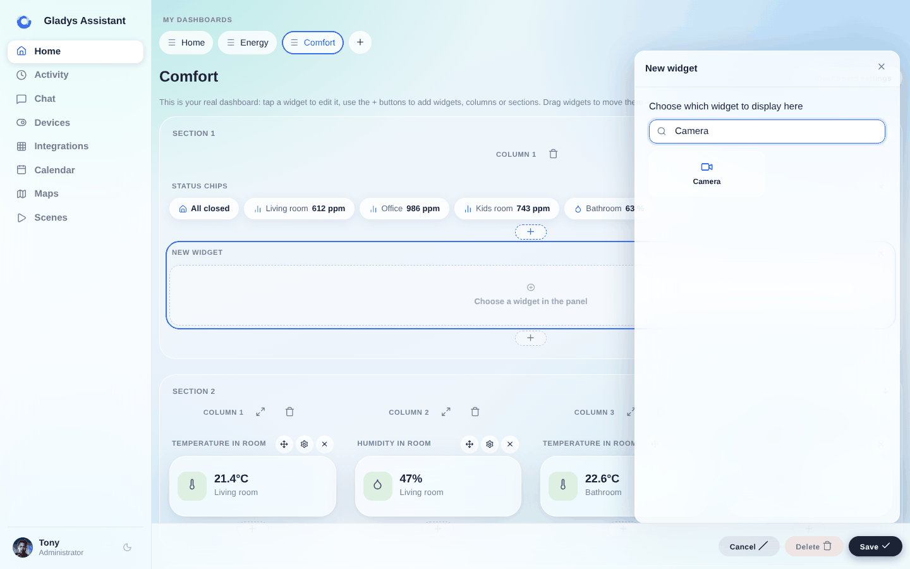
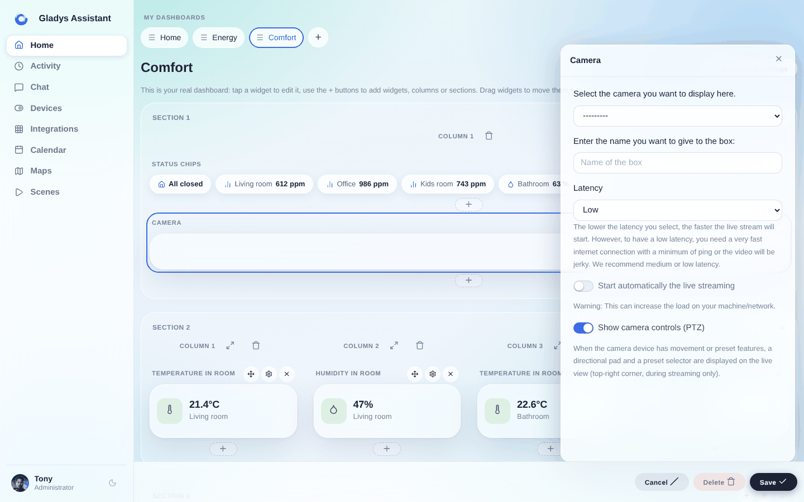

Du kannst ein Kamerabild auf dem Dashboard anzeigen und den Live-Videostream der Kamera ansehen.

## Voraussetzungen

Du musst eine Kamera konfiguriert haben, siehe [die Dokumentation](/de/docs/integrations/camera/) der Kamera-Integration.

## Konfiguration

Öffne das Dashboard von Gladys Assistant und klicke auf die Schaltfläche „Bearbeiten“.

Wähle das Widget „Kamera“:

Wähle anschließend die Kamera aus, die angezeigt werden soll.

Gib dem Widget einen Namen; dieser Text wird auf dem Dashboard unter dem Kamerabild angezeigt.

Klicke auf „Speichern“.

Fertig! Jetzt solltest du dein Kamerabild sehen.

Das Bild wird automatisch in der Frequenz aktualisiert, die du in der Kamera-Integration festgelegt hast.
