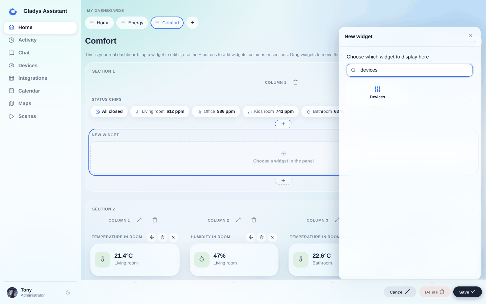
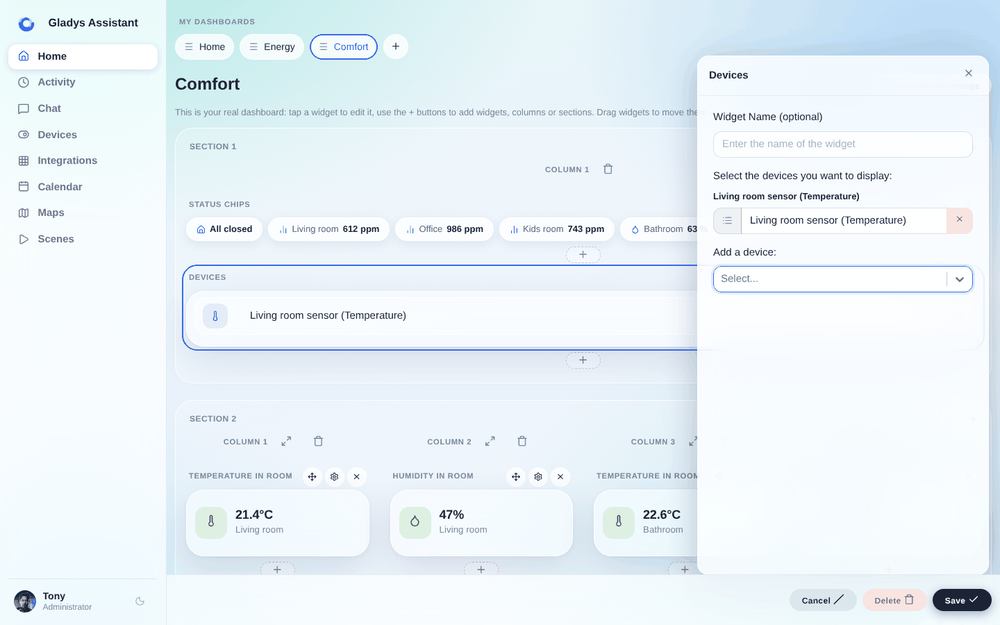
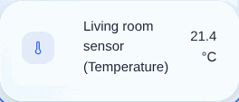
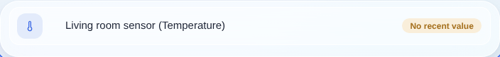
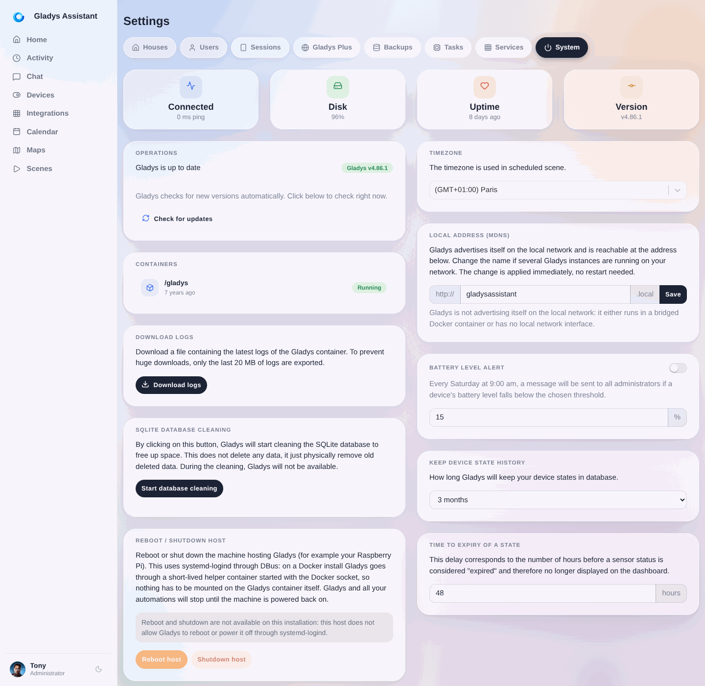

In Gladys Assistant kannst du deine Geräte direkt über das Dashboard steuern und die Werte deiner Sensoren in der Oberfläche anzeigen.

## Voraussetzungen

Du musst mindestens ein paar Geräte zu Gladys hinzugefügt haben (ohne Geräte ist es deutlich weniger spannend 😄).

## Konfiguration

Öffne das Gladys-Dashboard und klicke auf „Bearbeiten“.

Wähle das Widget „Geräte“:

Wähle die Geräte aus, die du anzeigen möchtest, und gib deinem Widget einen Namen (optional).

Klicke auf „Speichern“.

## Verwendung

Jetzt siehst du deine Geräte auf dem Dashboard, kannst bei Sensoren ihre letzten Werte ablesen oder die Geräte direkt steuern.

## Wenn kein Wert angezeigt wird

Zeigen deine Geräte „kein aktueller Wert“ an, bedeutet das, dass das Gerät in letzter Zeit keine Werte gesendet hat.

Standardmäßig liegt der Schwellenwert bei 48 Stunden ohne Werte. Du kannst ihn aber unter `Einstellungen` -> `System` -> `Ablaufzeit eines Zustands` ändern:

