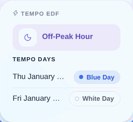
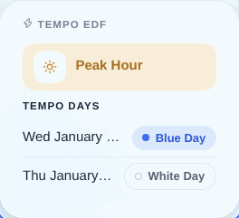

In Frankreich bietet EDF den Tarif [EDF Tempo](https://particulier.edf.fr/fr/accueil/gestion-contrat/options/tempo.html) an. Dabei ist Strom das ganze Jahr über in der Regel günstiger – außer an bestimmten „weißen“ und „roten“ Tagen, an denen der Strompreis deutlich höher ist.
Jedes Tempo-Jahr, das vom 1. September bis zum 31. August läuft, umfasst 300 blaue, 43 weiße und 22 rote Tage.
Dieser Vertragstyp eignet sich besonders für Nutzer, die ihren Verbrauch leicht verschieben können.

### EDF Tempo und Hausautomation

In Gladys kannst du den aktuellen Status der Tempo-Option auf deinem Dashboard anzeigen: Hochtarif- oder Niedertarifzeit sowie die Farbe des aktuellen und des nächsten Tages.

Niedertarifzeit:

Hochtarifzeit:

