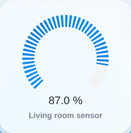
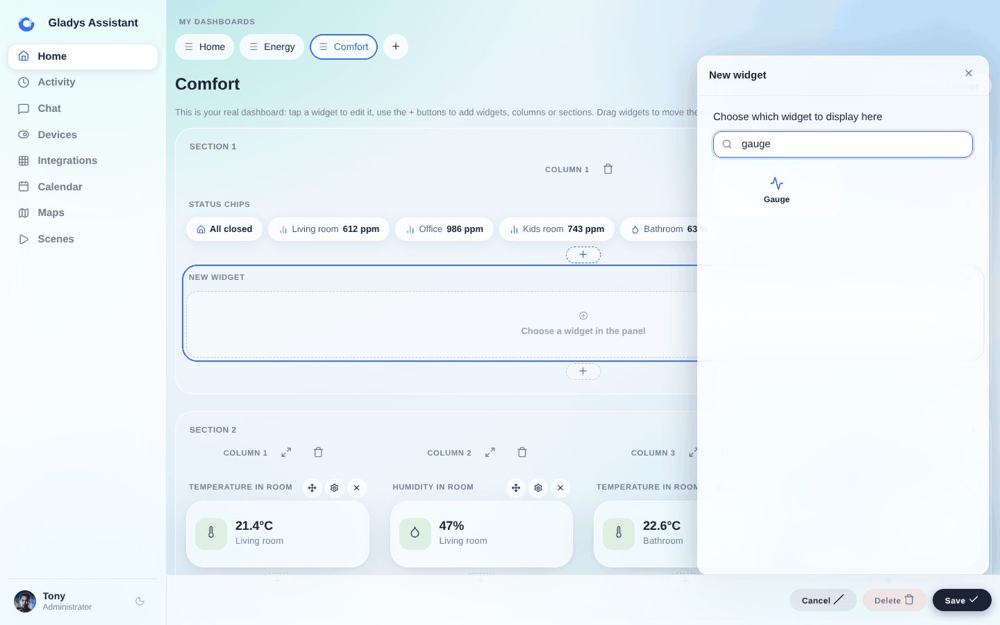
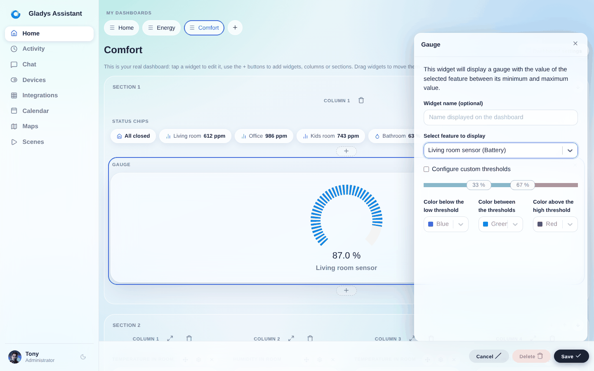

Du kannst auf dem Dashboard eine Messanzeige (Gauge) anzeigen.

Diese Messanzeige zeigt den aktuellen Wert des Sensors zwischen dem Minimum und dem Maximum an, die für den Sensor festgelegt sind.

:::note
Wenn du den Sensor selbst in der MQTT-Integration angelegt hast, kannst du Minimum und Maximum selbst anpassen.

Andernfalls ist die jeweilige Integration dafür zuständig, Minimum und Maximum korrekt festzulegen.

Sind Minimum und Maximum nicht richtig definiert, komm gerne ins Forum, um darüber zu sprechen!
:::

## Voraussetzungen

Du musst mindestens einen Sensor konfiguriert haben, der Daten an Gladys sendet.

## Konfiguration

Öffne das Dashboard und klicke auf „Bearbeiten“.

Füge ein Widget „Messanzeige“ hinzu:

Wähle dann den Sensor aus, der angezeigt werden soll:

Klicke auf „Speichern“ – und schon bist du fertig!
