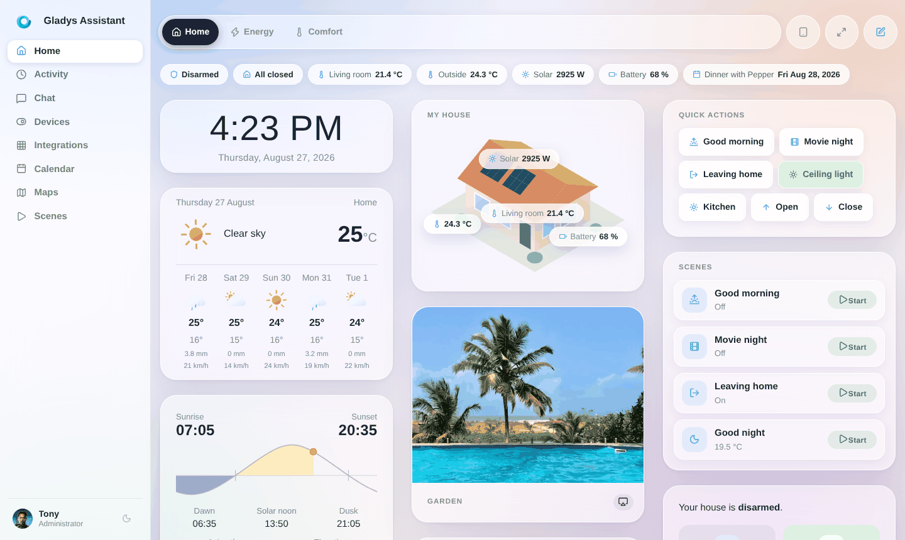
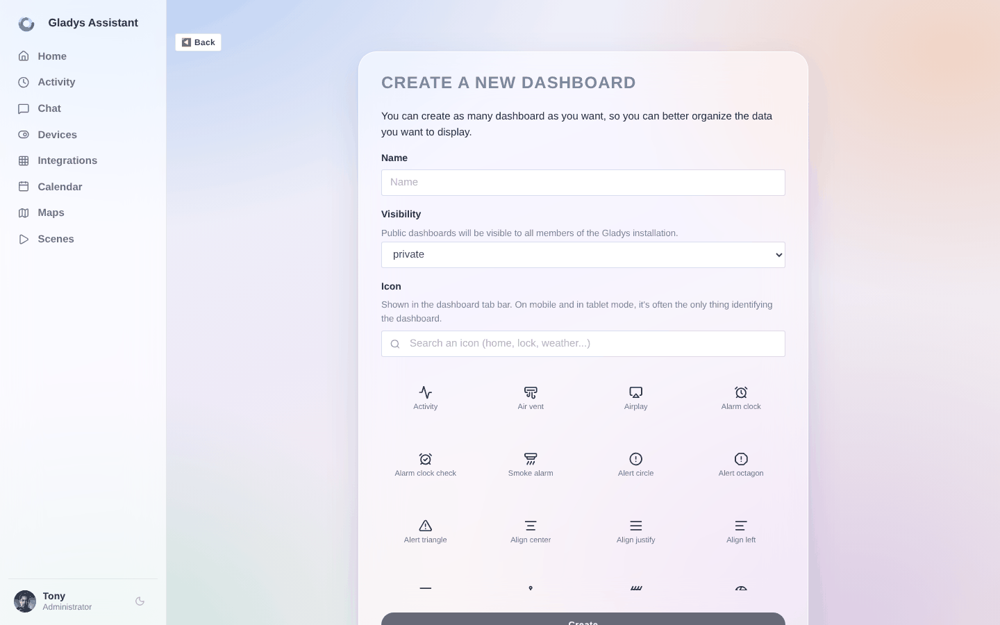

In Gladys Assistant ist das Dashboard die Hauptseite von Gladys.

Du kannst mehrere Dashboards erstellen und sie mit deinen Familienmitgliedern teilen.



Kamerabilder anzeigen? Sensorwerte überwachen? Deine Lichter steuern?

Alles ist möglich!

## Sichtbarkeit von Dashboards

Wenn du ein Dashboard erstellst, kann es „privat“ oder „öffentlich“ sein:

- Ein „privates“ Dashboard ist nur für dich selbst sichtbar.
- Ein „öffentliches“ Dashboard ist für alle Benutzer der Gladys-Instanz sichtbar.



### Tablet-Modus {/* #tablet-mode */}

Wenn du Gladys irgendwo in deinem Zuhause auf einem Touchscreen-Tablet nutzt, möchtest du das Gladys-Dashboard wahrscheinlich im Vollbildmodus anzeigen, ohne dass man diesen Bildschirm verlassen kann.

Du kannst einen Vollbildmodus erzwingen, indem du der URL einen Parameter hinzufügst:

```
?fullscreen=force
```

### Feedback?

Wenn du Anforderungen hast, die das aktuelle Gladys-Dashboard nicht abdeckt, melde dich gerne im [Forum](https://community.gladysassistant.com/), damit wir schauen können, ob wir ein passendes Widget entwickeln können.
