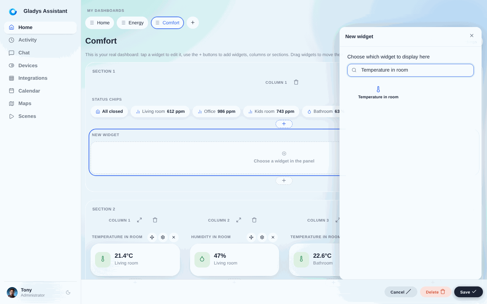
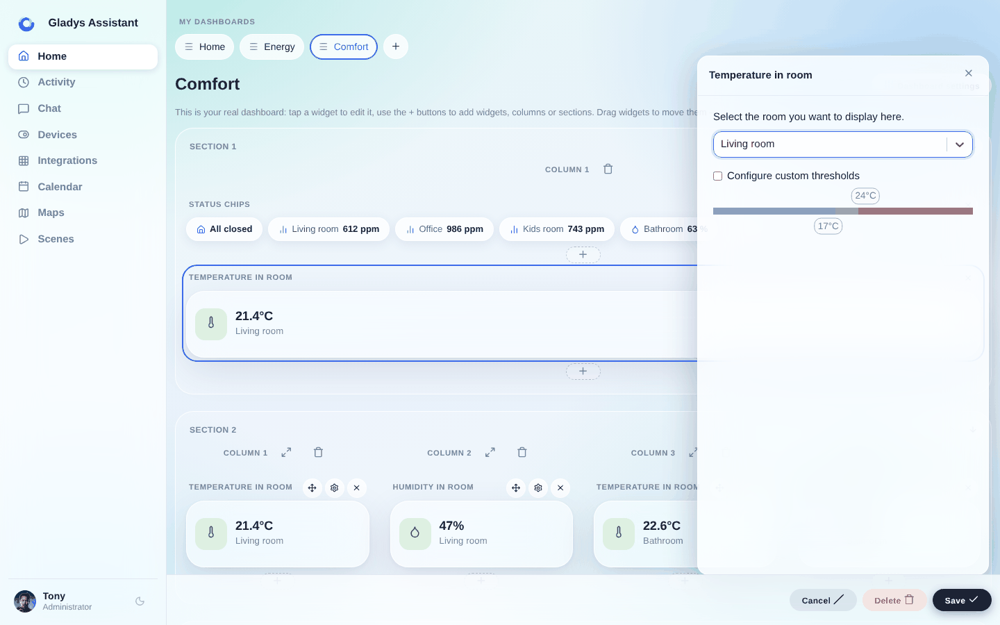
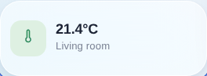
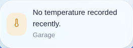

In Gladys Assistant kannst du die durchschnittliche Temperatur eines Raums auf deinem Dashboard anzeigen.

Dieses Widget ruft die Temperatur aller Temperatursensoren im Raum ab und zeigt den Durchschnitt auf dem Dashboard an.

## Voraussetzungen

Du musst vorher mindestens einen Temperatursensor konfiguriert haben.

Das kann ein Sensor mit beliebigem Protokoll sein (Zigbee, Matter, MQTT, ganz egal), und dieser Sensor muss einem Raum zugewiesen sein.

:::note
Manche Sensoren melden eine „Gerätetemperatur“ – ein Computer meldet zum Beispiel seine CPU-Temperatur. Gladys berücksichtigt diese Werte in diesem Widget nicht als Temperaturwerte.
:::

## Konfiguration

Öffne das Dashboard und klicke auf „Bearbeiten“.

Wähle das Widget „Raumtemperatur“ und klicke auf die Schaltfläche +.

Wähle anschließend den Raum aus, der angezeigt werden soll.

Du kannst eigene Schwellenwerte festlegen, bei denen sich die Farbe des Widgets je nach Temperatur ändert.

Klicke auf „Speichern“.

Wenn sich keine Sensoren im Raum befinden oder diese in der letzten Stunde keine Werte gesendet haben, siehst du Folgendes:

