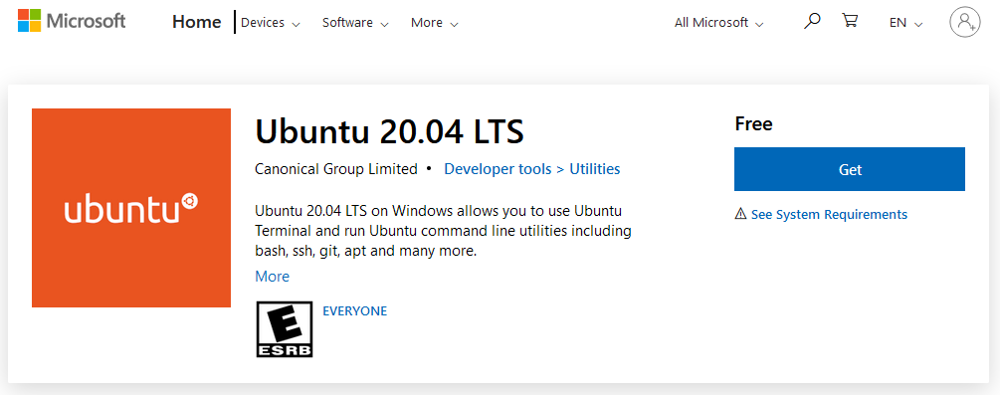

Hier findest du die Anleitung, wie du eine Entwicklungsumgebung für Gladys 4 einrichtest.

## Systemvoraussetzungen

Folge diesen Links, um dein Betriebssystem vorzubereiten.

- [Windows-Subsystem für Linux](https://docs.microsoft.com/en-us/windows/wsl/install-win10)
- [Docker Desktop für Windows](https://hub.docker.com/editions/community/docker-ce-desktop-windows)
- [Visual Studio Code](https://code.visualstudio.com/download)

### WSL-Konfiguration

Stelle sicher, dass dein System WSL2 verwendet, indem du folgenden Befehl ausführst:

```
wsl.exe --set-default-version 2
```

Suche im Microsoft Store nach der neuesten Ubuntu-LTS-Version und installiere sie. Das kann je nach Verbindungsgeschwindigkeit eine Weile dauern.



Jetzt kannst du Ubuntu starten: Öffne Ubuntu LTS über dein Startmenü.
Beim ersten Start von Ubuntu wirst du aufgefordert, einen Benutzer anzulegen.

### Systemabhängigkeiten installieren

Als Erstes aktualisierst du die Distribution mit diesen Befehlen:

```bash
sudo apt update && sudo apt upgrade -y && sudo apt autoremove -y
```

- Installation der Bibliotheken:

  ```bash
  sudo apt install sqlite3 make g++ git coreutils tzdata nmap openssl gzip udev -y
  ```

- Installation von Node.js 22:

  ```bash
  curl -sLO https://deb.nodesource.com/nsolid_setup_deb.sh
  sudo bash nsolid_setup_deb.sh 22
  sudo apt install nodejs -y
  ```
  Alternativ kannst du [nvm](https://github.com/nvm-sh/nvm) verwenden, um Node.js-Versionen zu installieren und zu verwalten.

## Server

Der Server ist eine Node.js-Anwendung.

### Das Git-Repository von Gladys klonen

```
git clone https://github.com/GladysAssistant/Gladys gladys && cd gladys
```

### NPM-Abhängigkeiten installieren

```
cd server
```

Da du beim Entwickeln wahrscheinlich nicht jede einzelne Integration brauchst, empfehlen wir dir, im Ordner `server` eine Datei `.env` mit folgendem Inhalt anzulegen:

```
INSTALL_SERVICES_SILENT_FAIL=true
```

So erstellst du die Datei `.env` mit diesem Inhalt:

```bash
echo "INSTALL_SERVICES_SILENT_FAIL=true" > .env
```

Danach kannst du die Abhängigkeiten des Servers installieren:

```
npm install
```

### Datenbankmigration ausführen

```
npm run db-migrate:dev
```

### Server starten

```
npm start
```

Der Server sollte nun unter `http://localhost:1443` erreichbar sein.

## Frontend

Führe im Stammverzeichnis des Git-Repositorys Folgendes aus:

```
cd front
```

### NPM-Abhängigkeiten installieren

```
npm install
```

### Frontend starten

```
npm start
```

Das Frontend sollte nun unter `http://localhost:1444` erreichbar sein.

## Servertests starten

Wechsle in den Ordner `server`.

Und führe aus:

```
npm test
```

Damit werden die Mocha-Tests ausgeführt.

Den Linter startest du mit:

```
npm run eslint
```

## Servertests nur für einen einzelnen Service starten

Um die Tests nur für einen einzelnen Service auszuführen, wechsle in den Ordner `server` und führe folgenden Befehl aus:

```
npm run test-service --service=tasmota
```

## VS Code starten

Du kannst Visual Studio Code aus Ubuntu heraus mit folgendem Befehl starten:

```
code .
```
