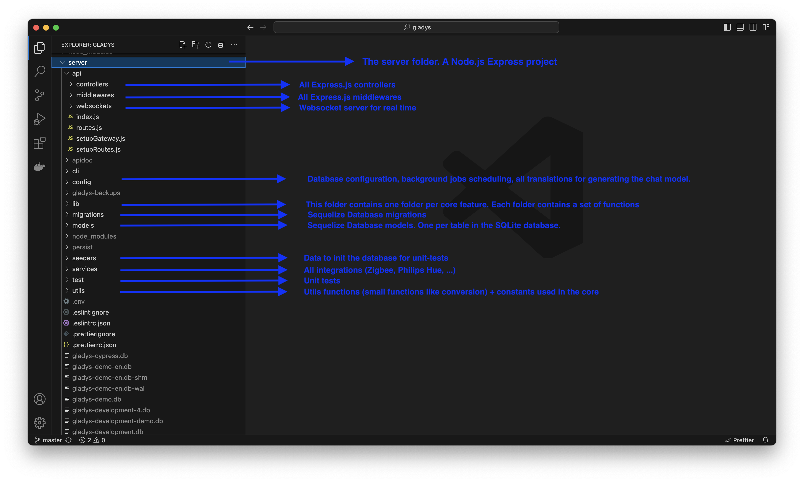
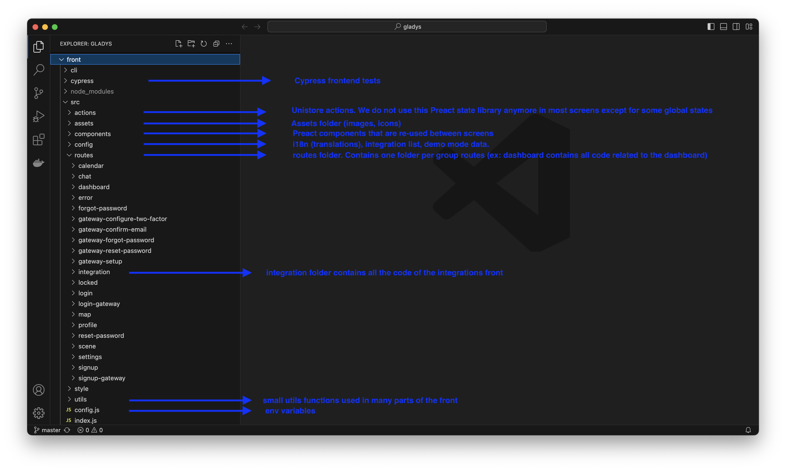

Gladys Assistant ist ein Open-Source-Projekt, und der gesamte Code ist auf [Github](https://github.com/GladysAssistant/Gladys) verfügbar.

Jeder kann diesen Code lesen und ändern, um einen Fehler zu beheben, Funktionen im Backend oder in der Benutzeroberfläche hinzuzufügen und das Projekt zu verbessern.

:::tip[Du willst eine Integration bauen? Fang mit externen Integrationen an]
Der **einfachste und schnellste** Weg, eine Integration zu erstellen und sie mit einem Klick für alle Nutzer zu veröffentlichen, ist eine [**externe Integration**](/de/docs/dev/external-integrations/). Kein Pull Request, kein Code-Review, keine Freigabe durch Maintainer: Du schreibst sie in der Sprache deiner Wahl, verpackst sie als Docker-Container und veröffentlichst sie auf GitHub.

**Auf dieser Seite geht es um Beiträge zum Kern von Gladys selbst**: Fehler beheben, Funktionen im Backend hinzufügen, die Benutzeroberfläche verbessern und, für offene Protokolle, die wirklich in den Kern gehören, eine eingebaute Integration hinzufügen.
:::

## Was du beitragen kannst

- **Einen Fehler beheben**, egal ob im Backend oder im Frontend.
- **Eine Funktion im Backend hinzufügen**: eine neue Szenen-Aktion, einen neuen REST-Endpunkt, eine neue Fähigkeit in der Gladys-API.
- **Die Benutzeroberfläche verbessern**: neue Dashboard-Boxen, bessere Bildschirme, Barrierefreiheit und Übersetzungen.
- **Eine Kern-Integration hinzufügen oder verbessern** für ein offenes Protokoll (Zigbee, Matter, MQTT). Für alles andere solltest du eine [externe Integration](/de/docs/dev/external-integrations/) bevorzugen.

## Verwendete Technologien

Gladys ist ein recht klassisches Node.js-Projekt und verwendet:

- [Preact.js](https://preactjs.com/) für das Frontend (wie React, nur schlanker)
- Node.js [Express](https://expressjs.com/) als Backend-Framework
- [SQLite](https://www.sqlite.org/index.html) für die Datenbank
- [DuckDB](https://duckdb.org/) zum Speichern von Zeitreihendaten (Sensordaten).
- [Sequelize](https://sequelize.org/) als ORM für die Datenbank und die Migrationen
- [Mocha](https://mochajs.org/) für die Backend-Tests
- [Cypress](https://www.cypress.io/) für die Integrationstests des Frontends

## Eine Entwicklungsumgebung einrichten

Je nach Plattform gibt es zwei Anleitungen:

- [Entwicklungsumgebung unter macOS/Linux einrichten](/de/docs/dev/setup-development-environment-mac-linux/)
- [Entwicklungsumgebung unter Windows einrichten](/de/docs/dev/setup-development-environment-windows/)

## Verzeichnisstruktur

### Der Node.js-Express-Server

Das Backend befindet sich im Verzeichnis **server**. Die Ordner, mit denen du am häufigsten arbeiten wirst, sind:

- `server/lib`: die Gladys-API, also die zentrale Fachlogik (Geräte, Benutzer, Szenen, Räume usw.). Hier wird der Großteil der Backend-Funktionen umgesetzt.
- `server/api`: die REST-Controller und -Routen, die die Gladys-API für das Frontend bereitstellen.
- `server/services`: die eingebauten (Kern-)Integrationen.
- `server/models`: die Sequelize-Modelle.
- `server/migrations`: die Datenbankmigrationen.
- `server/utils`: die gemeinsam genutzten Hilfsfunktionen.

Hier eine kurze Erklärung aller Backend-Ordner im Verzeichnis **server**:



### Das Preact.js-Frontend

Die Preact-Anwendung wurde mit [preact-cli](https://github.com/preactjs/preact-cli) erstellt:



## Am Backend arbeiten

Wenn du eine Funktion im Backend hinzufügst, gehst du in der Regel so vor:

1. Setze die Logik im passenden Modul unter `server/lib` (der Gladys-API) um. Ein Modul sollte niemals mit rohem SQL auf die Datenbank zugreifen, sondern die Modelle und den Rest der Gladys-API verwenden. Wenn eine Fähigkeit fehlt, füge der API eine neue Funktion hinzu.
2. Stelle sie bei Bedarf über eine REST-Route in `server/api` bereit.
3. Decke sie mit Unit-Tests ab (siehe [Deine Änderungen testen](#testing-your-changes) weiter unten).

Ein paar Konventionen, die im gesamten Code gelten:

- **JSDoc-Kommentare an Funktionen sind Pflicht.** Sie dokumentieren den Code und dienen außerdem der Typprüfung.
- Platziere `require()`-Aufrufe von Drittanbieter-Modulen **innerhalb** der Funktion, die sie nutzt, und nicht am Anfang der Datei. So kann ein defektes NPM-Modul niemals den gesamten Prozess zum Absturz bringen.

### Kern-Integrationen (offene Protokolle)

Eingebaute Integrationen befinden sich im Verzeichnis [server/services](https://github.com/GladysAssistant/Gladys/tree/master/server/services), ein Ordner pro Service. Jeder Service hat eine `package.json` (mit den Pflichtfeldern `os` und `cpu`) und eine `index.js`, die eine Factory exportiert, die mindestens eine Funktion `start()` und eine Funktion `stop()` bereitstellt:

```js
module.exports = function ExampleService(gladys) {
  async function start() {
    // start the service
  }
  async function stop() {
    // stop the service
  }
  return Object.freeze({ start, stop });
};
```

Über das Argument `gladys` hast du Zugriff auf die komplette Gladys-API. Registriere deinen Service, indem du ihn in [server/services/index.js](https://github.com/GladysAssistant/Gladys/blob/master/server/services/index.js) einträgst.

Dieser Weg lohnt sich nur für offene Protokolle, die in den Kern gehören. Für alles andere ist eine [externe Integration](/de/docs/dev/external-integrations/) schneller gebaut, braucht kein Review und lässt sich mit einem Klick installieren.

## An der Benutzeroberfläche arbeiten

Die Oberfläche von Gladys 4 ist eine [Preact](https://preactjs.com/)-Anwendung im Verzeichnis **front**. Der Code ist wie folgt aufgebaut:

- `front/src/routes`: die Seiten, ein Ordner pro Bildschirm.
- `front/src/components`: die wiederverwendbaren UI-Komponenten.
- `front/src/actions`: der Anwendungszustand und die Aktionen, die ihn verändern.
- `front/src/config/i18n`: die Übersetzungen (`en.json`, `fr.json`, `de.json` usw.).
- `front/src/routes/integration/all`: die Bildschirme der einzelnen Integrationen.

Um der Oberfläche eine Funktion hinzuzufügen, legst du eine Route und ihre Komponenten an oder bearbeitest sie, verbindest den Zustand über `actions` und trägst jede verwendete Beschriftung in alle Dateien `front/src/config/i18n/<lang>.json` ein, damit die Oberfläche vollständig übersetzt bleibt (Englisch und Französisch sind die Referenzsprachen).

## Deine Änderungen testen {/* #testing-your-changes */}

Ein zentrales Ziel von Gladys Assistant ist es, eine extrem stabile und zuverlässige Software zu sein. Deshalb muss der gesamte Code von Gladys getestet sein.

- **Backend (Mocha):** Die Tests liegen im Verzeichnis [server/test](https://github.com/GladysAssistant/Gladys/tree/master/server/test). Um sie auszuführen, rufe `npm test` im Verzeichnis `server` auf. Während der Entwicklung kannst du dich auf einen einzelnen Test konzentrieren, indem du ihm `.only` hinzufügst (entferne es unbedingt vor dem Commit). Deine Tests dürfen niemals echte APIs aufrufen: Mocke alle Aufrufe von Drittanbieter-Modulen, zum Beispiel mit [proxyquire](https://github.com/GladysAssistant/Gladys/blob/master/server/test/services/example/index.test.js#L5).
- **Frontend (Cypress):** Siehe die eigene Seite zu den [Cypress-Tests](/de/docs/dev/cypress-tests/).

## Codequalität

Wir verwenden eine recht strenge `eslint`-Konfiguration.

Nutze `VSCode` für die Entwicklung, um Linting-Probleme in Echtzeit zu sehen, oder führe `npm run eslint` im Verzeichnis `server` (und in `front`) aus, um alle Linting-Fehler anzuzeigen.

## Deinen Beitrag einreichen

Sobald deine Änderung fertig und getestet ist: Glückwunsch! Du kannst einen Pull Request auf GitHub öffnen.

Lies dazu: [Einen PR auf GitHub erstellen](https://docs.github.com/en/pull-requests/collaborating-with-pull-requests/proposing-changes-to-your-work-with-pull-requests/creating-a-pull-request)

## Fragen?

Du hast Fragen? Diskutiere sie gerne [im Forum](https://community.gladysassistant.com/)!
