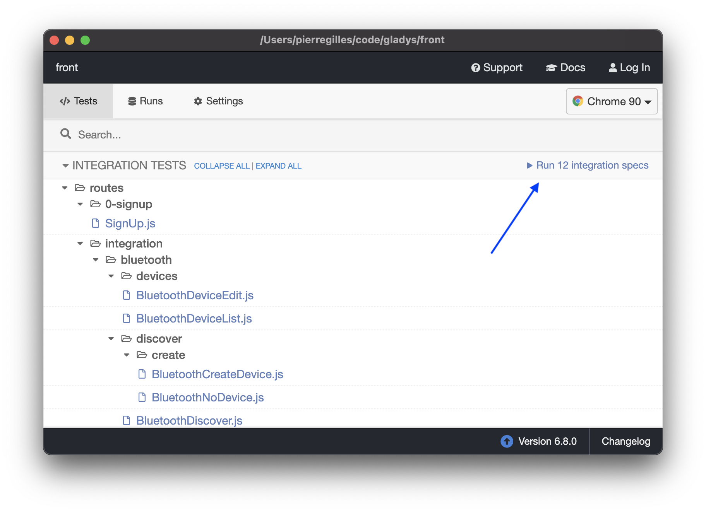

Wir verwenden [Cypress](https://www.cypress.io/) für End-to-End-Tests des Frontends.

## Backend starten

Führe im Ordner `server` Folgendes aus:

```
npm run cypress
```

Dadurch wird eine neue SQLite-Datenbank nur für die Tests angelegt und das Backend gestartet.

## Cypress öffnen

Starte im Ordner `front` das Gladys-Frontend:

```
npm run start:cypress
```

Danach kannst du die Cypress-App öffnen:

```
npm run cypress:open
```

Dadurch öffnet sich die Cypress-Electron-App.

Dort kannst du die Tests manuell starten und sie in einem Browser ablaufen sehen:



## Tests in der Kommandozeile ausführen

Du kannst die Cypress-Tests in der Kommandozeile ausführen mit:

```
npm run cypress:run
```
