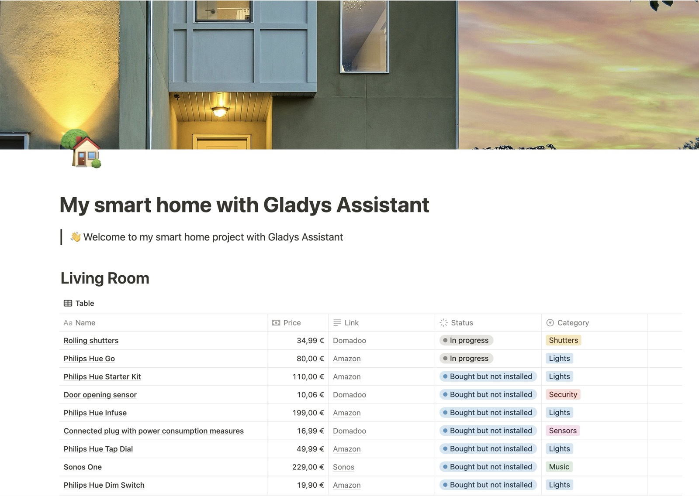
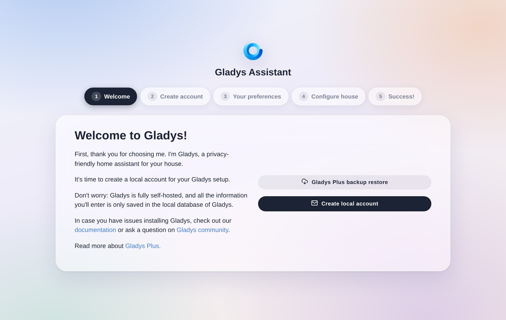

Wenn du neu in der Hausautomation bist, ist es oft schwer zu wissen, wo du anfangen sollst.

## Wähle deine Smart-Home-Zentrale

Gladys Assistant ist eine selbst gehostete Software, das heißt, alles läuft lokal auf einer Smart-Home-Zentrale. Das ist eine ihrer größten Stärken!

Du hast mehrere Möglichkeiten, Gladys zu betreiben:

### Option 1: Mini-PC (empfohlen)

Die meisten Nutzer installieren Gladys selbst auf einem Mini-PC mit Linux. Für einen langfristigen Betrieb bietet das das beste Preis-Leistungs-Verhältnis.

- **Neuer Mini-PC** (Beelink, Intel NUC …): Installiere Ubuntu Server und anschließend Gladys über Docker. Beispiel: [Beelink Mini S13 bei Amazon](https://www.amazon.com/s?k=Beelink+Mini+S13&tag=gladproj-21)
- **Gebrauchter Mini-PC**: auf Gebrauchtmarktplätzen oft günstiger. Achte auf mindestens 8 GB RAM und eine SSD.
- **Hardware, die du bereits besitzt**: ein alter PC, ein Intel NUC, der Staub ansetzt … Wenn Docker darauf läuft, läuft auch Gladys darauf.

👉 [Anleitung zur Installation auf einem Mini-PC](/de/docs/installation/mini-pc/)

### Option 2: Vorhandene Hardware

Wenn du bereits kompatible Hardware hast:

- **Synology-NAS, Intel NUC oder jeder Docker-fähige Linux-Server**
  - Nutze deine vorhandene Hardware weiter
  - Folge unseren Installationsanleitungen weiter unten

### Option 3: Raspberry Pi

- Eine tolle Möglichkeit, Gladys kennenzulernen, wenn du schon einen zur Hand hast
- Vereinfachte Einrichtung mit unserem offiziellen 64-Bit-Image (Pi 3, 4 und 5)
- 👉 [Anleitung zur Installation auf einem Raspberry Pi](/de/docs/installation/raspberry-pi/)
- Für den langfristigen Alltagsbetrieb bleibt ein Mini-PC die bessere Wahl

## Gladys Assistant installieren

Je nach gewählter Hardware kannst du einer der folgenden Anleitungen folgen:

- [Gladys Assistant auf einem Mini-PC installieren](/de/docs/installation/mini-pc/)
- [Gladys Assistant auf einem Synology-NAS installieren](/de/docs/installation/synology/)
- [Gladys Assistant auf einem Unraid-NAS installieren](/de/docs/installation/unraid/)
- [Gladys Assistant auf einem Raspberry Pi installieren](/de/docs/installation/raspberry-pi/)

## Plane dein Smart-Home-Projekt

Das Wichtigste ist, festzulegen, welche Automatisierungen du in deinem Zuhause umsetzen möchtest: vernetzte Beleuchtung, eine Alarmanlage zur Absicherung deines Zuhauses, Energiesparen durch das Abschalten ungenutzter Geräte oder der Heizung?

Eine gute Möglichkeit, dich zu organisieren, ist eine Tabelle (in Excel, Google Sheets oder Notion), in der du Raum für Raum alle Geräte auflistest, die du einbinden möchtest.

### Beispiel: Wohnzimmer

| Name                                                          | Preis  | Link                                                                                                                           |
| ------------------------------------------------------------- | ------ | ------------------------------------------------------------------------------------------------------------------------------ |
| Zigbee-Temperatur-/Feuchtigkeitssensor mit Display            | $19,99 | [Amazon US](https://amzn.to/4i3oRP1)                                                                                           |
| ZigBee-Steckdosen im 4er-Pack mit Echtzeit-Verbrauchsmessung  | €16.99 | [Amazon US](https://amzn.to/3CRoBne)                                                                                           |
| IKEA-TRÅDFRI-E27-Glühbirne (Deckenleuchte)                    | $13,99 | [IKEA US](https://www.ikea.com/us/en/p/tradfri-led-bulb-e26-1100-lumen-smart-wireless-dimmable-white-spectrum-globe-50545678/) |
| IKEA-STYRBAR-Fernbedienung (Helligkeit)                       | $13,99 | [IKEA US](https://www.ikea.com/us/en/p/styrbar-remote-control-smart-white-80488370/)                                           |
| Zigbee-Bewegungsmelder im 4er-Pack                            | $75,99 | [Amazon US](https://amzn.to/4k2hb0X)                                                                                           |

Es geht nicht unbedingt darum, alles auf einmal zu kaufen, sondern eher darum, zu planen und dein Zuhause nach und nach auszustatten – es sei denn, du bist gerade erst eingezogen und möchtest alles sofort installieren.

## Dein Smart Home konfigurieren

Sobald Gladys bei dir zu Hause läuft, kannst du es über deinen Webbrowser aufrufen und mit der Konfiguration deines Zuhauses beginnen.

Folge dann einfach den Schritten: Lege das Hauptadministratorkonto für dein Smart Home an, beantworte ein paar Fragen zu deinen Vorlieben und gib deinem Haus einen Namen. Das dauert nur ein paar Minuten.

Das war's! Du hast jetzt ein Smart-Home-System mit Gladys bei dir zu Hause.

Jetzt kannst du die verschiedenen Integrationen einrichten, die in Gladys verfügbar sind.

Wenn du Fragen hast, komm gleich zu uns [ins Forum](https://community.gladysassistant.com/)!
