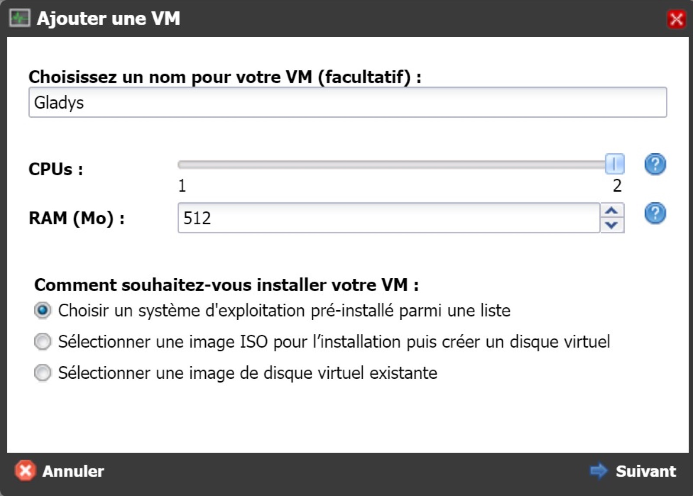
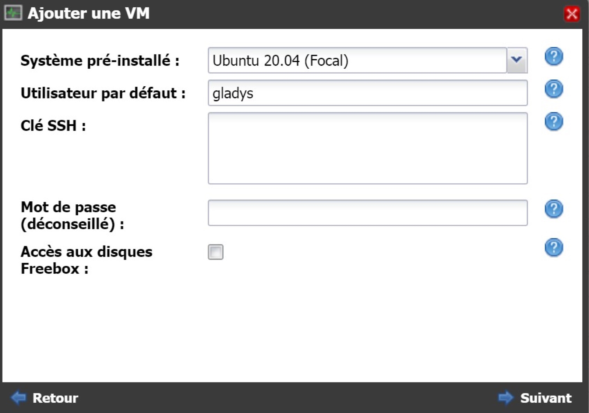
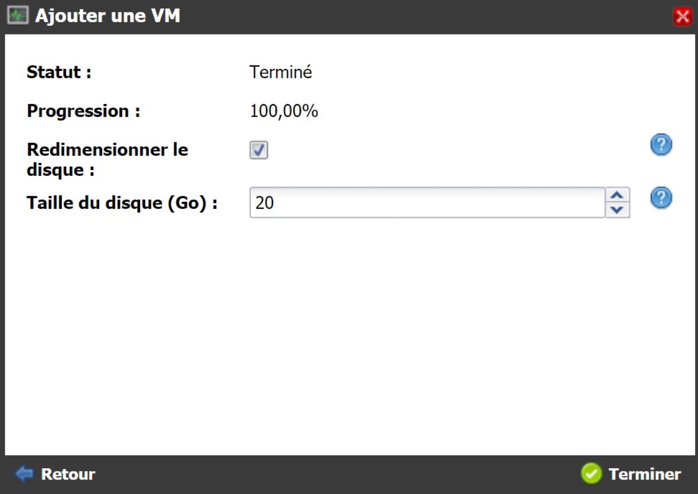
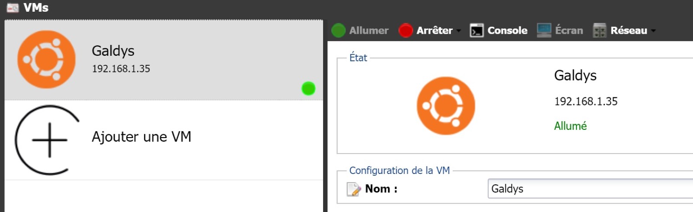
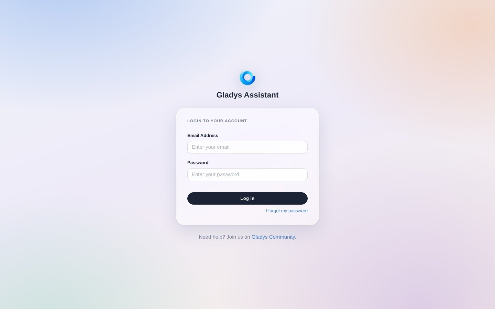

## Auf einer Freebox Delta

Diese Anleitung erklärt, wie du Gladys auf einer Freebox Delta installierst (das geschieht mit Docker).

### Eine virtuelle Maschine auf der Freebox Delta erstellen

Rufe zunächst die Freebox-Oberfläche unter folgender Adresse auf: mafreebox.free.fr.


Klicke auf „VMs“. Dieses Fenster erscheint:



Wähle einen Namen für die VM, zum Beispiel `Gladys`.

Wähle die Option „Ein vorinstalliertes Betriebssystem aus einer Liste auswählen“.

Klicke auf „Weiter“.



Wähle das zu installierende System, zum Beispiel `Ubuntu`.

Gib einen öffentlichen SSH-Schlüssel oder ein Passwort ein.

Wähle einen Benutzernamen, zum Beispiel `gladys`.

Klicke auf „Weiter“.



Klicke auf „Fertigstellen“.

Die virtuelle Maschine (VM) ist bereit. Klicke auf „Einschalten“, um die VM zu starten.



Verbinde dich per SSH mit deiner VM und aktualisiere das System:

```bash
sudo apt update
sudo apt upgrade
```

### Docker auf der Freebox Delta installieren

Gib die folgenden Befehle nacheinander ein, um Docker auf der Freebox Delta zu installieren.

```bash
sudo apt install docker.io
sudo systemctl enable --now docker
sudo usermod -aG docker gladys
```

Beende anschließend deine SSH-Sitzung und melde dich erneut an, damit die Änderungen übernommen werden.

### Gladys starten

Um Gladys zu starten, führe den folgenden Befehl auf deiner VM aus:

```bash
docker run -d \
--log-driver json-file \
--log-opt max-size=10m \
--cgroupns=host \
--restart=always \
--privileged \
--network=host \
--name gladys \
-e NODE_ENV=production \
-e SERVER_PORT=80 \
-e TZ=Europe/Paris \
-e SQLITE_FILE_PATH=/var/lib/gladysassistant/gladys-production.db \
-v /var/run/docker.sock:/var/run/docker.sock \
-v /var/lib/gladysassistant:/var/lib/gladysassistant \
-v /dev:/dev \
-v /run/udev:/run/udev:ro \
gladysassistant/gladys:v5
```

## Gladys mit Watchtower automatisch aktualisieren

Mit Watchtower kannst du Gladys automatisch aktualisieren, sobald eine neue Version verfügbar ist. Starte dazu einen Watchtower-Container:

```
docker run -d \
  --name watchtower \
  --restart=always \
  -v /var/run/docker.sock:/var/run/docker.sock \
  nickfedor/watchtower \
  --cleanup --include-restarting
```

### Gladys aufrufen

Du erreichst Gladys unter `http://gladysassistant.local`, dem Namen, den Gladys per mDNS in deinem lokalen Netzwerk bekannt macht. Falls dein Netzwerk mDNS blockiert, gib stattdessen die IP-Adresse deiner VM in deinen Browser ein.


